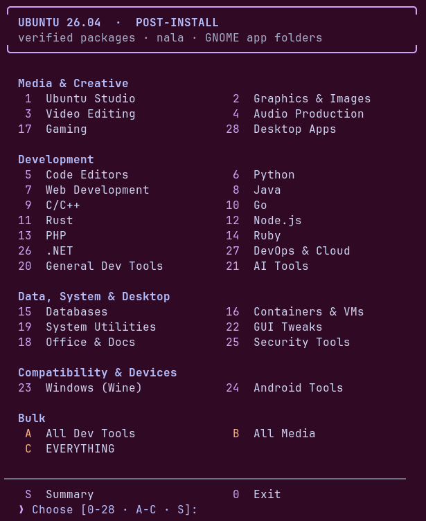
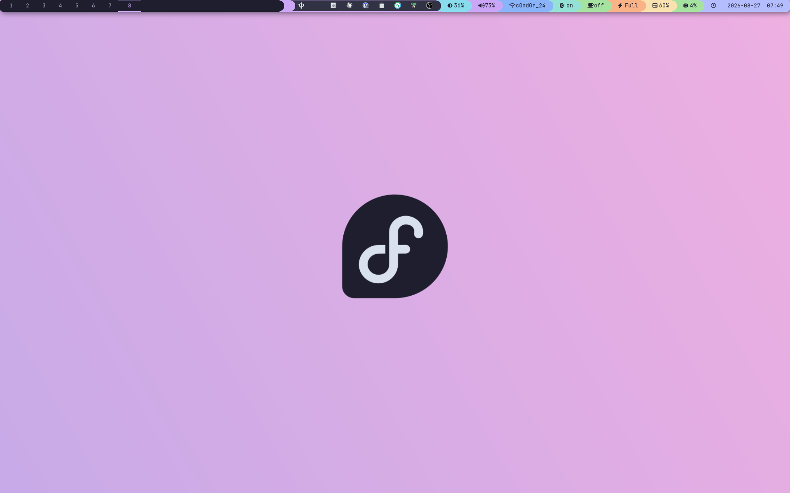

# 🐧🎩 Linux Post-Install Scripts

> **Menu-driven post-installation scripts with verified packages, error handling, installation checks, and automatic GNOME Shell app-folder creation.**



This repo ships **three independent, distro-specific scripts** — pick the one that matches your machine:

- **[`post-install-ubuntu.sh`](post-install-ubuntu.sh)** — for **Ubuntu 26.04 LTS / 26.10**, built on apt/Nala.
- **[`post-install-fedora.sh`](post-install-fedora.sh)** — for **Fedora Workstation**, built on `dnf5`/RPM Fusion.
- **[`post-install-arch.sh`](post-install-arch.sh)** — for **Arch Linux and [Omarchy](https://omarchy.org)**, built on `pacman` with a `yay` AUR fallback.

They share the same Catppuccin-themed menu-driven UX, the same installed/skipped/failed tracking, and the same GNOME Shell app-folder feature — but every install path (package names, repos, drivers, codecs) is re-sourced per distro rather than being a single script with `if`-branches. None of the three scripts depends on or modifies another; run whichever matches your system.

There's also a fourth, standalone script that isn't part of that trio: **[`fedroa-setup-i3-cattpuccin.sh`](fedroa-setup-i3-cattpuccin.sh)** builds a full Catppuccin Mocha–themed **i3 tiling window manager** desktop on top of Fedora — a single-purpose rice script, not a menu-driven package browser. Run it after (or independently of) `post-install-fedora.sh`. See [i3 + Catppuccin Rice Script](#-i3--catppuccin-rice-script-fedora) below.

---

## 📋 Table of Contents

- [🐧 Ubuntu Post-Install Script](#-ubuntu-2604-lts--2610-post-install-script)
  - [🚀 Overview](#-overview)
  - [✨ Features](#-features)
  - [📥 Installation](#-installation)
  - [🎯 Usage](#-usage)
  - [🗂️ GNOME App Folders (Super Key Groups)](#️-gnome-app-folders-super-key-groups)
  - [📦 Package Categories](#-package-categories)
    - [Ubuntu Studio (Media)](#ubuntu-studio-media)
    - [Graphics &amp; Image Manipulation](#graphics--image-manipulation)
    - [Video Creation &amp; Editing](#video-creation--editing)
    - [Audio Production](#audio-production)
    - [Code Editors](#code-editors)
    - [Python Development](#python-development)
    - [Web Development](#web-development)
    - [Java Development](#java-development)
    - [C/C++ Development](#cc-development)
    - [Go Development](#go-development)
    - [Rust Development](#rust-development)
    - [Node.js Development](#nodejs-development)
    - [PHP Development](#php-development)
    - [Ruby Development](#ruby-development)
    - [Database Tools](#database-tools)
    - [Container &amp; Virtualization](#container--virtualization)
    - [Gaming](#gaming)
    - [Office &amp; Productivity](#office--productivity)
    - [System Utilities](#system-utilities)
    - [General Development Tools](#general-development-tools)
    - [AI Tools](#ai-tools)
    - [GUI Tweaks](#gui-tweaks)
    - [Windows Software Support](#windows-software-support)
    - [Android Tools](#android-tools)
    - [Security Tools](#security-tools)
    - [.NET Development](#net-development)
    - [DevOps &amp; Cloud](#devops--cloud)
    - [Desktop Apps](#desktop-apps)
    - [Drivers & Extra Repos](#drivers--extra-repos)
    - [Printers (CUPS + HP)](#printers-cups--hp)
  - [🔀 Bulk Options (A / B / C)](#-bulk-options-a--b--c)
  - [🔧 Error Handling &amp; Installation Checks](#-error-handling--installation-checks)
  - [📊 Installation Summary &amp; Logging](#-installation-summary--logging)
  - [🔒 Security Notes](#-security-notes)
  - [⚠️ Known Limitations](#️-known-limitations)
  - [⚙️ Customization](#-customization)
  - [🐛 Troubleshooting](#-troubleshooting)
- [🎩 Fedora Post-Install Script](#-fedora-post-install-script)
  - [🚀 Fedora Overview](#-fedora-overview)
  - [✨ Fedora Features](#-fedora-features)
  - [📥 Fedora Installation](#-fedora-installation)
  - [🎯 Fedora Usage](#-fedora-usage)
  - [🗂️ Fedora GNOME App Folders (Super Key Groups)](#️-fedora-gnome-app-folders-super-key-groups)
  - [📦 Fedora Package Categories](#-fedora-package-categories)
    - [Fedora: Creative Suite](#fedora-creative-suite)
    - [Fedora: Code Editors](#fedora-code-editors)
    - [Fedora: Python](#fedora-python)
    - [Fedora: Web Development](#fedora-web-development)
    - [Fedora: Java](#fedora-java)
    - [Fedora: C/C++](#fedora-cc)
    - [Fedora: Go](#fedora-go)
    - [Fedora: Rust](#fedora-rust)
    - [Fedora: Node.js](#fedora-nodejs)
    - [Fedora: PHP](#fedora-php)
    - [Fedora: Ruby](#fedora-ruby)
    - [Fedora: Databases](#fedora-databases)
    - [Fedora: Containers & VMs](#fedora-containers--vms)
    - [Fedora: Gaming](#fedora-gaming)
    - [Fedora: Office & Productivity](#fedora-office--productivity)
    - [Fedora: System Utilities](#fedora-system-utilities)
    - [Fedora: General Development Tools](#fedora-general-development-tools)
    - [Fedora: AI Tools](#fedora-ai-tools)
    - [Fedora: GUI Tweaks](#fedora-gui-tweaks)
    - [Fedora: Windows Software Support](#fedora-windows-software-support)
    - [Fedora: Android Tools](#fedora-android-tools)
    - [Fedora: Security Tools](#fedora-security-tools)
    - [Fedora: .NET](#fedora-net)
    - [Fedora: DevOps & Cloud](#fedora-devops--cloud)
    - [Fedora: Desktop Apps](#fedora-desktop-apps)
    - [Fedora: Browsers](#fedora-browsers)
    - [Fedora: Communication](#fedora-communication)
    - [Fedora: Drivers & Extra Repos](#fedora-drivers--extra-repos)
    - [Fedora: Printers (CUPS + HP)](#fedora-printers-cups--hp)
  - [🔀 Fedora Bulk Options (A / B / C)](#-fedora-bulk-options-a--b--c)
  - [🔧 Fedora Error Handling &amp; Installation Checks](#-fedora-error-handling--installation-checks)
  - [📊 Fedora Installation Summary &amp; Logging](#-fedora-installation-summary--logging)
  - [🔒 Fedora Security Notes](#-fedora-security-notes)
  - [⚠️ Fedora Known Limitations](#-fedora-known-limitations)
  - [⚙️ Fedora Customization](#-fedora-customization)
  - [🐛 Fedora Troubleshooting](#-fedora-troubleshooting)
- [🏹 Arch Linux / Omarchy Post-Install Script](#-arch-linux--omarchy-post-install-script)
  - [🚀 Arch Overview](#-arch-overview)
  - [✨ Arch Features](#-arch-features)
  - [📥 Arch Installation](#-arch-installation)
  - [🎯 Arch Usage](#-arch-usage)
  - [🗂️ Arch GNOME App Folders (Super Key Groups)](#️-arch-gnome-app-folders-super-key-groups)
  - [📦 Arch Package Categories](#-arch-package-categories)
    - [Arch: AI Tools](#arch-ai-tools)
    - [Arch: Code Editors](#arch-code-editors)
    - [Arch: Python](#arch-python)
    - [Arch: Web Development](#arch-web-development)
    - [Arch: Java](#arch-java)
    - [Arch: C/C++](#arch-cc)
    - [Arch: Go](#arch-go)
    - [Arch: Rust](#arch-rust)
    - [Arch: Node.js](#arch-nodejs)
    - [Arch: PHP](#arch-php)
    - [Arch: Ruby](#arch-ruby)
    - [Arch: .NET](#arch-net)
    - [Arch: General Dev Tools](#arch-general-dev-tools)
    - [Arch: DevOps & Cloud](#arch-devops--cloud)
    - [Arch: Database Tools](#arch-database-tools)
    - [Arch: Containers & VMs](#arch-containers--vms)
    - [Arch: Gaming](#arch-gaming)
    - [Arch: Windows Software Support](#arch-windows-software-support)
    - [Arch: Browsers](#arch-browsers)
    - [Arch: Communication](#arch-communication)
    - [Arch: Desktop Apps](#arch-desktop-apps)
    - [Arch: Creative Suite](#arch-creative-suite)
    - [Arch: Office & Productivity](#arch-office--productivity)
    - [Arch: System Utilities](#arch-system-utilities)
    - [Arch: Android Tools](#arch-android-tools)
    - [Arch: Security Tools](#arch-security-tools)
    - [Arch: Peripherals (Logitech)](#arch-peripherals-logitech)
    - [Arch: Drivers & Extra Repos](#arch-drivers--extra-repos)
    - [Arch: Snapshots & Backup](#arch-snapshots--backup)
    - [Arch: Printers (CUPS + HP)](#arch-printers-cups--hp)
    - [Arch: GUI Tweaks / Theming](#arch-gui-tweaks--theming)
  - [🔀 Arch Bulk Options (A / B / C)](#-arch-bulk-options-a--b--c)
  - [🔧 Arch Error Handling &amp; Installation Checks](#-arch-error-handling--installation-checks)
  - [📊 Arch Installation Summary &amp; Logging](#-arch-installation-summary--logging)
  - [🐉 Omarchy-Specific Behavior](#-omarchy-specific-behavior)
  - [🔒 Arch Security Notes](#-arch-security-notes)
  - [⚠️ Arch Known Limitations](#-arch-known-limitations)
  - [⚙️ Arch Customization](#-arch-customization)
  - [🐛 Arch Troubleshooting](#-arch-troubleshooting)
- [🎨 i3 + Catppuccin Rice Script (Fedora)](#-i3--catppuccin-rice-script-fedora)
  - [🚀 i3 Script Overview](#-i3-script-overview)
  - [📦 What Gets Installed](#-what-gets-installed)
  - [📥 i3 Script Installation & Usage](#-i3-script-installation--usage)
  - [⌨️ Keybinding Cheat Sheet](#️-keybinding-cheat-sheet)
  - [🖥️ Multi-Monitor Setup](#️-multi-monitor-setup)
  - [🛟 Rollback Safety Net](#-rollback-safety-net)
  - [⚠️ i3 Script Known Limitations & Caveats](#️-i3-script-known-limitations--caveats)
- [📜 License](#-license)
- [🙏 Acknowledgments](#-acknowledgments)

---

# 🐧 Ubuntu 26.04 LTS / 26.10 Post-Install Script

### 🚀 Overview

This script automates the post-installation setup of **Ubuntu 26.04 LTS and 26.10** by providing a menu-driven interface for installing software packages grouped by category. It is designed for developers, creatives, and power users who want to quickly set up a fully-featured development, media production, or virtualization environment.

On startup the script **detects the running release** (via `lsb_release`, falling back to `/etc/os-release`) and captures both the version and codename. Both supported releases share the same package names and codename-resolved repositories, so a single code path serves both; the few genuinely release-specific spots (e.g. PPAs that may have no build for a brand-new interim release) are handled through a small `is_lts()` / codename dispatch rather than a forked script. Running on any other version isn't blocked — the script warns and asks whether to continue.

It then **bootstraps [Nala](https://github.com/volitank/nala)** (installed with apt-get right after the first package-list update) and routes subsequent installs/updates through it for parallel downloads and cleaner output on Ubuntu's default mirrors, transparently falling back to apt-get if Nala can't be installed.

**Startup sequence** (before the menu appears), in order:

1. **Root check** — must be run with `sudo`.
2. **Version detection** — supports 26.04 LTS / 26.10; warns and asks to continue on anything else.
3. **Stale-mirror recovery** — if a previous `nala fetch` left `/etc/apt/sources.list.d/fetch.sources` behind (a common source of 404 / "is not signed" errors), offers to remove it and fall back to Ubuntu's default mirrors (prompted, default-yes, non-fatal).
4. **First package-list update** (apt-get — Nala isn't installed yet).
5. **Nala bootstrap** — installs Nala; on success all later installs/updates route through it, else apt-get.
6. **Base utilities** — `curl`, `git`, `whiptail`, `dbus-x11`, etc.
7. **Interactive menu.**

Beyond just installing packages, after each category finishes it can also **create a real GNOME Shell app folder** for the apps it just installed, so they show up grouped together when you press the **Super key** and open the app grid — see [GNOME App Folders](#️-gnome-app-folders-super-key-groups) below.

**Key Design Principles:**

- ✅ **Dual-Release Support (26.04 LTS & 26.10)**: A startup version check accepts both supported releases and stores the detected version/codename; release-specific behavior is dispatched via `is_lts()` and the resolved codename instead of maintaining two scripts. Add another release to the `SUPPORTED_VERSIONS` array to have the check accept it without prompting.
- ✅ **Nala front-end (with apt-get fallback)**: [Nala](https://github.com/volitank/nala) is installed early and used for package installs/updates (parallel downloads, cleaner output). It's a thin layer over the same libapt/dpkg, so package behavior is identical. A `pm_install`/`pm_update` abstraction routes operations through Nala when present and **falls back to apt-get** if Nala isn't available — the script works either way. Queries (`apt-cache`, `dpkg`) intentionally stay on apt, which Nala doesn't replace.
- ✅ **Verified Packages Only**: Every apt package name has been checked against the live Ubuntu 26.10 archive (`apt-cache policy`) before being added — several package names from earlier drafts (`ubuntu-studio-*`, `qemu-kvm`, `android-tools-adb`) turned out not to exist under those names and were corrected
- ✅ **Direct Downloads for Third-Party**: Non-repo tools (VS Code, Sublime Text, Ollama, Cursor, Mistral Vibe CLI) use their official installers/repositories
- ✅ **Snap for Archive Gaps**: Tools with no real apt package at all (LXD, IntelliJ IDEA Community, DBeaver CE) are installed via `snap` instead of silently failing
- ✅ **Robust Error Handling**: Gracefully skips unavailable packages and continues installation
- ✅ **No Silent Duplicates**: Package lists were audited across all categories so the same tool isn't installed twice by accident (a few overlaps are intentional and documented — see [Known Limitations](#️-known-limitations) and inline comments in the script)

---

### ✨ Features

#### Core Features

| Feature                       | Description                                                                                    |
| ------------------------------ | ------------------------------------------------------------------------------------------------ |
| **Version Detection**         | Detects the running release at startup, supports **Ubuntu 26.04 LTS and 26.10**, warns/prompts on anything else |
| **Nala Front-End**            | Installs and uses [Nala](https://github.com/volitank/nala) for installs/updates (parallel downloads, cleaner output); transparently falls back to apt-get if unavailable |
| **Catppuccin-Themed Output**  | Menus, logs, and summary use the Catppuccin Mocha palette (truecolor), auto-disabled for non-TTY / `NO_COLOR` |
| **Interactive Menu**          | Text-based menu with 28 categories, plus Ubuntu Studio, Security, GUI Tweaks, Browsers, Communication, Drivers & Extra Repos, and Printers sub-menus |
| **GNOME App-Folder Creation** | After each category, optionally groups the apps you just installed into a Super-key app folder |
| **Terminal Font Setup**       | In GUI Tweaks, optionally sets the terminal / system monospace font to an installed Nerd Font (works on Ptyxis, GNOME Console, and gnome-terminal) |
| **Error Handling**             | Skips unavailable packages, continues installation                                              |
| **Pre-Install Checks**        | Verifies if packages are already installed                                                      |
| **Package Verification**      | Checks if packages exist in repositories before attempting                                      |
| **Snap Fallback**              | Installs archive-gap tools (LXD, IntelliJ, DBeaver CE) via snap with the same tracking as apt   |
| **Installation Tracking**     | Tracks installed, skipped, and failed packages per run                                          |
| **Summary Reporting**          | Shows detailed installation summary with the "S" command                                        |
| **Log Saving**                 | Saves complete logs to `/var/log/ubuntu_post_install_TIMESTAMP.log`                             |

#### Statistics

- **Main Menu Categories:** 28 (plus Ubuntu Studio, Security, GUI Tweaks, Browsers, Communication, Drivers & Extra Repos, and Printers sub-menus)
- **Package Front-End:** Nala (auto-installed, with transparent apt-get fallback)
- **Verified APT Packages:** 200+
- **Snap-Only Tools:** 3 (LXD, IntelliJ IDEA Community, DBeaver CE)
- **Third-Party Direct-Install Tools:** VS Code, Sublime Text, Ollama, Cursor, Mistral Vibe CLI, Claude Code, Gemini CLI, OpenCode, Go, Rust/rustup, Chris Titus mybash, Azure CLI, lazygit (via Go), LazyVim + Nordic (Neovim config)
- **Estimated Install Time:** 15 minutes – several hours (depending on selections; "Install EVERYTHING" is a long run)
- **Estimated Disk Space:** 5–30GB+ (depending on selections)

---

### 📥 Installation

#### Prerequisites

- **Ubuntu 26.04 LTS or 26.10** (the script detects the release at startup; on any other version it warns and asks whether to continue)
- **Root access** (script must be run with `sudo`)
- **Internet connection** (for downloading packages, third-party installers, and Nerd Fonts)
- **An active GNOME desktop session** if you want app folders created (see below) — running the script over plain SSH with no desktop session will still install packages fine, it just can't create the Super-key groups
- **Minimum 10GB free disk space** (more for a full/media-heavy install)

#### Quick Start

```bash
# Make the script executable
chmod +x post-install-ubuntu.sh

# Run with sudo
sudo ./post-install-ubuntu.sh
```

---

### 🎯 Usage

#### Running the Script

```bash
chmod +x post-install-ubuntu.sh
sudo ./post-install-ubuntu.sh
```

#### Menu Navigation

1. **Main Menu**: Shows all 28 categories (`0`–`28`)
2. **Sub-Menus**: Ubuntu Studio (option `1`) has a sub-menu (`1`–`6`); Security Tools (option `25`) has a sub-menu to choose Full or Defensive-only; GUI Tweaks (option `22`), Browsers (option `29`), and Communication (option `30`) each have a sub-menu to install everything in the category or pick a single item
3. **Bulk Options**: `A`, `B`, `C` (see [Bulk Options](#-bulk-options-a--b--c) below)
4. **`S`** — Show Installation Summary
5. **`0`** — Exit

After a single category finishes installing, you'll be asked whether to group its apps into a GNOME app folder. Bulk options (`A`/`B`/`C`) **auto-create** a folder per category as they go — no prompts (fitting their hands-off nature).

#### Example Workflows

##### Install a Development Environment

```bash
sudo ./post-install-ubuntu.sh
# Select: 5 (Code Editors)   -> optionally create a "Code Editors" app folder
# Select: 6 (Python Development)
# Select: 7 (Web Development)
# Press 0 to exit
```

##### Install Media Production Tools

```bash
sudo ./post-install-ubuntu.sh
# Select: 1 (Ubuntu Studio) -> 1 (Full)
# Select: 2 (Graphics)
# Select: 3 (Video)          -> includes full codec/plugin stack + DVD support
# Select: 4 (Audio)
# Press 0 to exit
```

##### Set Up Container & VM Tooling

```bash
sudo ./post-install-ubuntu.sh
# Select: 16 (Container & Virtualization)
# -> installs Docker/Podman/LXC/LXD, KVM/QEMU + virt-manager/GNOME Boxes, and Cockpit
```

##### Full System Setup

```bash
sudo ./post-install-ubuntu.sh
# Select: C (Install EVERYTHING)
# Wait for completion (potentially a few hours)
```

---

### 🗂️ GNOME App Folders (Super Key Groups)

This is the script's headline feature beyond plain package installation: after a category installs, it can create a real **GNOME Shell app folder** (via the `org.gnome.desktop.app-folders` gsettings schema) so the apps you just installed show up grouped together when you press **Super** and open the app grid — no logout required.

**Requirements:** a live GNOME session for the target user (the script checks for `/run/user/<uid>/bus`). If none is found (e.g. running over SSH with no desktop logged in), the script warns and skips folder creation for that category — the packages themselves still install normally.

**How app resolution works.** Given a package name, the script has to figure out which real, displayable `.desktop` launcher(s) it corresponds to — this isn't always 1:1 with the apt package name, so it tries, in order:

1. **The package's own files** (`dpkg -L`) — most packages ship their own `.desktop` file directly.
2. **A full recursive dependency walk** (`apt-cache depends --recurse --important`, batched into a couple of `dpkg` calls for speed) — for meta-packages that ship no launcher of their own and depend on the real app instead. Examples: `neovim`'s launcher lives in `neovim-runtime`; `libreoffice`'s seven component apps (Writer/Calc/Impress/Draw/Base/Math/Start Center) are all separate dependencies; `emacs` depends only on an OR-alternative (`emacs-gtk`/`emacs-pgtk`/`emacs-lucid`/`emacs-nox`) and its "Emacs (Client)" launcher is two dependency levels down, in `emacs-common`.
3. **A reverse-DNS prefix guess** (`org.kde.`, `org.gnome.`, `com.obsproject.`, etc.) for cases where neither of the above resolves anything.
4. **The snap desktop directory** (`/var/lib/snapd/desktop/applications/`) for snap-only tools like DBeaver CE and IntelliJ IDEA, which `dpkg` has never heard of.

At every tier, files marked `NoDisplay=true` or `Hidden=true` are filtered out — many packages ship several `.desktop` files where only one is a real, user-facing launcher and the rest are MIME-type or print-preview helper registrations (Okular ships ~12 files and only one is real; Evince ships 2 and only one is real). The script also collects **every** real match per package rather than stopping at the first, since a meta-package can legitimately contribute several separate icons (LibreOffice, Emacs), and de-duplicates the final list in case two requested packages resolve to the same file.

If nothing resolves for a whole category, the folder is skipped with a warning rather than being silently created empty.

---

### 📦 Package Categories

Below is a breakdown of what each category actually installs, matching the current script. **All apt package names listed have been verified against the live Ubuntu 26.10 archive.**

---

#### Ubuntu Studio (Media)

Official Ubuntu Studio meta-packages (note: **no hyphen** between "ubuntu" and "studio" in the real package names — `ubuntustudio-video`, not `ubuntu-studio-video`).

| Option | Package                     | Description                                             |
| ------ | ---------------------------- | -------------------------------------------------------- |
| 1      | *(runs options 2–6)*        | Full Ubuntu Studio content set (Graphics/Video/Audio/Photography/Publishing) |
| 2      | `ubuntustudio-graphics`     | Graphics applications                                    |
| 3      | `ubuntustudio-video`        | Video production tools                                   |
| 4      | `ubuntustudio-audio`        | Audio production tools                                   |
| 5      | `ubuntustudio-photography`  | Photography tools                                        |
| 6      | `ubuntustudio-publishing`   | Publishing tools                                          |

---

#### Graphics &amp; Image Manipulation

**Raster/Vector Editors:** `gimp`, `inkscape`, `krita`, `darktable`, `rawtherapee`, `shotwell`, `nomacs`

**3D:** `blender`

**Pinta** — apt's `pinta` was dropped from Ubuntu's repos along with Mono; installed from Flathub (`com.github.PintaProject.Pinta`) instead when the apt package isn't available, same fallback pattern as Telegram.

**Command-line utilities:** `imagemagick`, `graphicsmagick`, `optipng`, `jpegoptim`, `pngquant`, `webp-tools`

---

#### Video Creation &amp; Editing

**Editors:** `kdenlive`, `shotcut`, `pitivi`

**Encoding & Conversion:** `handbrake`, `ffmpeg`, `mkvtoolnix`, `mkvtoolnix-gui`, `yt-dlp`

**Players:** `mpv`, `vlc`

**Recording/Streaming:** `obs-studio`

**Full media codec/plugin stack** (added so real-world playback doesn't silently fail):

- `gstreamer1.0-libav`, `gstreamer1.0-plugins-base`, `gstreamer1.0-plugins-good`, `gstreamer1.0-plugins-bad`, `gstreamer1.0-plugins-ugly`, `gstreamer1.0-vaapi` (hardware-accelerated decode where supported)
- `libavcodec-extra` (codec support for anything decoding through ffmpeg's libraries)
- `unrar` (many downloaded media bundles are RAR archives)
- `libdvd-pkg` — builds `libdvdcss2` (DVD decryption) from source on first install via a preseeded debconf answer, since this isn't a normal `.deb`. **Note:** whether building/using this is permitted varies by jurisdiction; it's the standard, widely-documented way Ubuntu desktops get encrypted-DVD playback working, not something forced silently — you can remove this line from `install_libdvdcss` if you don't want it.
- **`ubuntu-restricted-extras` (opt-in prompt):** extra patent-encumbered codecs (MP3/H.264 helpers) plus Microsoft core fonts. It's kept out of the default codec batch because its `ttf-mscorefonts-installer` dependency gates on an interactive **Microsoft core-fonts EULA** that would hang an unattended install. `install_restricted_extras` therefore **asks first** — the prompt states that choosing Yes accepts that EULA — and only then preseeds the answer (`debconf-set-selections`) so the install runs non-interactively. Declining is recorded as **skipped**, not failed. This prompt appears at the end of the Video category, including within the `B`/`C` bulk runs.

---

#### Audio Production

**DAWs & Editors:** `audacity`, `ardour`, `lmms`, `musescore`, `hydrogen`

**Synth:** `zynaddsubfx` — ships four separate launchers (Alsa / Jack / Jack multi-channel / Oss), all added to the app folder

**JACK Audio:** `qjackctl`, `jackd2`, `pulseaudio-module-jack`, `xjadeo` (JACK video monitor)

**Plugins & Effects:** `ladspa-sdk`, `calf-plugins`

**Conversion & Tagging:** `soundconverter`, `easytag`, `flac`, `lame`, `oggenc`, `opus-tools`, `vorbis-tools`, `wavpack`, `sox`, `libsox-fmt-all`

**Mixing:** `pavucontrol` (PulseAudio volume control)

**Streaming/Playback:** [`cliamp`](https://www.cliamp.stream/) (terminal Winamp-style music player/streamer — not packaged for Ubuntu, installed via its own release-binary `curl | sh` installer into `~/.local/bin`)

---

#### Code Editors

**APT Packages:** `vim`, `neovim`, `emacs`, `nano`, `geany`, `gedit`, `kate`

**Third-Party (official repos, added and removed automatically):**

- **Visual Studio Code** — via the Microsoft apt repository
- **Sublime Text** — via the Sublime HQ apt repository

Both already-installed checks correctly mark the app as "skipped" (not silently ignored) so its icon still gets picked up for the Code Editors app folder.

**LazyVim + Nordic (optional prompt):** after the editors install, you're asked whether to set up [LazyVim](https://github.com/LazyVim/starter) as your Neovim config with the [Nordic](https://github.com/AlexvZyl/nordic.nvim) theme. It's a **prompted opt-in** because it **replaces `~/.config/nvim`** — any existing config is backed up to `~/.config/nvim.bak.<timestamp>` first. The clone runs as your user; plugins sync on the first `nvim` launch. The prompt also appears in the `A`/`C` bulk runs.

---

#### Python Development

`python3`, `python3-dev`, `python3-venv`, `python3-pip`, `python-is-python3`, `ipython3`, `pipx`

---

#### Web Development

**Web Servers:**

- `nginx` — started normally (owns port 80)
- `apache2` — installed with `--no-install-recommends` but deliberately **not started**. During the apache2 and PHP installs the script drops a temporary `policy-rc.d` (returning 101 for `apache2` only) so no maintainer script can auto-(re)start Apache into a port-80 collision with nginx. Without this, `apache2`/`libapache2-mod-php` postinsts fail mid-install with a systemd error.

**PHP baseline** (kept intentionally minimal here — just enough to serve something; deeper PHP tooling lives in [PHP Development](#php-development)): `php-cli`, `php-fpm`, `composer`

> The bare `php` metapackage is intentionally **not** installed. With apache2 present, `php`'s OR-dependency resolves to `libapache2-mod-php`, whose postinst restarts Apache and collides with nginx on port 80. `php-fpm` (the SAPI nginx talks to) plus `php-cli` (for composer) provide the runtime without ever pulling the Apache module.

**Node.js** (shared installer with [Node.js Development](#nodejs-development) — intentionally installed from either category since it's foundational to web dev but also useful standalone):

- Added via the **NodeSource** repository, Node.js 20.x
- Global npm packages: `npm-check-updates`, `nodemon`, `pm2`, `webpack`, `webpack-cli`, `eslint`, `prettier`

**Not installed here** (moved to their own categories to avoid duplication): `memcached`, `redis-server`, `sqlite3`, `sqlitebrowser` (→ Database Tools), `ruby`/`ruby-dev` (→ Ruby Development).

---

#### Java Development

**JDK/JRE & Build Tools:** `default-jdk`, `default-jre`, `gradle`, `maven`, `ant`

**Testing:** `junit4`, `testng`

**Environment:** `JAVA_HOME` is detected and set two ways — a bare `JAVA_HOME=…` line in `/etc/environment` (system-wide, idempotently rewritten) and a `/etc/profile.d/java-home.sh` that exports it and adds `$JAVA_HOME/bin` to `PATH` at login. **Note:** `/etc/environment` is a plain `NAME=value` file, **not** a shell script — earlier versions wrote `export JAVA_HOME=…` there, which breaks any dpkg maintainer script that reads the file (e.g. `install-info`) with `export: … bad variable name` and then fails every later package. The current code writes the correct format and the detection step also strips any malformed `export` lines a previous run left behind.

**IDE:** `intellij-idea-community` via **snap** (`--classic`) — no Java IDE exists as a normal apt package in the Ubuntu 26.10 archive at all (checked: Eclipse, IntelliJ, NetBeans all return nothing from `apt-cache policy`), so snap is the only real distribution channel.

*(Not included: `ant-contrib`, `hamcrest`, `mockito` — not available in the Ubuntu 26.10 repositories.)*

---

#### C/C++ Development

**Compilers:** `build-essential`, `gcc`, `g++`, `gfortran`, `clang`

**Build Systems:** `cmake`, `make`, `ninja-build`, `ccache`, `autoconf`, `automake`, `libtool`, `m4`, `bison`, `flex`, `gettext`, `pkg-config`

**Debugging & Profiling:** `cppcheck`, `valgrind`, `gdb`, `ltrace`, `strace`

*(`make`/`cmake`/`autoconf`/`automake`/`bison`/`flex`/`gettext`/`pkg-config` intentionally overlap with [General Development Tools](#general-development-tools) — kept as shared foundational tooling.)*

---

#### Go Development

**APT Package:** `golang`

**Direct Install (if `go` isn't already on `PATH`):** downloads and installs **Go 1.22.5** from the official source to `/usr/local/go`, and adds it to `PATH` via **`/etc/profile.d/go.sh`** (a real shell script that expands `$PATH` at login — *not* `/etc/environment`, which is a `NAME=value` pam_env file where an `export` line would break `install-info`; the step also strips any such broken line an older version left behind)

---

#### Rust Development

**APT Packages:** `rustc`, `cargo`

**Direct Install (if `rustup` isn't already present):** installs **rustup** from the official source **as the desktop user** (so the toolchain lands in *their* `~/.cargo`, not root's), sets `stable` as default, and adds the `rust-src` component. Skipped when there's no sudo-invoking user (script run as root directly).

---

#### Node.js Development

Calls the same Node.js installer used by [Web Development](#web-development) — NodeSource repository, Node.js 20.x, plus the same global npm package set. This overlap with Web Development is intentional (kept per an earlier explicit decision), not an accidental duplicate.

---

#### PHP Development

**Note:** the Ondrej PHP PPA is **not yet available for Ubuntu 26.10** — this category uses the **default Ubuntu repository PHP packages only**.

`php-cli`, `php-fpm`, `php-dev`, `php-pear`, `php-mysql`, `php-pgsql`, `php-sqlite3`, `php-gd`, `php-curl`, `php-mbstring`, `php-xml`, `php-zip`, `composer`

> As in Web Development, the bare `php` metapackage is omitted so it can't pull `libapache2-mod-php` and restart Apache into a port-80 conflict (relevant when apache2 is already installed, e.g. during an "EVERYTHING" run). The same apache-autostart guard is applied here as a safety net.

*(The `php`/`php-cli`/`php-fpm`/`composer` baseline intentionally overlaps with Web Development — see that section's note.)*

---

#### Ruby Development

`ruby`, `ruby-dev`, `ruby-bundler`

---

#### Database Tools

**SQL/NoSQL Databases:** `mysql-server`, `mysql-client`, `postgresql`, `sqlite3`, `redis-server`, `redis-tools`, `memcached`

**GUI Clients:**

- `sqlitebrowser` — the only DB GUI available as a normal apt package in the Ubuntu 26.10 archive
- `dbeaver-ce` via **snap** (`--classic`) — covers MySQL/Postgres/SQLite in one tool. No MySQL Workbench, pgAdmin4, or DBeaver apt package exists in these repos at all (checked), so snap is the only real distribution channel.

---

#### Container &amp; Virtualization

This category now actually covers both halves of its name — previously it only installed containers.

**Containers:**

- `docker.io`, `docker-compose`, `podman`, `lxc`
- `lxd` via **snap** (Canonical no longer ships an apt package for it)
- If Docker installs successfully: the invoking user is added to the `docker` group and the `docker` service is enabled/started

**Virtualization (KVM/QEMU):**

- `qemu-system-x86` (**not** `qemu-kvm` — that package name doesn't exist on this Ubuntu version), `qemu-utils`
- `libvirt-daemon-system`, `libvirt-clients`, `bridge-utils`
- `virtinst`, `virt-viewer`, `spice-client-gtk` — needed for virt-manager to actually create VMs and show their graphical console
- **GUI front-ends (both installed — different UX, not a duplicate):** `virt-manager` (full-featured, multi-VM) and `gnome-boxes` (GNOME's simpler one-VM-at-a-time tool)
- If `virsh` is available: the invoking user is added to the `libvirt` group, `libvirtd` is enabled/started, and the Virtio-Win Windows-guest drivers are fetched (see below)

**Virtio-Win drivers (Windows guests):** no Debian/Ubuntu apt package or PPA exists for these, so the script downloads upstream's "latest stable" ISO directly (a static URL that's always kept current) to `/var/lib/libvirt/images/virtio-win.iso` — point a Windows VM's second CD-ROM at it during install to get the virtio network/disk/balloon drivers, instead of a crawling emulated IDE disk and no network. Skipped if that file already exists.

**Cockpit (Web GUI):**

- `cockpit`, `cockpit-machines` (VM management module), `cockpit-podman` (container management module)
- A genuinely separate, actively-maintained dashboard at `https://localhost:9090` that manages both containers and VMs — not a duplicate of virt-manager/Boxes/docker CLI. No maintained Podman Desktop or Docker Desktop apt package exists in these repos, so this is the closest apt-installable equivalent.
- `cockpit.socket` is enabled/started automatically if the install succeeds
- **Note:** Cockpit's packages ship no `.desktop` file at all (it's browser-based) — you'll see "Desktop file not found" for `cockpit`/`cockpit-machines`/`cockpit-podman` in the summary; that's expected, the same as `docker`/`podman`/`adb`.

---

#### Gaming

`steam`, `lutris`, `gamemode`, `mangohud`

**32-bit Support:** adds the i386 architecture and installs `libgl1-mesa-glx:i386` for Steam

*(`obs-studio`/`mpv`/`vlc` are intentionally **not** installed here — they're not a dependency of Steam or Lutris, and [Video Creation & Editing](#video-creation--editing) already owns them.)*

---

#### Office &amp; Productivity

`libreoffice`, `okular`, `evince`, `zathura`, `pandoc`

Note: `libreoffice` is a meta-package that resolves to **seven separate real apps** for app-folder purposes (Writer, Calc, Impress, Draw, Base, Math, Start Center) — see [GNOME App Folders](#️-gnome-app-folders-super-key-groups).

---

#### System Utilities

**Process Monitoring:** `htop`, `iotop`, `nmon`, `sysstat`, `dstat`, `glances`

**Network Monitoring:** `nethogs`, `iftop`, `nload`, `vnstat`, `tcpdump`, `wireshark`

**System Inspection:** `lsof`, `strace`, `ltrace`, `valgrind`, `gdb`

**Shells & Terminal:** `tmux`, `screen`, `byobu`, `zsh`, `fish`, `fzf`, `ripgrep`, `tree`, `ncdu`, `rsync`, `unzip`, `bat`

**Markdown:** `glow` ([charmbracelet/glow](https://github.com/charmbracelet/glow), a terminal markdown renderer) — no official Debian/Ubuntu package exists, so the script adds Charm's own apt repo first (dearmored keyring at `/usr/share/keyrings/charm.gpg` + a `sources.list.d` entry, same idiom as `install_claude_desktop`), idempotently skipped if that keyring is already there.

> **Note:** the apt package `bat` installs its binary as `/usr/bin/batcat`, not `/usr/bin/bat` (an unrelated Debian package-name collision). Alias it yourself if you want the `bat` command to work directly.

---

#### General Development Tools

`jq`, `tig`, `subversion`, `make`, `cmake`, `autoconf`, `automake`, `bison`, `flex`, `gettext`, `pkg-config`, `manpages`, `less`

*(`git` is intentionally not re-listed here — it's installed for every run as part of the base utilities in `install_base`, since the script itself needs it for the Chris Titus mybash clone step.)*

---

#### AI Tools

**Third-Party Tools (direct installation):**

| Tool                | Installation Method | Description                                              |
| -------------------- | --------------------- | ----------------------------------------------------------- |
| **Ollama**          | Official install script | Local LLM runner, auto-detects GPU/CPU                  |
| **Alpaca**           | Flathub (`com.jeffser.Alpaca`) | Native GTK4 GUI client for Ollama                |
| **Claude Code**     | Official native installer (`claude.ai/install.sh`), npm fallback | Anthropic's CLI code assistant (provides the `claude` command) |
| **Gemini CLI**       | `npm install -g @google/gemini-cli` | Google's official CLI code assistant (provides the `gemini` command) |
| **Mistral Vibe CLI** | Official installer script (`mistral.ai/vibe/install.sh`), installs the `mistral-vibe` Python package via `uv`/`pip` | Mistral's terminal coding agent (provides the `vibe` command) |
| **OpenCode**         | Official native installer (`opencode.ai/install`), npm fallback (`opencode-ai`) | Provider-agnostic terminal AI coding agent (provides the `opencode` command) |
| **Cursor**           | `.deb` download       | AI-powered code editor                                    |

All of these register in the installed/skipped/failed tracking, so they appear in the summary and are fed to the app-folder resolver. **Cursor** ships its own `cursor.desktop` and **Alpaca** exports a Flatpak launcher, so both are grouped into the AI Tools folder. **Ollama**, **Claude Code**, **Gemini CLI**, **Mistral Vibe CLI**, and **OpenCode** are command-line only (no launcher), so they're tracked but don't get a folder icon — expected, same as `docker`/`adb`.

---

#### GUI Tweaks

Option `22` has its own sub-menu so you can install everything below at once, or pick just one piece (e.g. only **Themes**) instead of the full bundle: **All GUI Tweaks**, **Icon Sets**, **Themes**, **Cursor Themes**, **Nerd Fonts**, **Chris Titus mybash**, **GUI Tools**, **GNOME Shell Extensions**. **Themes** itself opens a further sub-menu so you can pick any single theme instead of installing the full curated set.

**Icon Sets:** (creators credited in [Acknowledgments](#-acknowledgments))

- **Apt packages** (Papirus via its Team PPA; the rest are plain universe packages): `papirus-icon-theme`, `numix-icon-theme`, `numix-icon-theme-circle`, `breeze-icon-theme`, `adwaita-icon-theme`, `obsidian-icon-theme`
- **Built from source, straight to `/usr/share/icons`** (no PPA/package exists for these): [Qogir](https://github.com/vinceliuice/Qogir-icon-theme), [WhiteSur](https://github.com/vinceliuice/WhiteSur-icon-theme), [Vimix](https://github.com/vinceliuice/Vimix-icon-theme) — each cloned and run through its own `install.sh` directly as root (their destination logic is already `$UID`-aware and has no other per-user dependency, unlike the GTK themes below, so no `su`-as-desktop-user dance is needed here). Tracked via a system-wide marker file under `/var/lib/ubuntu-postinstall-themes/`.
- **Ready-made, no build step**: [Newaita](https://github.com/cbrnix/Newaita) (light + dark) — copied straight into `/usr/share/icons`.

> The Papirus PPA is added through a codename-aware helper (`add_ppa`). PPAs are keyed by codename: the 26.04 LTS almost always has a build, while a brand-new interim release (26.10) frequently has none yet — if the PPA has no build for the running codename the helper warns and continues with the distro icon packages instead of leaving a broken apt source behind.

**GTK Theme:** `arc-theme`

**Third-party GTK/Shell themes:** Beyond the apt-packaged `arc-theme`, a curated set of popular GitHub theme projects is installed straight from source, entirely **as the logged-in desktop user** (needs an active GNOME session — skipped cleanly otherwise, same as the GNOME extensions step):

- **SASS-built GTK themes** ([Graphite](https://github.com/vinceliuice/Graphite-gtk-theme), [Colloid](https://github.com/vinceliuice/Colloid-gtk-theme), [Catppuccin](https://github.com/Fausto-Korpsvart/Catppuccin-GTK-Theme), [Everforest](https://github.com/Fausto-Korpsvart/Everforest-GTK-Theme), [Gruvbox](https://github.com/Fausto-Korpsvart/Gruvbox-GTK-Theme), [Kanagawa](https://github.com/Fausto-Korpsvart/Kanagawa-GKT-Theme), [Material](https://github.com/Fausto-Korpsvart/Material-GTK-Themes), [Nightfox](https://github.com/Fausto-Korpsvart/Nightfox-GTK-Theme), [Osaka](https://github.com/Fausto-Korpsvart/Osaka-GTK-Theme), [Rosé Pine](https://github.com/Fausto-Korpsvart/Rose-Pine-GTK-Theme), [Tokyonight](https://github.com/Fausto-Korpsvart/Tokyonight-GTK-Theme)) — each is cloned and run through its own `install.sh` with `--libadwaita` (so GTK4/Libadwaita apps pick it up too), landing in `~/.themes`. `sassc` is installed first since every one of these installers self-elevates with an internal `sudo apt install sassc` when it's missing, which would otherwise hang waiting for a terminal. Idempotent via a per-theme sentinel file under `~/.cache/ubuntu-postinstall-themes/`, since (unlike an apt package) there's no single "is it installed" check for a theme.
- **Ready-made GNOME Shell themes** ([Oval](https://github.com/metro2222/ovel), [Rounded Rectangle Dark Blue](https://github.com/metro2222/rounded-rectangle-dark-blue-theme)) — no build step, just copied into `~/.local/share/themes/`.
- **[Obsidian Flow](https://github.com/JustDeax/Obsidian-flow-shell-theme)** — installed via its own Python installer (`install.py -a`, all accent colors/light/dark) rather than a folder copy, into `~/.themes`.
- **[Material GNOME](https://github.com/SakibShahariar/material-gnome-theme)** — the repo root is the theme tree itself with no installer, so it's cloned and copied straight into `~/.themes/Material-Gnome`; its GTK4/Libadwaita stylesheets are then symlinked into `~/.config/gtk-4.0` since those apps ignore `~/.themes` entirely.
- **[Lycia](https://github.com/Aevstiel/Lycia-Theme)** — its own `install.sh` is interactive, so answers are piped in: yes to the GTK4/Libadwaita files, no to the GDM login-screen theme (that step overwrites a system `gnome-shell-theme.gresource`, too invasive for an unattended installer). Needs `gtk2-engines-murrine`, `sassc`, and `gnome-themes-extra` as runtime dependencies, installed alongside it.

All of these need the **User Themes** extension (installed by the GNOME extensions step above) to actually select and apply a shell theme; GTK themes are selectable directly in `gnome-tweaks`.

**Cursor Themes:** `dmz-cursor-theme`, `breeze-cursor-theme`

**Nerd Fonts:**

- APT packages: `fonts-firacode`, `fonts-jetbrains-mono`
- Individually downloaded from GitHub releases: FiraCode, JetBrainsMono, Hack, SourceCodePro, CascadiaCode, UbuntuMono, DejaVuSansMono
- Installed to `/usr/share/fonts/truetype/nerd-fonts/`, font cache refreshed automatically

**Terminal / System Monospace Font (optional prompt):**

After Nerd Fonts install, the script offers to set the terminal font to **JetBrainsMono Nerd Font**. This is what Chris Titus mybash's `setup.sh` also attempts, but that write targets GNOME Terminal's own keys and runs as root with no D-Bus session — so on GNOME's newer default terminal (**Ptyxis**, shipped on Ubuntu 26.04+) and under `sudo` it silently does nothing (the `dbus-launch: No such file or directory` warning). The in-script option fixes that by:

- Running as the **logged-in desktop user against their live D-Bus session** (reusing the same session/bus detection the app-folder feature uses) — never as root via `dbus-launch`.
- Setting `org.gnome.desktop.interface monospace-font-name`, the authoritative lever that **GNOME Console and a default Ptyxis both follow**, as do GNOME apps and gnome-tweaks.
- Additionally pinning **Ptyxis** to "use system font" and setting **gnome-terminal**'s per-profile font when those are present — every write is guarded, so it's a safe no-op on whichever terminal/keys aren't installed.
- Skipping cleanly (with a reason) when the font isn't actually installed or there's no active desktop session (e.g. over SSH).

Takes effect immediately in open terminals — no logout. To set it manually instead, as your user (not `sudo`):

```bash
gsettings set org.gnome.desktop.interface monospace-font-name 'JetBrainsMono Nerd Font 12'
```

> `dbus-x11` (which provides `dbus-launch`) is installed as part of the base utilities, so the noisy `dbus-launch: No such file or directory` warning from mybash's own font step is quieted on both releases.

**Chris Titus mybash:**

- Clones [christitustech/mybash](https://github.com/christitustech/mybash) into the target user's home directory
- Runs `setup.sh` **as root** (with `HOME`/`USER`/`LOGNAME` overridden to the target user) rather than via `su` — `setup.sh` calls `sudo` internally, which needs a real controlling terminal to prompt a non-root user for a password; running it as root sidesteps that entirely, since root's `sudo` never prompts
- Falls back to copying `.bashrc`, `starship.toml`, and `config.jsonc` directly if `setup.sh` fails, matching the current upstream repo layout
- Ownership is fixed back to the target user afterward; you'll need to run `source ~/.bashrc` or restart your terminal

**GUI Tools:** `gnome-tweaks`, `gnome-shell-extensions`, `gnome-themes-extra`, `nautilus`, `eog`, `file-roller`, `simple-scan`, `gnome-screenshot`, `gnome-system-monitor`, `dconf-editor`

**GNOME Shell extensions:** installed via [`gext`](https://github.com/essembeh/gnome-extensions-cli) (set up per-user with `pipx`), as the logged-in user (needs an active GNOME session — skipped cleanly otherwise). Curated set: GSConnect, Window State Manager, Bluetooth Battery Meter, Auto Move Windows, User Themes, Clipboard History, [Dash to Dock](https://extensions.gnome.org/extension/307/dash-to-dock/), [Compact Quick Settings](https://extensions.gnome.org/extension/5527/compact-quick-settings/). Best-effort — a failed extension is logged and skipped; some need a log-out/in to activate.

**Logiops (Logitech HID++ driver) — optional prompt:** builds [PixlOne/logiops](https://github.com/PixlOne/logiops) from source and enables the `logid` service. **Prompted opt-in** because it only matters for configurable Logitech mice/keyboards and pulls a build toolchain. Writes a working `/etc/logid.cfg` (MX Master 3 / MX Master — gestures, smartshift, hi-res scroll, DPI) **embedded in the script** so it works standalone; any existing config is backed up to `/etc/logid.cfg.bak.<timestamp>` first. Edit the config in `write_logid_config()` to change mappings.

*(`evince`/`gedit` intentionally not re-listed here — [Office & Productivity](#office--productivity) and [Code Editors](#code-editors) already own them.)*

---

#### Windows Software Support

**Wine Environment:** `wine`, `winetricks`, `zenity`

> The Ubuntu `winetricks` package ships as a CLI script with **no `.desktop` launcher**, so it never got a menu icon or landed in the app folder (same reason `adb`/`docker` don't). Since winetricks has a GUI when launched with no arguments, the script now **creates a `winetricks.desktop` launcher** (if the package doesn't provide one) so it appears in menus and is grouped into the Windows Software Support folder. `zenity` is installed so that GUI can draw its dialogs.

**Wine Dependencies:** `libasound2-plugins`, `libsdl2-2.0-0`, `libfreetype6`, `libx11-6`, `libxext6`

**32-bit Support:** adds the i386 architecture automatically

**Configuration:** initializes a Wine prefix (`wineboot --init`) and installs Windows core fonts via `winetricks -q corefonts` for the target user

*(`lutris` is intentionally not installed here — it's not an apt dependency of Wine/winetricks, and [Gaming](#gaming) already owns it.)*

---

#### Android Tools

`adb`, `fastboot`, `scrcpy`

- `adb`/`fastboot` are the correct package names on modern Ubuntu — the older `android-tools-adb`/`android-tools-fastboot` names from 20.04-era guides no longer exist in the archive
- `adb`/`fastboot` are CLI-only with no `.desktop` launcher — you'll see "Desktop file not found" for both, which is expected (same as `docker`/`podman`)
- `scrcpy` ([Genymobile/scrcpy](https://github.com/Genymobile/scrcpy) — display and control your Android device) ships **two** legitimate, separate desktop launchers (a normal one and a terminal-first "console" variant), both of which get added to the app folder

---

#### Security Tools

Standard security / pentest / defensive tooling, **all from Ubuntu's own repositories** (main/universe) — intended for authorized security testing, CTFs, education, and hardening/defensive work on systems you own or are permitted to test.

Option 25 opens a **sub-menu** with two variants:

| # | Variant | Installs |
|---|---------|----------|
| 1 | **Full (pentest + defensive)** | The complete set below — scanning, web-attack, cracking, wireless, forensics/RE, hardening, firewall/VPN |
| 2 | **Defensive only** | Blue-team subset only: hardening, integrity, auditing, anti-malware, IDS/IPS, firewall, VPN, credentials — **no** offensive/dual-use tools |

**Full** — installed in themed sub-batches:

- **Network:** `nmap`, `masscan`, `netcat-openbsd`, `hping3`, `dnsutils` *(wireshark/tcpdump intentionally not repeated — [System Utilities](#system-utilities) owns them)*
- **Web app testing:** `nikto`, `sqlmap`, `dirb`, `gobuster`, `whatweb`, `wapiti`, `wfuzz`
- **Cracking & wireless:** `john`, `hashcat`, `hydra`, `aircrack-ng`, `macchanger`
- **Forensics & reverse engineering:** `radare2`, `binwalk`, `foremost`, `sleuthkit`, `steghide`, `yara`, `exiftool`
- **Hardening & anti-malware (defensive):** `lynis`, `chkrootkit`, `rkhunter`, `clamav`, `clamav-daemon`, `fail2ban`, `aide`
- **Firewall / VPN / privacy / credentials:** `gufw`, `openvpn`, `wireguard`, `proxychains4`, `torsocks`, `keepassxc`, `ettercap-graphical`

Most of these are CLI-only (no `.desktop` launcher), so they won't get folder icons — expected, same as `nmap`/`adb`. The GUI tools (`gufw`, `keepassxc`, `ettercap-graphical`) do get grouped into the Security Tools folder. Every package name is guarded by `package_exists`, so any not present on a given release is logged "Not in repos" rather than failing the batch.

**Defensive only** — a blue-team subset that deliberately **excludes** the offensive/dual-use tools above (scanners, web-attack, crackers, wireless, MITM) and adds a few defense-specific packages the full set doesn't carry:

- **Hardening & integrity:** `lynis`, `chkrootkit`, `rkhunter`, `aide`, `debsums`, `auditd`
- **Anti-malware:** `clamav`, `clamav-daemon`
- **IDS/IPS:** `fail2ban`, `suricata`
- **Firewall / VPN / credentials:** `ufw`, `gufw`, `openvpn`, `wireguard`, `keepassxc`

> The **C (Install EVERYTHING)** bulk run uses the **Full** security set.

---

#### .NET Development

Installs the **.NET SDK** from Ubuntu's own repositories. Because the exact SDK versions available drift by release, the script installs the **newest `dotnet-sdk-*` actually present** (checks for `dotnet-sdk-10.0`, then `9.0`, then `8.0`) rather than hardcoding one that may have aged out, and adds the matching `aspnetcore-runtime-*` when packaged. EF Core and other `dotnet tool` installs are per-user (`dotnet tool install -g …`) and left to you.

> If no `dotnet-sdk-*` package is found on your release, it's logged as failed with a pointer to [Microsoft's Linux install docs](https://learn.microsoft.com/dotnet/core/install/linux-ubuntu).

---

#### DevOps &amp; Cloud

Developer/cloud tooling installed together:

- **Docker + docker-compose** (`docker.io`, `docker-compose`) — a lightweight, dedicated Docker install; adds the invoking user to the `docker` group and enables the service. *(The [Container & Virtualization](#container--virtualization) category also installs these, alongside podman/LXC/KVM/Cockpit — this is just Docker for a dev box.)*
- **Azure CLI** — via Microsoft's official install script (`curl -sL https://aka.ms/InstallAzureCLIDeb | bash`); provides the `az` command.
- **lazygit** — installed with `go install github.com/jesseduffield/lazygit@latest`. Go is installed first if missing; the build runs **as your user** (lands in `~/go/bin`) and is symlinked into `/usr/local/bin` so it's on everyone's `PATH`.

> `docker`/`az`/`lazygit` are CLI tools with no `.desktop` launcher, so this category produces no app-folder icons (expected).

---

#### Desktop Apps

Common desktop applications:

- **Spotify** — installed from Spotify's own apt repo (`repository.spotify.com`) rather than snap, so it updates through apt; migrates off a leftover snap automatically.
- **Slack** — official `slack-desktop` `.deb` installed through the active package manager (version scraped from Slack's release notes, with a pinned fallback); migrates off a leftover snap automatically.
- **Remmina** (remote-desktop client) — installed from the upstream `remmina-next` PPA when available (codename-aware via `add_ppa`, falls back to the distro package), with the RDP (`remmina-plugin-rdp`) and secret-storage (`remmina-plugin-secret`) plugins.
- **Windows App for Linux** ([mariuszkopowski/windows-app-for-linux](https://github.com/mariuszkopowski/windows-app-for-linux)) — a remote-desktop client for Windows 365 / Azure Virtual Desktop / RDP. Not on Flathub, so the latest `x86_64` Flatpak bundle is downloaded from its GitHub releases and installed into the desktop user's per-user Flatpak scope (installs Flatpak itself first if missing).
- **TeamViewer** — official vendor `.deb` downloaded and installed directly (amd64/arm64); the package registers TeamViewer's own apt repo so future updates flow through apt.
- **1Password** — installed from [1Password's official apt repo](https://support.1password.com/install-linux/) (amd64 only); also configures the documented `debsig-verify` policy for package-integrity checks.

---

#### Drivers & Extra Repos

Unlike Fedora's version of this category, there's no proprietary GPU driver here — `ubuntu-drivers`/the distro's own tooling already covers that. Just one item:

- **DisplayLink Driver** — for USB/dock-connected display adapters (DL-3xxx–DL-7xxx chipsets). Synaptics publishes a real official apt repo (confirmed by extracting their `synaptics-repository-keyring.deb`: it drops `/etc/apt/sources.list.d/synaptics.list` pointing at `https://www.synaptics.com/sites/default/files/Ubuntu`), so the script downloads and `dpkg -i`s that keyring package, runs `apt update`, then installs `displaylink-driver` normally — the same repo/package their own `displaylink-installer.sh` uses internally when it detects apt, rather than running that vendor `.run` installer directly or hand-rolling a DKMS package. Prompted opt-in — only useful with actual DisplayLink hardware. If Secure Boot is enabled, prints the `mokutil --import`/reboot-into-MOKManager commands rather than attempting to automate them.

---

#### Printers (CUPS + HP)

| # | Item | What it does |
|---|------|---------------|
| 1 | **Printer Support** | Installs `cups`, `hplip`, and `system-config-printer`, then `systemctl enable --now cups.service`. |
| 2 | **HP Proprietary Plugin** | Several HP models — especially older "host-based" LaserJets/inkjets like the LaserJet P1006/P1005/P1018 — need a proprietary HP-supplied plugin on top of HPLIP's open-source `hpcups` driver for actual rasterization; without it, jobs sit in the queue and silently fail with `hplip.plugin-error` / `m_Job initialization failed with error = 48` in `/var/log/cups/error_log`, with no error surfaced anywhere else (confirmed directly against a real LaserJet P1006). Checks `/var/lib/hp/hplip.state` (an `installed = 1` line under `[plugin]` means it's already done) and, if an HP device is actually detected — CUPS's discovered devices, or USB vendor ID `03f0` — runs the interactive `hp-plugin -i`, which downloads the plugin from HP, prompts to accept its license, and installs it. Skipped entirely (with a message) if no HP device is detected. |

---

### 🔀 Bulk Options (A / B / C)

| Option | Runs                                                                                                                                                                                            | Notes                                    |
| ------ | ------------------------------------------------------------------------------------------------------------------------------------------------------------------------------------------------ | ------------------------------------------- |
| **A**  | Code Editors, Python, Web Development, Java, C/C++, Go, Rust, Node.js, PHP, Ruby, .NET, General Development Tools, AI Tools                                                                    | "ALL Development Tools" (languages; DevOps & Cloud is C only) |
| **B**  | Ubuntu Studio (Full), Graphics, Video, Audio                                                                                                                                                    | "ALL Media Tools"                        |
| **C**  | Everything in A and B, plus Database Tools, Container & Virtualization, Gaming, Office & Productivity, System Utilities, GUI Tweaks, Windows Software Support, Android Tools, Security Tools, .NET, DevOps & Cloud, and Desktop Apps | "EVERYTHING"                             |

**App folders:** A/B/C **auto-create** a GNOME app folder for each category they install (no prompts). The individual numbered categories (1–24) and the Ubuntu Studio sub-menu instead *ask* before creating each folder. Either way, folder creation needs an active GNOME session (see [GNOME App Folders](#️-gnome-app-folders-super-key-groups)); without one, each is skipped with a warning and packages still install.

---

### 🔧 Error Handling &amp; Installation Checks

#### Installation Check Flow

```
1. Check if package is ALREADY INSTALLED
   ↓ Yes → Skip (add to SKIPPED_PACKAGES)
   ↓ No
2. Check if package EXISTS in repositories
   ↓ No → Fail (add to FAILED_PACKAGES)
   ↓ Yes
3. Attempt INSTALLATION
   ↓ Success → Add to INSTALLED_PACKAGES
   ↓ Fail → Add to FAILED_PACKAGES
```

The install/update step itself runs through the `pm_install`/`pm_update` front-end abstraction — **Nala** when available, **apt-get** otherwise — so the checks above are identical regardless of back-end. Queries (`apt-cache`, `dpkg`) always use apt directly.

Snap-only tools (`lxd`, `intellij-idea-community`, `dbeaver-ce`) go through the equivalent `safe_snap_install` flow instead, checking `command -v`/`snap list` before falling back to `snap install`.

#### Key Functions

| Function                            | Purpose                                                        |
| ------------------------------------ | ----------------------------------------------------------------- |
| `is_installed(pkg)`                 | Checks if a package is installed via `dpkg`                     |
| `package_exists(pkg)`               | Verifies a package exists in the apt cache                      |
| `install_nala`                      | Bootstraps Nala after the first update; flips `PM` to `nala` on success |
| `check_stale_fetch_sources`         | Detects a leftover `nala fetch` mirror file and offers to remove it (prompted, default-yes) |
| `pm_install(pkgs...)` / `pm_update` | Package-manager front-end — routes to Nala when available, else apt-get |
| `safe_install(pkgs...)`             | Safely installs packages with the checks above (via `pm_install`) |
| `safe_snap_install(name, [args])`   | Same tracking/checks, for snap-only tools                       |
| `batch_install(category, pkgs...)`  | Installs a batch of packages with a per-category summary line   |
| `create_menu_category(...)`         | Resolves installed packages to real `.desktop` files and creates/updates the GNOME app folder |
| `prompt_menu_category(...)`         | Asks (via `whiptail` or plain `read`) whether to create the app folder for a category (individual menu entries) |
| `auto_category(name, fn)`           | Installs a category and auto-creates its folder from that category's package delta — no prompt (bulk A/B/C) |
| `check_version` / `detect_version` / `is_lts` | Detects the running release into `UBUNTU_VERSION`/`UBUNTU_CODENAME`, gates on `SUPPORTED_VERSIONS`, and exposes an LTS dispatch flag |
| `add_ppa(ppa, tag)`                 | Codename-aware PPA add that degrades gracefully when a release has no PPA build |
| `resolve_desktop_session`           | Resolves the desktop user + uid and confirms a live D-Bus session bus exists |
| `set_terminal_font` / `configure_terminal_font` | Sets (after a prompt) the terminal / system monospace font as the logged-in user |
| `log(level, message)`               | Color-coded logging (ERROR, WARNING, INFO, SUCCESS)              |

#### Error Recovery

- **Failed Package Lists**: Continues installation even if some packages fail
- **Dependency Fixing**: Falls back to `apt-get install -f` where relevant
- **Retry Logic**: Allows retry for `apt-get update` and npm global package installs
- **Non-Fatal Extras**: Optional extras like `libdvd-pkg`'s DVD-decryption build failing (e.g. no network path to videolan.org) don't abort the run
- **Cleanup**: Removes temporary files and apt source entries added for third-party repos (VS Code, Sublime Text) even on failure

---

### 📊 Installation Summary &amp; Logging

#### Real-Time Feedback

Output is themed with the **[Catppuccin](https://github.com/catppuccin/catppuccin) Mocha** palette (24-bit truecolor), assigned by semantic role. Colors **auto-disable** when output isn't a terminal or `NO_COLOR` is set, so piped/redirected output and the log file stay plain.

- 🟢 **Green** `✓`: Success
- 🔵 **Blue** `•`: Info
- 🟡 **Yellow** `▲`: Warnings (including "Desktop file not found" for CLI-only tools — see individual category notes above for when this is expected)
- 🔴 **Red** `✗`: Errors
- 🟣 **Mauve**: headings / menu keys · **Lavender**: prompts · **Peach**: bulk actions (A/B/C)

> Best viewed in a truecolor terminal (Ptyxis, GNOME Console, most modern terminals). On a legacy 8/16-color terminal the escapes degrade to the nearest supported color.

#### Summary Screen

Press `S` at any time, or it's shown automatically after each category, to see totals, and lists of failed and skipped packages.

#### Log File

```
/var/log/ubuntu_post_install_TIMESTAMP.log
```

Contains a timestamp, the running user, summary statistics, and the full installed/failed package lists for that run.

---

### 🔒 Security Notes

The script runs as **root** and installs software from a mix of Ubuntu repos and third-party sources. What that means for trust:

- **Package integrity:** apt/Nala packages are signed by Ubuntu's archive keys. Third-party **apt repos** (VS Code, Sublime) pin their GPG key with `signed-by=` and import it directly into `/usr/share/keyrings/` (no `/tmp` intermediate). **PPAs** (Papirus, Remmina) trust the Launchpad PPA owner, whose packages run maintainer scripts as root.
- **Remote install scripts run as root, trusted over HTTPS only:** NodeSource (`setup_20.x`), Ollama (`install.sh`), and Azure CLI (`InstallAzureCLIDeb`) are piped to `bash`/`sh`. These are the vendors' official install methods; integrity rests on TLS + the vendor, with no independent checksum. The **Cursor `.deb`** (`dpkg -i`) is likewise TLS-trust only. **Claude Code**, **Mistral Vibe CLI**, **OpenCode** (all `install.sh`), and rustup are installed **as your user** (via `su - $SUDO_USER`), not root.
- **Docker group = root-equivalent:** installing Docker adds your user to the `docker` group, which grants full control of the Docker socket — effectively root. This is standard and expected; know that it's a privilege boundary. (Prefer rootless Docker if you want to avoid it.)
- **Third-party desktop code:** GNOME Shell extensions (from extensions.gnome.org) run in your shell as your user; `--classic` snaps (IntelliJ, DBeaver CE) run unconfined. Both execute third-party code by design.
- **Source builds:** Logiops is compiled and `make install`ed from source in a **private `mktemp -d`** (not a predictable, reusable `/tmp` path).
- **No secrets handled:** the script never asks for or stores passwords/tokens, and menu input (a single character) can't reach a shell.

---

### ⚠️ Known Limitations

- **Bulk options auto-create app folders**: `A`/`B`/`C` create a folder per category automatically via `auto_category` (no prompt). Categories whose packages have no GUI launcher (e.g. System Utilities, Android Tools) are skipped with a "no GUI apps" notice rather than producing an empty folder.
- **DVD decryption legality**: `libdvd-pkg` (in the Video category) builds `libdvdcss2` from source, which is legal in some jurisdictions and legally gray in others (this is why it's in `multiverse` rather than `main`). It's on by default; remove the `install_libdvdcss` call if you'd rather it not run.
- **`ubuntu-restricted-extras` is opt-in** in the Video category (MP3/H.264 codec helpers + Microsoft core fonts). It prompts before installing because saying yes accepts the Microsoft core-fonts EULA; decline and it's recorded as skipped. Note the prompt also appears during the `B`/`C` bulk runs (the one interactive point in an otherwise hands-off bulk install).
- **26.10 package parity is not exhaustively verified**: package names were checked against the 26.04-era archive; 26.10 shares the same names in practice, but any package renamed or dropped in the interim release simply lands in the `FAILED` list (via the existing `package_exists` guard) rather than being pre-corrected. The version dispatch (`is_lts`/codename) is in place for such cases as they surface.

---

### ⚙️ Customization

#### Adding New Packages

```bash
batch_install "Category Name" \
    package1 \
    package2 \
    package3
```

**Important:** verify new packages exist in the Ubuntu 26.10 repos (`apt-cache policy <pkg>`) before adding them — several package-name mistakes have been caught this way already (see the inline comments throughout the script).

#### Creating New Categories

1. Add an install function:
   ```bash
   install_my_category() {
       batch_install "My Category" package1 package2
   }
   ```
2. Add a menu line in `show_main_menu`: `echo " 25.  My Category"`
3. Add a case branch in `main()`:
   ```bash
   25) reset_tracking; install_my_category; display_summary; prompt_menu_category "My Category" "icon" "Comment" "${INSTALLED_PACKAGES[@]}" "${SKIPPED_PACKAGES[@]}";;
   ```
4. Optionally add the new function to the `A`/`B`/`C` bulk chains in `main()`

#### Modifying Default Behavior

- Color definitions and tracking arrays are declared at the top of the script
- The `.desktop` resolution prefix guess list (for reverse-DNS-style app IDs) lives inside `create_menu_category`'s fallback tier — extend it if a new vendor's launcher isn't being found

#### Disabling Categories

Comment out or remove the menu `echo` line, the `case` branch, and the function definition.

---

### 🐛 Troubleshooting

| Issue                              | Solution                                                                              |
| ------------------------------------ | ---------------------------------------------------------------------------------------- |
| **Script exits immediately**        | Run with `sudo`                                                                       |
| **Package not found**               | May not be in the Ubuntu 26.10 repos yet — check the package name or install manually |
| **Dependency errors**               | Run `sudo apt-get install -f` to fix broken dependencies                              |
| **Network errors**                  | Check your internet connection and retry                                              |
| **Disk space full**                 | Free up space (10GB+ recommended)                                                      |
| **Permission denied**               | Ensure the script is executable: `chmod +x post-install-ubuntu.sh`                           |
| **App folder not created**          | You need an active GNOME desktop session as the target user — check for the "No active GNOME session found" warning; running over plain SSH with nobody logged into the desktop won't work |
| **An installed app's icon is missing from its folder** | Check the summary for "Desktop file not found: `<pkg>`" — for CLI-only tools (docker, adb, cockpit, etc.) this is expected; for a real GUI app, it may need a resolver fix (see `create_menu_category` in the script) |
| **"Designed for Ubuntu 26.04/26.10, detected: …"** | You're on a release the script isn't validated against — answer `y` to continue anyway, or add your version to `SUPPORTED_VERSIONS` at the top of the script |
| **Terminal font didn't change**     | Set it as your user (not `sudo`): `gsettings set org.gnome.desktop.interface monospace-font-name 'JetBrainsMono Nerd Font 12'`. Confirm the font is present with `fc-list \| grep -i jetbrains`. On Ptyxis, ensure "use system font" is on (the script sets it) |
| **"unit files changed on disk, run daemon-reload"** | Benign systemd notice when a package drops a unit/binfmt file (e.g. clang). Not an error — the script runs `systemctl daemon-reload` after each batch to reconcile it. Safe to ignore if it still appears once mid-batch |
| **`install-info` fails: `export: … bad variable name`** | A previous Java **or Go** install wrote `export` lines into `/etc/environment` (invalid there). Clean them and finish configuring: `sudo sed -i '/^export /d' /etc/environment && sudo dpkg --configure -a`. Current script versions no longer write those lines (Java → `/etc/profile.d/java-home.sh`, Go → `/etc/profile.d/go.sh`) and auto-strip old ones on the next run |
| **`404 Not Found` / `is not signed` on package downloads** | A `nala fetch`-selected mirror is incomplete/stale (the script no longer selects mirrors, but a prior run leaves the chosen mirrors in `/etc/apt/sources.list.d/fetch.sources`). Restore Ubuntu's defaults: `sudo rm -f /etc/apt/sources.list.d/fetch.sources && sudo nala update` |

#### Manual Installation

```bash
sudo apt-get install package-name
```

Or follow the official installation instructions for third-party tools.

#### Checking Logs

```bash
# View a specific log
cat /var/log/ubuntu_post_install_*.log

# Tail the most recent
ls -lt /var/log/ubuntu_post_install_*.log | head -1 | awk '{print $NF}' | xargs cat
```

---

# 🎩 Fedora Post-Install Script

### 🚀 Fedora Overview

`post-install-fedora.sh` is a from-scratch Fedora Workstation port of this project — same Catppuccin-themed menu-driven UX, same installed/skipped/failed tracking, same GNOME app-folder feature as the Ubuntu script above, but every install path re-sourced for **`dnf5`** and RPM-based Fedora instead of apt/Nala. It's a separate, independent script (not a fork controlled by a flag) — run whichever file matches your distro.

On startup the script **detects the running release** by reading `/etc/os-release` directly (`ID=fedora`, `VERSION_ID`) rather than `lsb_release`, which isn't installed by default on Fedora. Running on an unsupported release isn't blocked — the script warns and asks whether to continue, same as the Ubuntu script.

It then **bootstraps RPM Fusion** (free + nonfree) and the Cisco OpenH264 repo right after the first metadata refresh — this is the Fedora equivalent of the Ubuntu script installing Nala, except here it's load-bearing rather than cosmetic: almost every proprietary codec, driver, and third-party app below assumes RPM Fusion is already enabled.

**Startup sequence** (before the menu appears), in order:

1. **Root check** — must be run with `sudo`.
2. **Version detection** — supports the current and previous Fedora release; warns and asks to continue on anything else.
3. **Metadata refresh** (`dnf makecache`).
4. **`bootstrap_repos`** — enables RPM Fusion free + nonfree, installs their AppStream metadata, enables the Cisco OpenH264 repo.
5. **Base utilities** — `curl`, `git`, `gnupg2`, `dnf5-plugins`, `dbus-x11`, etc.
6. **Interactive menu.**

Beyond just installing packages, after each category finishes it can also **create a real GNOME Shell app folder** for the apps it just installed — identical mechanism to the Ubuntu script (`org.gnome.desktop.app-folders`), just resolving `.desktop` files via `rpm -ql` instead of `dpkg -L`. See [Fedora GNOME App Folders](#️-fedora-gnome-app-folders-super-key-groups) below.

**Key Design Decisions (how this differs from a literal 1:1 port):**

- ✅ **No per-domain metapackages, so Ubuntu Studio becomes "Creative Suite"**: Fedora has nothing like `ubuntustudio-video/audio/graphics/...`. Instead, **Creative Suite** uses Fedora's own comps groups — `dnf group install audio` (Fedora Jam) and `dnf group install design-suite` — plus a hand-curated Video Editing list and small Photography/Publishing picks. See [Fedora: Creative Suite](#fedora-creative-suite).
- ✅ **"Ultramarine" → Terra, "Nobara" → nothing**: Ultramarine Linux has no repo installable on stock Fedora (it's a full OS spin); its parent project Fyra Labs' **Terra** repo is the practical substitute, scoped to its `extras` subrepo only. Nobara's own repo is **deliberately not added** — its maintainers document it as unsafe on a non-Nobara install, and its gaming-relevant packages are all natively available via RPM Fusion/Fedora anyway.
- ✅ **Flatpak minimized**: every category was individually re-researched against vendor RPM repos, RPM Fusion, and COPR before falling back to Flatpak. It's used only for Signal, Floorp, Zen Browser, Spotify, Bruno, and Alpaca — confirmed via live research to be the only real option for each.
- ✅ **Zero Snap usage**: both of the Ubuntu script's Snap-only escape hatches (IntelliJ IDEA Community, LXD) have real Fedora-native equivalents here (Flathub, Incus) — nothing in this script touches Snap.
- ✅ **New: proprietary NVIDIA driver support**: the Ubuntu script has no GPU-driver category at all. Fedora's is an explicit opt-in with build-status polling and a flagged (not faked) Secure Boot step — see [Fedora: Drivers & Extra Repos](#fedora-drivers--extra-repos).
- ✅ **Robust Error Handling**: same `package_exists`-before-`safe_install` safety net as the Ubuntu script — an unavailable package is skipped and logged, never a hard failure.

---

### ✨ Fedora Features

#### Fedora Core Features

| Feature                       | Description                                                                                    |
| ------------------------------ | ------------------------------------------------------------------------------------------------ |
| **Version Detection**         | Detects the running release at startup via `/etc/os-release`, warns/prompts on anything unsupported |
| **dnf5 Front-End**             | Uses plain `dnf` (dnf5 is Fedora 41+'s default) — no alternate front-end to bootstrap the way the Ubuntu script bootstraps Nala |
| **Catppuccin-Themed Output**  | Same palette/menus/logging as the Ubuntu script, auto-disabled for non-TTY / `NO_COLOR`         |
| **Interactive Menu**          | Text-based menu with 28 categories, plus Creative Suite, Security, GUI Tweaks, Browsers, Communication, Drivers & Extra Repos, and Printers sub-menus |
| **GNOME App-Folder Creation** | Identical feature to the Ubuntu script, `rpm -ql`-based resolution                              |
| **RPM Fusion Bootstrap**       | Enables free + nonfree repos and Cisco OpenH264 automatically on first run                       |
| **NVIDIA Driver Support**      | Opt-in `akmod-nvidia` + CUDA install with build-status polling and Secure Boot detection (new — no Ubuntu-script equivalent) |
| **Error Handling**             | Skips unavailable packages, continues installation                                              |
| **Pre-Install Checks**        | Verifies if packages are already installed (`rpm -q`)                                            |
| **Package Verification**      | Checks if packages exist in enabled repos before attempting (`dnf info -q`)                      |
| **Zero Snap Usage**            | Every Snap-only case in the Ubuntu script has a Flathub or native dnf equivalent here            |
| **Installation Tracking**     | Tracks installed, skipped, and failed packages per run                                          |
| **Summary Reporting**          | Shows detailed installation summary with the "S" command                                        |
| **Log Saving**                 | Saves complete logs to `/var/log/fedora_post_install_TIMESTAMP.log`                             |

#### Fedora Statistics

- **Main Menu Categories:** 28 (plus Creative Suite, Security, GUI Tweaks, Browsers, Communication, Drivers & Extra Repos, and Printers sub-menus)
- **Package Front-End:** dnf5 (Fedora 41+'s default `dnf`)
- **Third-Party/Vendor Repos:** Brave, Vivaldi, Google Chrome, Microsoft Edge, LibreWolf, TeamViewer, 1Password, Cursor, Slack, VS Code, Sublime Text, Microsoft Azure CLI, Microsoft Teams (teams-for-linux) — all real vendor `dnf`/yum repos
- **RPM Fusion-Native Apps:** Steam, Discord, Telegram Desktop (better coverage than the Ubuntu script gets from apt for the latter two)
- **COPR-Sourced:** DBeaver CE (`copart/dbeaver`)
- **Flatpak-Only (confirmed no better source exists):** Signal, Floorp, Zen Browser, Spotify, Bruno, Alpaca
- **Snap-Only Tools:** 0 — zero, by design
- **Estimated Install Time:** 15 minutes – several hours (depending on selections; "EVERYTHING" is a long run)
- **Estimated Disk Space:** 5–30GB+ (depending on selections)

---

### 📥 Fedora Installation

#### Fedora Prerequisites

- **Fedora Workstation** (current or previous release — the script detects it at startup; on any other version it warns and asks whether to continue)
- **Root access** (script must be run with `sudo`)
- **Internet connection** (for downloading packages, third-party repos/installers, and Nerd Fonts)
- **An active GNOME desktop session** if you want app folders created, GNOME Shell extensions, or user-scoped GTK/icon themes installed — running over plain SSH with no desktop session still installs packages fine, it just skips those pieces
- **Minimum 10GB free disk space** (more for a full/media-heavy install)

#### Fedora Quick Start

```bash
# Make the script executable
chmod +x post-install-fedora.sh

# Run with sudo
sudo ./post-install-fedora.sh
```

---

### 🎯 Fedora Usage

#### Fedora Menu Navigation

1. **Main Menu**: Shows all 28 categories (`0`–`28`)
2. **Sub-Menus**: Creative Suite (option `1`) has a 6-item sub-menu (Full/Graphics/Video/Audio/Photography/Publishing); GUI Tweaks (option `19`), Security Tools (option `22`), Browsers (option `26`), and Communication (option `27`) each have their own sub-menu; Drivers & Extra Repos (option `28`) offers NVIDIA, Terra, and DisplayLink as separate opt-ins
3. **Bulk Options**: `A`, `B`, `C` (see [Fedora Bulk Options](#-fedora-bulk-options-a--b--c) below)
4. **`S`** — Show Installation Summary
5. **`0`** — Exit

#### Fedora Example Workflows

##### Install a Fedora Development Environment

```bash
sudo ./post-install-fedora.sh
# Select: 2 (Code Editors)   -> optionally create a "Code Editors" app folder
# Select: 3 (Python)
# Select: 4 (Web Development)
# Press 0 to exit
```

##### Install Fedora Creative Suite Tools

```bash
sudo ./post-install-fedora.sh
# Select: 1 (Creative Suite) -> 1 (Full)
# -> installs Design Suite (graphics), Video Editing, Fedora Jam (audio), Photography, Publishing
```

##### Set Up Fedora Container & VM Tooling

```bash
sudo ./post-install-fedora.sh
# Select: 13 (Containers & VMs)
# -> installs moby-engine/podman/Incus, KVM/QEMU + virt-manager/GNOME Boxes, and Cockpit
```

##### Enable NVIDIA Driver + Full System Setup

```bash
sudo ./post-install-fedora.sh
# Select: 28 (Drivers & Extra Repos) -> 1 (NVIDIA Proprietary Driver)
# Select: C (EVERYTHING)
# Wait for completion (potentially a few hours)
```

---

### 🗂️ Fedora GNOME App Folders (Super Key Groups)

Exactly the same headline feature as the Ubuntu script — see [GNOME App Folders](#️-gnome-app-folders-super-key-groups) above for the full explanation of how it works (D-Bus session detection, `.desktop` resolution tiers, `NoDisplay`/`Hidden` filtering, snap/flatpak directory scanning). The only real difference: **tier 1** of `.desktop` resolution uses `rpm -ql <pkg>` instead of `dpkg -L`, and the meta-package dependency walk (**tier 2**) uses `rpm -q --requires` instead of `apt-cache depends --recurse --important`. Flatpak-exported app resolution (for Signal, Floorp, Zen, Spotify, Bruno, Alpaca) works identically to the Ubuntu script.

---

### 📦 Fedora Package Categories

Below is a breakdown of what each Fedora category actually installs. **Package-name confidence note:** RPM Fusion/driver/codec packages, browsers, communication apps, desktop apps, Fedora Jam/Design Suite groups, Incus, and Flathub fallbacks were all individually verified against live vendor docs, packages.fedoraproject.org, and Flathub during development. The bulk of "ordinary" packages (editors, languages, system utilities) rely on standard Fedora naming conventions rather than a live re-check against a running Fedora system — the same `package_exists`-before-`safe_install` safety net means a wrong guess is logged "Not in repos" and skipped, not a hard failure.

---

#### Fedora: Creative Suite

The Ubuntu-Studio-metapackage replacement. Option `1` opens a 6-item sub-menu:

| # | Item | Installs |
|---|------|----------|
| 1 | **Full** | Everything below (Graphics + Video + Audio + Photography + Publishing) |
| 2 | **Graphics & Design** | `dnf group install design-suite` (GIMP, Inkscape, Krita, Blender, Darktable, Scribus, digiKam, Synfig, Pitivi) + `nomacs`, `flameshot`, `imagemagick`, `GraphicsMagick`, `optipng`, `jpegoptim`, `pngquant`, `libwebp-tools`; also binds Print Screen to Flameshot |
| 3 | **Video Editing** | `kdenlive`, `shotcut`, `obs-studio`, `mkvtoolnix`, `mkvtoolnix-gui`, `mpv`, `vlc`, `yt-dlp`, plus the full multimedia codec batch below |
| 4 | **Audio Production** | `dnf group install audio` (Fedora Jam: Ardour9, Audacity, Carla, Hydrogen, Guitarix, LV2/LADSPA plugin stack) + `qjackctl`, `pulseaudio-utils`, `soundconverter`, `easytag`, `pavucontrol`, [`cliamp`](https://www.cliamp.stream/) (terminal Winamp-style music player/streamer — not packaged for Fedora, installed via its own release-binary `curl \| sh` installer into `~/.local/bin`) |
| 5 | **Photography** | `darktable`, `rawtherapee`, `digikam`, `hugin`, `gthumb` |
| 6 | **Publishing** | `scribus`, `fontforge`, `calibre` |

**Multimedia codecs** (installed as part of Video Editing, since real-world playback needs them): `ffmpeg-free` → `ffmpeg` swap, `gstreamer1-plugins-good/bad-free/bad-freeworld/ugly/ugly-free`, `gstreamer1-plugin-libav`, `openh264`, `gstreamer1-plugin-openh264`, `mozilla-openh264` — requires RPM Fusion + the Cisco OpenH264 repo, both enabled automatically on first run.

**Design Suite and Fedora Jam overlap by design**: Design Suite already includes several photography (Darktable, digiKam) and desktop-publishing-adjacent tools, so Photography/Publishing here are intentionally kept smaller/non-redundant picks rather than a from-scratch list — mirroring how Ubuntu Studio's own metapackages sometimes overlapped too.

---

#### Fedora: Code Editors

**dnf packages:** `vim-enhanced`, `neovim`, `emacs`, `nano`, `geany`, `gnome-text-editor`, `gedit`, `kate` (both `gnome-text-editor` and `gedit` are listed since which one ships depends on the exact Fedora release — GNOME replaced gedit with gnome-text-editor in GNOME 42+)

**Third-party (official vendor repos):**

- **Visual Studio Code** — Microsoft's official yum repo (`packages.microsoft.com/yumrepos/vscode`)
- **Sublime Text** — Sublime HQ's official rpm repo (`download.sublimetext.com/rpm/stable`)

**Bruno** — installed via Flathub (`com.usebruno.Bruno`); confirmed no stable rpm or COPR exists from usebruno.com.

**LazyVim + Nordic (optional prompt):** identical feature to the Ubuntu script — replaces `~/.config/nvim` (existing config backed up first), clones [LazyVim/starter](https://github.com/LazyVim/starter) + the [Nordic](https://github.com/AlexvZyl/nordic.nvim) theme.

---

#### Fedora: Python

`python3`, `python3-devel`, `python3-pip`, `python3-virtualenv`, `ipython`, `pipx`

Fedora Workstation ships `python3` by default, and there's no `python-is-python3`-style package needed — Fedora's `python3` command already *is* the system Python.

---

#### Fedora: Web Development

**Web Servers:**

- `nginx` — started normally (owns port 80)
- `httpd` (Apache) — installed for availability but not started; RPM `%post` scriptlets don't auto-start services the way Debian's do, so there's no need for the Ubuntu script's `policy-rc.d` workaround here at all

**PHP baseline:** `php-fpm`, `php-cli`, `composer`

**Node.js:** ships natively in Fedora's own repos at a current version — **no NodeSource repo needed at all**, unlike Ubuntu. `nodejs`, `npm`, plus the same global npm package set (`npm-check-updates`, `nodemon`, `pm2`, `webpack`, `webpack-cli`, `eslint`, `prettier`).

---

#### Fedora: Java

**JDK/Build Tools:** `java-latest-openjdk`, `java-latest-openjdk-devel`, `gradle`, `maven`, `ant`, `junit`

**IDE:** IntelliJ IDEA Community via **Flathub** (`com.jetbrains.IntelliJ-IDEA-Community`) — a genuine dedicated app distinct from JetBrains Toolbox, confirmed as the real replacement for the Ubuntu script's Snap install (no Fedora/RPM Fusion package exists).

---

#### Fedora: C/C++

`gcc`, `gcc-c++`, `gcc-gfortran`, `clang`, `cmake`, `make`, `ninja-build`, `ccache`, `autoconf`, `automake`, `libtool`, `m4`, `bison`, `flex`, `gettext`, `pkgconf-pkg-config`, `cppcheck`, `valgrind`, `gdb`, `ltrace`, `strace`

---

#### Fedora: Go

**dnf package:** `golang` (installed if present in repos)

**Direct install fallback** (if `golang` isn't in repos and `go` isn't already on `PATH`): downloads Go 1.22.5 from the official source to `/usr/local/go`, symlinked into `/usr/local/bin`.

---

#### Fedora: Rust

**Primary:** installs **rustup** from the official source **as the desktop user** (same as the Ubuntu script) so the toolchain lands in *their* `~/.cargo`, not root's.

**Fallback:** distro `rust`/`cargo` packages if rustup fails or there's no sudo-invoking user.

---

#### Fedora: Node.js

Calls the same Node.js installer used by [Fedora: Web Development](#fedora-web-development) — Fedora's native `nodejs`/`npm` packages, no NodeSource repo, plus the same global npm set.

---

#### Fedora: PHP

`php-cli`, `php-fpm`, `php-devel`, `php-pear`, `php-mysqlnd`, `php-pgsql`, `php-pdo`, `php-gd`, `php-curl`, `php-mbstring`, `php-xml`, `php-zip`, `composer`

---

#### Fedora: Ruby

`ruby`, `ruby-devel`, `rubygem-bundler`

---

#### Fedora: Databases

**SQL/NoSQL:** `mariadb-server`, `mariadb` (Fedora's own repos ship MariaDB, not a plain `mysql-server` — Oracle's actual MySQL is a separate `community-mysql-server` package), `sqlite`, `sqlitebrowser`, `memcached`

**Valkey (Redis-compatible):** `valkey` — Fedora dropped the `redis` package starting Fedora 40 after Redis's license change, in favor of the Linux Foundation's redis-protocol-compatible fork. This is the current Fedora path, not a downgrade.

**PostgreSQL:** `postgresql-server`, `postgresql` — with an explicit `postgresql-setup --initdb` step run automatically if the database cluster doesn't exist yet. Unlike Debian's `postgresql-common`, RPM's `postgresql-server` package does **not** auto-initialize on install.

**GUI Client:** DBeaver CE via **COPR** (`copart/dbeaver`) — no vendor rpm repo exists (dbeaver.io only ships a Debian apt repo, a standalone rpm, and Snap/Flathub, which DBeaver Corporation itself doesn't support).

---

#### Fedora: Containers & VMs

**Containers:**

- `moby-engine` (Fedora's own Docker-compatible build), `docker-compose`, `podman` — mirrors the Ubuntu script's own existing preference for the distro package over Docker Inc.'s official repo, for consistency
- If moby-engine installs successfully: the invoking user is added to the `docker` group and the service is enabled/started
- `incus` — natively packaged in Fedora since Fedora 41, the community-maintained fork that replaces the Ubuntu script's Snap-only `lxd`

**Virtualization (KVM/QEMU):** `qemu-kvm`, `libvirt`, `virt-install`, `virt-manager`, `virt-viewer`, `gnome-boxes`, `cockpit`, `cockpit-machines`, `cockpit-podman`. If libvirt installs successfully: the invoking user is added to the `libvirt` group, `libvirtd` is enabled/started, and the Virtio-Win Windows-guest drivers are installed.

**Virtio-Win drivers (Windows guests):** Fedora doesn't carry these Windows driver RPMs in its own repos, so the script adds the upstream-maintained [virtio-win repo](https://fedorapeople.org/groups/virt/virtio-win/repo/) (via `dnf config-manager addrepo --from-repofile=...`) and installs the `virtio-win` package, then symlinks its ISO from `/usr/share/virtio-win/virtio-win.iso` into `/var/lib/libvirt/images/virtio-win.iso` for easy pickup when creating a VM. If the repo or package install doesn't go through, it falls back to downloading upstream's "latest stable" ISO directly to the same path. Skipped if that file already exists.

> Fedora handles 32-bit/multilib packages natively via `.i686` builds — there's no Ubuntu-style "add the i386 architecture" step needed anywhere in this script.

---

#### Fedora: Gaming

`steam` (from RPM Fusion nonfree — proprietary EULA), `lutris`, `gamemode`, `mangohud` (all three from Fedora's **own** repos, no RPM Fusion needed).

RPM Fusion's native Steam package is fully functional for Proton/Steam Play and controller support (pulls in `steam-devices` udev rules + system Vulkan/Mesa libs that Lutris/MangoHud also share) — the Fedora community's own recommended default over the Flatpak version.

---

#### Fedora: Office & Productivity

`libreoffice`, `okular`, `evince`, `gnome-papers`, `zathura`, `pandoc`

Both `evince` and `gnome-papers` are listed since which one ships depends on the exact Fedora release — GNOME is transitioning from Evince to Papers.

---

#### Fedora: System Utilities

**Process Monitoring:** `htop`, `iotop`, `sysstat`, `glances`

**Network Monitoring:** `nethogs`, `iftop`, `nload`, `vnstat`, `tcpdump`, `wireshark`

**System Inspection:** `lsof`, `strace`, `ltrace`, `valgrind`, `gdb`

**Shells & Terminal:** `tmux`, `screen`, `zsh`, `fish`, `fzf`, `ripgrep`, `tree`, `ncdu`, `rsync`, `unzip`, `bat`

**Markdown:** `glow` ([charmbracelet/glow](https://github.com/charmbracelet/glow), a terminal markdown renderer) — no Fedora COPR/official build exists, so the script adds Charm's own yum repo first (`/etc/yum.repos.d/charm.repo`, the exact stanza from their install docs), idempotently skipped if that repo file is already there.

> Unlike Ubuntu's `bat` package (which installs as `/usr/bin/batcat` due to a Debian name collision), Fedora's `bat` package installs straight to `/usr/bin/bat` — no alias needed.

---

#### Fedora: General Development Tools

`jq`, `tig`, `subversion`, `make`, `cmake`, `autoconf`, `automake`, `bison`, `flex`, `gettext`, `pkgconf-pkg-config`, `man-db`, `man-pages`, `less`, plus Bruno (Flathub, see [Fedora: Code Editors](#fedora-code-editors))

---

#### Fedora: AI Tools

Same tool set as the Ubuntu script — almost entirely package-manager-agnostic (vendor curl-installer scripts, npm globals, Flathub), ported near-verbatim:

| Tool | Installation Method |
|------|---------------------|
| **Ollama** | Official install script |
| **Alpaca** | Flathub (`com.jeffser.Alpaca`) |
| **Claude Code** | Official native installer, npm fallback |
| **Gemini CLI** | `npm install -g @google/gemini-cli` |
| **Mistral Vibe CLI** | Official installer script |
| **OpenCode** | Official native installer, npm fallback |
| **Cursor** | Official yum repo (`downloads.cursor.com/yumrepo`) — real vendor repo as of ~2025, simpler than the Ubuntu script's `.deb`/AppImage download-API dance |

---

#### Fedora: GUI Tweaks

Option `19` has its own sub-menu: **All GUI Tweaks**, **Icon Sets**, **Themes**, **Cursor Themes**, **Nerd Fonts**, **Chris Titus mybash**, **GUI Tools**, **GNOME Shell Extensions** — same shape as the Ubuntu script's. **Themes** opens a further sub-menu so you can pick a single theme instead of installing all of them.

**Icon Sets:**

- **dnf packages** (all ship directly in Fedora's own repos — no PPA equivalent needed for any of them): `papirus-icon-theme`, `numix-icon-theme`, `numix-icon-theme-circle`, `breeze-icon-theme`, `adwaita-icon-theme`, `obsidian-icon-theme`
- **Built from source, straight to `/usr/share/icons`**: [Qogir](https://github.com/vinceliuice/Qogir-icon-theme), [WhiteSur](https://github.com/vinceliuice/WhiteSur-icon-theme), [Vimix](https://github.com/vinceliuice/Vimix-icon-theme) — same mechanism as the Ubuntu script (their destination logic is `$UID`-aware, so this runs directly as root, no `su`-as-desktop-user needed)
- **Ready-made, no build step**: [Newaita](https://github.com/cbrnix/Newaita) (light + dark)

**GTK Themes:** [Nordic](https://github.com/EliverLara/Nordic) and [Colloid](https://github.com/vinceliuice/Colloid-gtk-theme) (Colloid cloned + `install.sh`, same mechanism as the Qogir/WhiteSur/Vimix icon themes above but landing in `~/.themes`), [Material GNOME](https://github.com/SakibShahariar/material-gnome-theme) (no installer — cloned straight into `~/.themes/Material-Gnome` with its GTK4/Libadwaita stylesheets symlinked into `~/.config/gtk-4.0`), and [Lycia](https://github.com/Aevstiel/Lycia-Theme) (its interactive `install.sh` is fed "yes" to the GTK4/Libadwaita files and "no" to the GDM login-screen theme — that step overwrites a system `gnome-shell-theme.gresource`, too invasive for an unattended installer; needs `gtk-murrine-engine`, `sassc`, and `gnome-themes-extra` as runtime deps).

**GNOME Shell Extensions:** same curated set as the Ubuntu script (GSConnect, Window State Manager, Bluetooth Battery Meter, Auto Move Windows, User Themes, Clipboard History, Dash to Dock, Compact Quick Settings), installed via `gext`/pipx identically.

**Chris Titus mybash:** same clone + `setup.sh` flow; upstream's `setup.sh` itself detects `dnf` and calls `sudo dnf install ...` internally rather than apt.

---

#### Fedora: Windows Software Support

`wine`, `winetricks`, `zenity` — same hand-written `winetricks.desktop` launcher as the Ubuntu script (Fedora's winetricks package also ships no `.desktop` file of its own).

---

#### Fedora: Android Tools

`android-tools` (Fedora bundles adb+fastboot into one package, unlike Ubuntu's separate `adb`/`fastboot`), `scrcpy`

---

#### Fedora: Security Tools

Option `22` opens the same two-variant sub-menu as the Ubuntu script (Full / Defensive-only). **Caveat flagged more prominently here than other categories**: several classic pentest tools have historically been thin or absent in Fedora's own repos (no PPA-equivalent to pull them from) — expect more "Not in repos" skips here than elsewhere. Real GUI tools (`firewall-config`, `keepassxc`) get folder icons.

**Firewall:** uses `firewalld` + `firewall-config` — Fedora's own default firewall manager, replacing the Ubuntu script's `ufw`/`gufw` pairing (there's no Fedora equivalent of `ufw`; firewalld already fills that role).

Package sets otherwise mirror the Ubuntu script's Full/Defensive split closely: network scanning (`nmap`, `masscan`, `nmap-ncat`, `hping3`, `bind-utils`), web testing (`nikto`, `sqlmap`, `gobuster`, `whatweb`, `wfuzz`), cracking/wireless (`john`, `hashcat`, `hydra`, `aircrack-ng`, `macchanger`), forensics/RE (`radare2`, `binwalk`, `sleuthkit`, `steghide`, `yara`, `perl-Image-ExifTool`), hardening (`lynis`, `chkrootkit`, `rkhunter`, `clamav`, `clamav-update`, `fail2ban`, `aide`), and — Defensive-only adds `audit`, `suricata`.

---

#### Fedora: .NET

`dotnet-sdk-9.0`, `dotnet-sdk-8.0`, `aspnetcore-runtime-9.0` — ships **natively in Fedora's own repos**, no Microsoft repo needed at all (mixing Microsoft's repo with Fedora's own dotnet packages is explicitly discouraged upstream). Simpler than the Ubuntu script's `packages.microsoft.com` dance.

---

#### Fedora: DevOps & Cloud

- **Docker (standalone)** — `moby-engine` + `docker-compose`, same distro-native choice as [Fedora: Containers & VMs](#fedora-containers--vms)
- **Azure CLI** — Microsoft's official yum repo (`packages.microsoft.com/yumrepos/azure-cli`)
- **lazygit** — ships natively in Fedora's own repos (simpler than the Ubuntu script's `go install` build, which is kept only as a fallback if the package isn't found)

---

#### Fedora: Desktop Apps

- **Spotify** — Flathub (`com.spotify.Client`); confirmed no rpm/repo exists from Spotify (their own page lists only Snap + a Debian apt repo, and states Linux isn't actively supported)
- **Slack** — official but **undocumented** vendor repo via `packagecloud.io` (not linked from slack.com's own downloads page, which shows only a standalone rpm + Snap)
- **Remmina** — ships directly in Fedora's own repos at a current version, no PPA equivalent needed the way Ubuntu needs `remmina-ppa-team`
- **Windows App for Linux** — same standalone Flatpak-bundle-from-GitHub-releases mechanism as the Ubuntu script
- **TeamViewer** — official yum repo (`linux.teamviewer.com/yum/stable`), Fedora explicitly listed as supported
- **1Password** — official yum repo (`downloads.1password.com/linux/rpm/stable`); simpler than the Ubuntu apt path since rpm needs no `debsig-verify`-style extra policy step, just the repo + gpgkey

---

#### Fedora: Browsers

Option `26` opens the same All/individual sub-menu shape as the Ubuntu script:

| Browser | Source |
|---------|--------|
| Brave | Official yum repo |
| Vivaldi | Official yum repo |
| Google Chrome | Self-registering official rpm |
| Microsoft Edge | Official yum repo |
| LibreWolf | Official yum repo (supersedes older community COPRs) |
| Zen Browser | Flathub — confirmed no vendor rpm/COPR exists |
| Floorp | Flathub — Ablaze's own docs point to Flathub as the Linux path, no rpm/yum equivalent to `ppa.ablaze.one` |

---

#### Fedora: Communication

Option `27` opens a 5-item sub-menu (**Zoom is not included** — dropped entirely per explicit request during development, unlike the Ubuntu script which doesn't have this category split out this way either):

| App | Source |
|-----|--------|
| Signal | Flathub (`org.signal.Signal`) — confirmed no rpm/yum repo exists anywhere; the commonly-cited `updates.signal.org/desktop/yum/` URL 404s |
| Discord | RPM Fusion nonfree, natively — better than a Flatpak fallback |
| Telegram Desktop | RPM Fusion free, natively — more consistently available than Ubuntu's own `telegram-desktop` apt package |
| Teams (teams-for-linux) | Its own real dnf repo (`repo.teamsforlinux.de/rpm`) |

---

#### Fedora: Drivers & Extra Repos

The Ubuntu script has its own, much smaller Drivers & Extra Repos category (DisplayLink only — no GPU-driver or extra-repo concept beyond that).

| # | Item | What it does |
|---|------|---------------|
| 1 | **NVIDIA Proprietary Driver** | Installs `akmod-nvidia` + `xorg-x11-drv-nvidia-cuda` from RPM Fusion nonfree, then polls `modinfo -F version nvidia` for up to 5 minutes (the kernel module compiles in the background — RPM Fusion's own docs say to expect this). If Secure Boot is detected as enabled, prints the exact `kmodgenca`/`mokutil --import`/reboot-into-MOKManager commands rather than attempting to automate them — enrolling a Secure Boot key is a hardware-firmware-level interactive step no script can complete unattended. |
| 2 | **Terra Repo** | Enables [Terra](https://github.com/terrapkg/packages) (Ultramarine Linux's parent project's general-purpose repo), scoped to the `terra-release-extras` subrepo only — deliberately **not** its alternate Mesa/NVIDIA subrepos, which conflict with RPM Fusion's own and would fight with option 1 above. Prompted opt-in either way. |
| 3 | **DisplayLink Driver** | Fedora carries no DisplayLink RPM in its own repos, so the script downloads the community [displaylink-rpm](https://github.com/displaylink-rpm/displaylink-rpm) project's prebuilt `fedora-<version>-displaylink-*.rpm` GitHub release asset matching the running Fedora version/arch and `dnf install`s it directly — its `%post` handles the DKMS `evdi` build and starts `displaylink-driver.service` itself, nothing left for the script to do afterward. Falls back to a warning pointing at the project's releases page if no matching build exists yet for the running Fedora version. Prompted opt-in, same shape as NVIDIA/Terra — only useful with actual DisplayLink hardware (USB docks/monitors, DL-3xxx–DL-7xxx chipsets). |

---

#### Fedora: Printers (CUPS + HP)

| # | Item | What it does |
|---|------|---------------|
| 1 | **Printer Support** | Installs `cups`, `hplip`, and `system-config-printer`, then `systemctl enable --now cups.service`. |
| 2 | **HP Proprietary Plugin** | Several HP models — especially older "host-based" LaserJets/inkjets like the LaserJet P1006/P1005/P1018 — need a proprietary HP-supplied plugin on top of HPLIP's open-source `hpcups` driver for actual rasterization; without it, jobs sit in the queue and silently fail with `hplip.plugin-error` / `m_Job initialization failed with error = 48` in `/var/log/cups/error_log`, with no error surfaced anywhere else (confirmed directly against a real LaserJet P1006). This option checks `/var/lib/hp/hplip.state` (an `installed = 1` line under `[plugin]` means it's already done) and, if an HP device is actually detected — either in CUPS's discovered devices or by USB vendor ID `03f0` — runs the interactive `hp-plugin -i`, which downloads the plugin from HP, prompts to accept its license, and installs it. Skipped entirely (with a message) if no HP device is detected, since most printers never need this. |

---

### 🔀 Fedora Bulk Options (A / B / C)

| Option | Runs | Notes |
| ------ | ---- | ----- |
| **A** | Code Editors, Python, Web Development, Java, C/C++, Go, Rust, Node.js, PHP, Ruby, .NET, General Development Tools, AI Tools | "All Dev Tools" |
| **B** | Creative Suite (Full) | "All Creative" |
| **C** | Everything in A and B, plus Database Tools, Containers & VMs, Gaming, Office & Productivity, System Utilities, GUI Tweaks, Windows Software Support, Android Tools, Security Tools (Full), DevOps & Cloud, Desktop Apps, Browsers, Communication | "EVERYTHING" |

**App folders:** identical behavior to the Ubuntu script — A/B/C **auto-create** a GNOME app folder per category (no prompts); individual numbered categories *ask* first. NVIDIA driver / Terra repo (option `28`) are intentionally **not** part of any bulk option — both are meaningful, semi-interactive opt-ins that shouldn't fire unattended during "EVERYTHING".

---

### 🔧 Fedora Error Handling & Installation Checks

Same three-step check flow as the Ubuntu script (already installed? → exists in repos? → attempt install), just backed by `rpm -q` / `dnf info -q` / `dnf install -y` instead of `dpkg -l` / `apt-cache policy` / `pm_install`. No Nala-style front-end split — `dnf` is `dnf` either way.

| Function | Purpose |
|----------|---------|
| `is_installed(pkg)` | Checks if a package is installed via `rpm -q` |
| `package_exists(pkg)` | Verifies a package exists via `dnf info -q` (checks both installed and available) |
| `bootstrap_repos` | Enables RPM Fusion free+nonfree, AppStream data, and Cisco OpenH264 — runs once, early |
| `add_copr(project, tag)` | Enables a COPR project, degrading gracefully (like `add_ppa`) if it has no build for this release |
| `safe_install(pkgs...)` / `batch_install(category, pkgs...)` | Same shape as the Ubuntu script |
| `create_menu_category(...)` | Same GNOME app-folder feature, `rpm -ql`-based resolution |
| `install_nvidia_driver` | Installs the NVIDIA driver, polls for the akmod build to finish, detects and flags Secure Boot |
| `install_terra_repo` | Opt-in Terra repo setup, scoped to the `extras` subrepo only |

---

### 📊 Fedora Installation Summary & Logging

Identical Catppuccin-themed summary/logging to the Ubuntu script. The only difference is the log path:

```
/var/log/fedora_post_install_TIMESTAMP.log
```

---

### 🔒 Fedora Security Notes

- **Package integrity:** dnf packages are signed by Fedora's own archive keys and RPM Fusion's. Third-party **yum/dnf repos** (VS Code, Brave, Vivaldi, Chrome, Edge, LibreWolf, TeamViewer, 1Password, Cursor, Azure CLI, Slack, Teams) pin their GPG key via `gpgkey=`/`rpm --import`. **COPR** (DBeaver CE) trusts the COPR project owner, whose packages run maintainer scripts as root — same trust model as an Ubuntu PPA.
- **Remote install scripts run as root, trusted over HTTPS only:** Ollama's `install.sh`. Same trust model as the Ubuntu script — TLS + the vendor, no independent checksum.
- **Claude Code, Mistral Vibe CLI, OpenCode, and rustup** are installed **as your user** (via `su - $SUDO_USER`), not root — same reasoning as the Ubuntu script (their installers assume a real `$HOME`).
- **NVIDIA proprietary driver:** a real out-of-tree kernel module (`akmod-nvidia`), signed for Secure Boot only if you complete the MOK enrollment yourself (the script prints the steps but cannot automate the reboot-into-firmware-UI part).
- **Docker/libvirt group = root-equivalent:** installing Docker or libvirt adds your user to the `docker`/`libvirt` group, which grants effective root over that daemon's socket — same caveat as the Ubuntu script.
- **No secrets handled:** the script never asks for or stores passwords/tokens, and menu input (a single character) can't reach a shell.

---

### ⚠️ Fedora Known Limitations

- **Package-name confidence varies by category** — see the note at the top of [Fedora Package Categories](#-fedora-package-categories). The "hard" categories were individually researched and verified; the bulk of ordinary packages weren't re-checked against a live Fedora system (none was available during development), and rely on the `package_exists` safety net instead of a pre-verified list.
- **NVIDIA + Secure Boot needs a manual step**: the script detects Secure Boot and prints the exact commands, but enrolling the MOK key genuinely requires an interactive reboot into a firmware-level UI — no script can complete this unattended.
- **Bulk options don't include Drivers & Extra Repos or Printers**: NVIDIA driver, Terra repo, the DisplayLink driver, and the HP proprietary plugin are deliberately excluded from `A`/`B`/`C` since they're meaningful, semi-interactive opt-ins (the HP plugin in particular downloads from HP and requires accepting a license), not safe to fire unattended.
- **"Ubuntu Studio" categories are consolidated**: the Ubuntu script has separate top-level Graphics/Video/Audio categories *in addition to* its Ubuntu Studio sub-menu (a deliberate overlap there). Fedora has no per-domain metapackage split to mirror that duplication meaningfully, so this port folds all of it into one **Creative Suite** category — a simplification, not an oversight.

---

### ⚙️ Fedora Customization

#### Adding New Packages (Fedora)

```bash
batch_install "Category Name" \
    package1 \
    package2 \
    package3
```

**Important:** verify new packages exist in Fedora's repos (`dnf info -q <pkg>`) before adding them.

#### Creating New Categories (Fedora)

1. Add an install function:
   ```bash
   install_my_category() {
       batch_install "My Category" package1 package2
   }
   ```
2. Add a menu line in `show_main_menu`.
3. Add a case branch in `main()`:
   ```bash
   29) reset_tracking; install_my_category; display_summary; prompt_menu_category "My Category" "icon" "Comment" "${INSTALLED_PACKAGES[@]}" "${SKIPPED_PACKAGES[@]}";;
   ```
4. Optionally add the new function to the `A`/`B`/`C` bulk chains in `main()`.

---

### 🐛 Fedora Troubleshooting

| Issue | Solution |
| ----- | -------- |
| **Script exits immediately** | Run with `sudo` |
| **Package not found** | May not be in Fedora's repos yet — check the package name or install manually |
| **Dependency errors** | Run `sudo dnf distro-sync` or `sudo dnf install --allowerasing <pkg>` to resolve conflicts |
| **NVIDIA driver installed but the module won't load** | Check Secure Boot status: `mokutil --sb-state`. If enabled, the MOK key must be enrolled manually — see the exact commands the script prints, or [Fedora: Drivers & Extra Repos](#fedora-drivers--extra-repos) above |
| **`akmods --status` shows a failed build** | Usually means kernel headers are missing or out of sync after a kernel update — `sudo akmods --force` after a reboot into the new kernel often fixes it |
| **App folder not created** | Same requirement as the Ubuntu script — needs an active GNOME desktop session as the target user |
| **"Designed for Fedora NN/NN, detected: …"** | You're on a release the script isn't validated against — answer `y` to continue anyway, or add your version to `SUPPORTED_VERSIONS` at the top of the script |

#### Checking Fedora Logs

```bash
# View a specific log
cat /var/log/fedora_post_install_*.log

# Tail the most recent
ls -lt /var/log/fedora_post_install_*.log | head -1 | awk '{print $NF}' | xargs cat
```

---

# 🏹 Arch Linux / Omarchy Post-Install Script

### 🚀 Arch Overview

[`post-install-arch.sh`](post-install-arch.sh) is the Arch/Omarchy port of `post-install-fedora.sh` — same category taxonomy, same Catppuccin-themed menu UX, same installed/skipped/failed tracking — rebuilt on **`pacman`** with a **`yay`** AUR fallback instead of `dnf`. It explicitly targets two things:

- **Plain Arch Linux.**
- **[Omarchy](https://omarchy.org)** — an opinionated Arch distro built on Hyprland + a custom Quickshell desktop shell, shipped as an ISO and updated via real pacman packages rather than a curl\|bash overlay. Reviewed against Omarchy v4.0.0 ("Quattro") during development.

Two things follow directly from also targeting Omarchy:

1. **Omarchy already owns the whole desktop layer** — Hyprland, its own Quickshell bar/launcher/notifications/lock-screen/theme system, terminal (Foot), editor (Neovim), browser (Chromium), file manager (Nautilus), screenshot tool, and even nine pre-wired AI coding-agent CLIs via mise stubs. This script never tries to install or theme a desktop environment on top of that — the GNOME-specific helpers (app-folders, terminal-font, Shell extensions) only do anything if a GNOME session is genuinely running, which is never true on Omarchy and only true on a plain-Arch-plus-GNOME box.
2. **Omarchy guards raw pacman syncs.** Since v4.0.0 it ships a pacman pre-transaction hook that aborts any direct full-sync (`pacman -Sy`/`-Syu`) not launched through `omarchy update`. The script never runs a raw `-Syu` when Omarchy is detected — only targeted `pacman -S <pkg>` installs, which the guard doesn't touch.

Everywhere Omarchy already provides a first-party wrapper for something this script would otherwise hand-roll (theme switching, NVIDIA driver selection, Btrfs snapshots, web-app `.desktop` files), the script **detects and defers to that wrapper** instead of duplicating its logic — see [Omarchy-Specific Behavior](#-omarchy-specific-behavior) below for the full list.

**Package-name confidence note:** Arch has no RPM-Fusion/COPR-style curated third-party layer — "not in the official repos" here almost always means "check the AUR," not "unavailable." `safe_install` therefore tries the official repos first and transparently falls back to the AUR (via `yay`) per package, following the same verification spirit as the Fedora script's own confidence notes. `is_installed`/`package_exists` still gate every install, so a wrong guess is logged "Not in repos or AUR" and skipped rather than failing the whole run.

---

### ✨ Arch Features

#### Arch Core Features

| Feature | Description |
| --- | --- |
| **Omarchy Detection** | Detects Omarchy vs. plain Arch at startup and adapts menus, driver installs, theming, and update behavior accordingly |
| **pacman + AUR (yay) Front-End** | `safe_install` checks official repos first, falls back to AUR via `yay` per package — no single-source assumption |
| **AUR Bootstrap** | Installs `yay` from **yay-bin** (prebuilt, no Go toolchain needed) if missing; no-op on Omarchy, which ships it by default |
| **Temporary Passwordless-Sudo Workaround** | Grants (and always revokes via `trap`) a narrowly-scoped `NOPASSWD: /usr/bin/pacman` rule so `yay` can call `sudo pacman` mid-build without a broken TTY chain |
| **Catppuccin-Themed Output** | Same palette/menus/logging as the Ubuntu/Fedora scripts, auto-disabled for non-TTY / `NO_COLOR` |
| **Interactive Menu** | Text-based menu with 31 categories, plus Creative Suite, Security, Browsers, Communication, GUI Tweaks, GTK Themes, Drivers, Snapshots, Peripherals, and Printers sub-menus |
| **GNOME App-Folder Creation** | Same feature as Ubuntu/Fedora, `pacman -Qlq`-based resolution — explicitly a no-op under Hyprland/Omarchy (no GNOME session to target) |
| **Snapshots & Backup Category** | New category with no Fedora/Ubuntu equivalent — Btrfs + Snapper + grub-btrfs, or Timeshift on non-Btrfs roots; Omarchy-aware (won't fight Omarchy's own Snapper/Limine setup) |
| **BlackArch & Chaotic-AUR Repo Bootstraps** | Opt-in third-party repo setups under Drivers & Extra Repos — BlackArch's official `strap.sh` with a manual checksum cross-check, Chaotic-AUR's signed keyring/mirrorlist |
| **NVIDIA Driver Support** | Defers to Omarchy's own `omarchy-apply-hardware` hardware detector when present; otherwise a manual DKMS-based install with dynamic kernel-headers detection and Secure Boot guidance |
| **Manjaro / Garuda Awareness** | Manjaro gets a hard confirmation gate warning that this script's AUR-heavy flow risks breaking Manjaro's intentionally-delayed package branch; Garuda gets an informational note that Chaotic-AUR/Snapper are typically already enabled there |
| **Error Handling** | Skips unavailable packages, continues installation |
| **Installation Tracking** | Tracks installed, skipped, and failed packages per run — AUR-sourced installs are tagged `(AUR)` in the summary |
| **Summary Reporting** | Shows detailed installation summary with the "S" command |
| **Log Saving** | Saves complete logs to `/var/log/arch_post_install_TIMESTAMP.log`, recording "Omarchy `<version>`" or "Arch Linux" as the detected system type |

#### Arch Statistics

- **Main Menu Categories:** 31 (Snapshots & Backup is hidden from the on-screen list on Omarchy but still reachable if typed directly), plus Creative Suite, Security, Browsers, Communication, GUI Tweaks, GTK Themes, Drivers, Snapshots, Peripherals, and Printers sub-menus
- **Package Front-End:** `pacman`, with `yay` bootstrapped automatically for AUR fallback
- **AUR-Sourced Tools (no official-repo package exists):** VS Code, Sublime Text, Cursor, most browsers (Brave, Edge, Chrome, Zen, Floorp), Spotify, Slack, TeamViewer, 1Password, teams-for-linux, virtio-win, DisplayLink driver, and several security tools (`whatweb`, `wfuzz`, `sleuthkit-git`, `steghide`, `chkrootkit`, `aide`, `suricata`)
- **Official-Repo Wins Over Fedora/Ubuntu:** Vivaldi, LibreWolf, Signal, Discord, Telegram, DBeaver, Azure CLI, lazygit, scrcpy, and most of the Security Tools "Firewall & Privacy" batch all land directly in Arch's `[extra]` repo — no vendor repo, COPR, or RPM Fusion dance needed
- **Flatpak-Only (last resort, no reliable repo/AUR alternative):** Alpaca, Bruno, IntelliJ IDEA Community, Windows App for Linux
- **Estimated Install Time:** 15 minutes – several hours (AUR builds compile from source, so individual packages can be noticeably slower than Fedora/Ubuntu's prebuilt binaries, especially without Chaotic-AUR enabled)
- **Estimated Disk Space:** 5–30GB+ (depending on selections)

---

### 📥 Arch Installation

#### Prerequisites

- **Arch Linux or Omarchy** — no formal version gate (rolling release); the script detects Omarchy vs. plain Arch and adapts automatically
- **Root access** (script must be run with `sudo`)
- **A real non-root user session** (`$SUDO_USER`) for anything that touches the AUR — `yay`/`makepkg` refuse to run as root
- **Internet connection**
- **An active GNOME desktop session** if you want app folders created on a plain-Arch+GNOME box — meaningless (and skipped) on Omarchy/Hyprland

#### Quick Start

```bash
chmod +x post-install-arch.sh
sudo ./post-install-arch.sh
```

---

### 🎯 Arch Usage

#### Running the Script

```bash
chmod +x post-install-arch.sh
sudo ./post-install-arch.sh
```

At startup the script runs `bootstrap_arch` (installs `yay` if missing, enables `[multilib]`) and `update_packages` — a full `pacman -Syu` on plain Arch (deliberate: the Arch Wiki warns a bare `-Sy` without an immediate `-u` risks a partial-upgrade break), but this step is **entirely skipped on Omarchy** because of its update-guard hook — you'd run `omarchy update` for that instead.

#### Menu Navigation

1. **Main Menu**: numbered categories `0`–`30`, grouped on screen into Creative & Drivers, Development, Data/System/Desktop, Compatibility & Devices, and Internet & Communication
2. **Sub-Menus**: Creative Suite (`1`), Security Tools (`22`), Browsers (`26`), Communication (`27`), GUI Tweaks/Theming (`19`, itself branching into a GTK Themes sub-menu), Drivers & Extra Repos (`28`), Snapshots & Backup (`29`), Peripherals (`30`) each open their own sub-menu
3. **Bulk Options**: `A` (All Dev Tools), `B` (All Creative), `C` (EVERYTHING) — see [Bulk Options](#-arch-bulk-options-a--b--c) below
4. **`S`** — Show Installation Summary
5. **`0`** — Exit

The menu subtitle line reads differently depending on what's detected: `pacman · AUR (yay) · GNOME app folders (if present)` on plain Arch, or `pacman · AUR (yay) · Omarchy <version>` on Omarchy.

#### Example Workflows

##### Install a Development Environment

```bash
sudo ./post-install-arch.sh
# Select: 2 (Code Editors)
# Select: 4 (Web Development)
# Select: 18 (AI Tools)
# Press 0 to exit
```

##### Install Creative/Media Tools

```bash
sudo ./post-install-arch.sh
# Select: 1 (Creative Suite) -> 1 (Full)
# -> installs Graphics & Design, Video Editing, Audio Production, Photography, Publishing
```

##### Set Up Containers & VMs

```bash
sudo ./post-install-arch.sh
# Select: 13 (Containers & VMs)
# -> installs Docker/Podman, KVM/QEMU + virt-manager/GNOME Boxes, Cockpit, and the docker/libvirt bridge-forwarding fix
```

##### Full System Setup

```bash
sudo ./post-install-arch.sh
# Select: C (EVERYTHING)
# Wait for completion (AUR builds make this the slowest of the three scripts' full runs)
```

---

### 🗂️ Arch GNOME App Folders (Super Key Groups)

Same feature and same `org.gnome.desktop.app-folders` gsettings mechanism as the Ubuntu/Fedora scripts, with an Arch-specific resolution order: a package's own file list (`pacman -Qlq`) first, then a dependency walk for meta-packages with no launcher of their own, then a reverse-DNS prefix guess, then a Flatpak-exports match for Flatpak-only tools (Alpaca, Bruno, IntelliJ, Windows App).

**On Omarchy this feature is a deliberate, explicit no-op.** `prompt_menu_category` detects Omarchy and, instead of prompting, logs: *"Omarchy's app launcher (Super+Space) already fuzzy-searches every installed app — no GNOME-style menu folder needed"* — then does a bare pause so the category's install summary doesn't flash by and vanish (the confirmation prompt that normally provides that pause is what's being skipped). Bulk-run categories (`A`/`B`/`C`) call `create_menu_category` directly and unprompted either way — still a no-op if no GNOME `app-folders` schema is present.

---

### 📦 Arch Package Categories

Below is a breakdown of what each category installs. Packages are tagged **(AUR)** where Arch has no official-repo equivalent; everything else is `[extra]`/`[core]`/`[multilib]`.

---

#### Arch: AI Tools

| Tool | Installation Method |
| --- | --- |
| **Ollama** | Official install script |
| **Alpaca** | Flathub (`com.jeffser.Alpaca`) — no reliable AUR package |
| **Claude Code** | Official native installer, npm fallback |
| **Claude Desktop** | AppImage downloaded directly from [aaddrick/claude-desktop-debian](https://github.com/aaddrick/claude-desktop-debian)'s GitHub Releases — its own AUR package (`claude-desktop-appimage`) was deleted 2026-08-01 in an AUR duplicate-package cleanup and is pending reinstatement, so the script hand-writes a `.desktop` launcher instead of waiting on it |
| **Gemini CLI** | `npm install -g @google/gemini-cli` |
| **Mistral Vibe CLI** | Official installer script (needs Python 3.12+) |
| **OpenCode** | Official native installer, npm fallback |
| **Cursor** | **(AUR)** `cursor-bin` — simpler than Fedora's yum-repo bootstrap, no repo registration needed |

**Omarchy note:** it pre-wires nine coding-agent CLIs (`claude`, `codex`, `opencode`, `gemini`, `copilot`, `crush`, `grok`, `pi`, `omp`) as lazy-loading mise stubs already on `$PATH` — no special-casing needed, every function here already gates on `command -v` first and just reports "already installed." Ollama, Alpaca, Claude Desktop, and Cursor aren't among those nine stubs, so they still install fresh even on Omarchy.

---

#### Arch: Code Editors

**Official repo:** `vim`, `neovim`, `emacs`, `nano`, `geany`, `gnome-text-editor`, `gedit`, `kate`

**AUR:** `visual-studio-code-bin` (VS Code has **no** official-repo package on Arch at all — even the community OSS build is AUR-only), `sublime-text-4`

**Bruno** — Flathub (`com.usebruno.Bruno`); AUR entries have historically been flaky/unmaintained

**LazyVim + Nordic (optional prompt):** same opt-in as Ubuntu/Fedora — backs up any existing `~/.config/nvim` first (this correctly catches and backs up Omarchy's own `omarchy-nvim` config too, with no special-casing needed).

---

#### Arch: Python

`python`, `python-pip`, `python-virtualenv`, `ipython`, `python-pipx`

---

#### Arch: Web Development

`nginx`; `apache`, `php-fpm`, `php`, `composer` (not started, mirroring the Ubuntu/Fedora port-80 avoidance); Node.js + the same global npm package set as [Node.js Development](#arch-nodejs).

---

#### Arch: Java

`jdk-openjdk`, `gradle`, `maven`, `ant`, `junit` — Arch has no separate javadoc split package (bundled into `jdk-openjdk`). Plus IntelliJ IDEA Community via Flathub (`com.jetbrains.IntelliJ-IDEA-Community`).

---

#### Arch: C/C++

`gcc`, `gcc-fortran`, `clang`, `cmake`, `make`, `ninja`, `ccache`, `autoconf`, `automake`, `libtool`, `m4`, `bison`, `flex`, `gettext`, `pkgconf`, `cppcheck`, `valgrind`, `gdb`, `ltrace`, `strace`

---

#### Arch: Go

The official package is simply `go` (not `golang`) — installed directly if `go` isn't already on `PATH`.

---

#### Arch: Rust

Prefers `rustup` (installed as your user into `~/.cargo/bin`, matching Ubuntu/Fedora's approach); falls back to the official `rust` package, which bundles `rustc`+`cargo`+stdlib as one package with no split.

---

#### Arch: PHP

`php`, `php-fpm`, `php-gd`, `php-curl`, `php-pgsql`, `php-sqlite`, `composer` — unlike Fedora, Arch doesn't split out `php-xml`/`php-mbstring`/`php-json`; they're compiled into the base `php` package.

---

#### Arch: Ruby

`ruby`, `ruby-bundler` — rubygems ships bundled inside `ruby`, not as a separate package.

---

#### Arch: Node.js

Same installer as [Web Development](#arch-web-development): `nodejs`, `npm`, plus global packages `npm-check-updates`, `nodemon`, `pm2`, `webpack`, `webpack-cli`, `eslint`, `prettier`.

---

#### Arch: .NET

`dotnet-sdk`, `aspnet-runtime` — both landed in the official `[extra]` repo; no longer requires a Microsoft-maintained AUR package.

---

#### Arch: General Dev Tools

`jq`, `tig`, `subversion`, `make`, `cmake`, `autoconf`, `automake`, `bison`, `flex`, `gettext`, `pkgconf`, `man-db`, `man-pages`, `less`, plus Bruno (see [Code Editors](#arch-code-editors)).

---

#### Arch: DevOps & Cloud

- **Docker + docker-compose** — dedicated standalone install, enables the service, adds the invoking user to the `docker` group
- **Azure CLI** — official `[extra]` package `azure-cli` (no longer AUR-only)
- **lazygit** — official `[extra]` package (unlike Fedora's historical `go install`/COPR fallback)

---

#### Arch: Database Tools

`mariadb`, `sqlite`, `sqlitebrowser`, `memcached`, and **`valkey`** (Redis-compatible) — Arch moved `redis` to AUR/deprecated status and replaced it in `[extra]` with `valkey` in 2024 over Redis's license change (the same dispute driving Fedora's own valkey default), so unlike Fedora there's no "offer both" choice here.

`postgresql` is initialized via `sudo -u postgres bash -c "initdb ..."` — deliberately **not** `su - postgres -c`, since Arch's `postgres` system user has shell `/usr/bin/nologin`, which would silently no-op under `su -`. MariaDB gets an explicit first-run `mariadb-install-db` (Arch's package, unlike Debian/Fedora's, doesn't do this in a post-install scriptlet).

**DBeaver** — official `[extra]` package `dbeaver` directly, no COPR/third-party repo needed.

---

#### Arch: Containers & VMs

**Containers:** `docker`, `docker-compose`, `podman`, `iptables` (explicit — Arch's docker package depends on nftables, and libvirt only optionally suggests `iptables-nft`, needed for the bridge-forward fix below). Docker enabled, user added to the `docker` group.

**Virtualization:** `qemu-full`, `libvirt`, `virt-install`, `virt-manager`, `virt-viewer`, `gnome-boxes`, `cockpit`, `cockpit-machines`, `cockpit-podman`. `libvirtd` enabled, user added to the `libvirt` group.

**Virtio-Win drivers:** tries the **(AUR)** `virtio-win` package first (its own PKGBUILD drops the ISO straight into `/var/lib/libvirt/images/virtio-win.iso`, no symlink detour needed like Fedora's RPM); falls back to a direct download of upstream's "stable" ISO if the AUR build is unavailable.

**Docker/libvirt bridge-forward fix:** the same Docker-sets-FORWARD-to-DROP-without-scoping issue documented in the Ubuntu/Fedora sections — a systemd oneshot service inserts `DOCKER-USER` ACCEPT rules for libvirt's `virbr+` bridges idempotently, `After=`/`Wants=` both `docker.service` and `libvirtd.service`.

---

#### Arch: Gaming

`steam`, `lutris`, `gamemode`, `mangohud`, `lib32-gamemode`, `lib32-mangohud` (multilib enabled first). The user is explicitly added to the **`gamemode`** group — unlike Fedora, Arch's `gamemode` package does **not** auto-enroll the user, so without this `gamemoded` is denied permission to change the CPU governor/niceness.

**Omarchy note:** Omarchy ships its own on-demand installers (`omarchy-install-gaming-steam`, `-lutris`, `-gpu-lib32`), but running this category doesn't conflict — `safe_install` just no-ops on anything already installed.

---

#### Arch: Windows Software Support

`wine`, `wine-mono`, `wine-gecko`, `winetricks`, `zenity` (multilib enabled first); a `winetricks.desktop` GUI launcher is written since the package ships none.

---

#### Arch: Browsers

Nearly every browser here needed a hand-rolled vendor-repo dance on Fedora; on Arch almost all have a well-established AUR `-bin` package or land directly in `[extra]`.

| Browser | Source |
| --- | --- |
| Brave | **(AUR)** `brave-bin` |
| Vivaldi | Official `[extra]` |
| Microsoft Edge | **(AUR)** `microsoft-edge-stable-bin` |
| Google Chrome | **(AUR)** `google-chrome` (repackages Google's official `.deb`; occasionally breaks briefly if Google changes URLs, fixed fast given 2000+ AUR votes) |
| LibreWolf | Official `[extra]` |
| Zen Browser | **(AUR)** `zen-browser-bin` (avoids the from-source `zen-browser` package's heavy rust/llvm/wasi toolchain) |
| Floorp | **(AUR)** `floorp-bin` — no Flathub fallback needed here, unlike Fedora |

---

#### Arch: Communication

| App | Source |
| --- | --- |
| Signal | Official `[extra]` (`signal-desktop`) — vs. Fedora's dedicated vendor repo |
| Discord | Official `[extra]` — vs. Fedora's RPM Fusion nonfree requirement |
| Telegram | Official `[extra]` (`telegram-desktop`) — vs. Fedora's RPM Fusion requirement |
| Microsoft Teams | **(AUR)** `teams-for-linux` — same community project Ubuntu/Fedora consume via their own repos |

---

#### Arch: Desktop Apps

| App | Source |
| --- | --- |
| Spotify | **(AUR)** `spotify` |
| Slack | **(AUR)** `slack-desktop` — no manual release-note version-scraping needed, unlike Fedora |
| Remmina | Official `[extra]` `remmina` + `freerdp` (explicit — freerdp is only an optional dep) |
| TeamViewer | **(AUR)** `teamviewer` — community-maintained, no official vendor support; the AUR package has carried an out-of-date flag before |
| 1Password | **(AUR)** `1password` — not on Arch/AUR's officially-supported platform list, unlike Fedora's rpm/Ubuntu's deb |
| Windows App for Linux | No AUR package exists — the script queries GitHub's API for the latest [mariuszkopowski/windows-app-for-linux](https://github.com/mariuszkopowski/windows-app-for-linux) release, downloads the `.flatpak` asset, and installs it into the desktop user's per-user Flatpak scope |

---

#### Arch: Creative Suite

Fedora uses `dnf` comps groups ("Fedora Jam", "Design Suite") for this; Arch has **no equivalent metapackage/group at all**, so every sub-category here is hand-curated.

- **Graphics & Design:** `gimp`, `inkscape`, `krita`, `blender`, `darktable`, `pitivi`, `qimgv` (swapped in for `nomacs` — its AUR package depends on a nonexistent `quazip-qt6`, confirmed via a live AUR query; `qimgv` fills the same role from the same maintainer), `flameshot`, `imagemagick`, `graphicsmagick`, `optipng`, `jpegoptim`, `pngquant`, `libwebp`. Also binds Print Screen to `flameshot gui` via gsettings on GNOME (explicit no-op on Omarchy, which has its own `omarchy-capture-*` screenshot tooling).
- **Video Editing:** `kdenlive`, `shotcut`, `obs-studio`, `mkvtoolnix-cli`, `mkvtoolnix-gui`, `mpv`, `vlc`, `yt-dlp`, plus multimedia codecs (`ffmpeg` — already the full/unencumbered build on Arch, no swap needed like Fedora's `ffmpeg-free`→`ffmpeg`; `gst-plugins-good/bad/ugly`, `gst-libav`).
- **Audio Production:** `ardour`, `audacity`, `carla`, `hydrogen`, `guitarix`, `qjackctl`, `lsp-plugins-lv2`, `calf`, `libpulse`, `soundconverter`, `easytag`, `pavucontrol`, [`cliamp`](https://www.cliamp.stream/) (terminal Winamp-style music player/streamer — AUR-only, picked up automatically by the same official-repo-then-AUR fallback every other package here uses, no special-casing needed).
- **Photography:** `darktable`, `rawtherapee`, `digikam`, `hugin`, `gthumb`.
- **Publishing:** `scribus`, `fontforge`, `calibre`.
- **Full** — runs Graphics, Video, Audio, Photography, and Publishing in sequence.

---

#### Arch: Office & Productivity

`libreoffice-fresh`, `okular`, `evince`, `zathura`, `pandoc-cli` (bare `pandoc` doesn't exist as a package name on Arch — that's the Haskell library, `haskell-pandoc`).

---

#### Arch: System Utilities

`htop`, `iotop`, `sysstat`, `glances`, `nethogs`, `iftop`, `nload`, `vnstat`, `tcpdump`, `wireshark-cli`, `wireshark-qt` (Arch splits Wireshark into a core/tshark package and a separate Qt GUI, unlike Fedora's single package), `lsof`, `strace`, `ltrace`, `valgrind`, `gdb`, `tmux`, `screen`, `zsh`, `fish`, `fzf`, `ripgrep`, `tree`, `ncdu`, `rsync`, `unzip`, `bat`, `glow` ([charmbracelet/glow](https://github.com/charmbracelet/glow), a terminal markdown renderer — already in Arch's official `extra` repo, unlike Fedora/Ubuntu which need Charm's own repo added first).

---

#### Arch: Android Tools

`android-tools`, `android-udev`, `scrcpy` — `scrcpy` lands directly in `[extra]` (depends on `android-tools`), no COPR needed like Fedora.

---

#### Arch: Security Tools

Same Full/Defensive-only sub-menu split as Ubuntu/Fedora, installed in themed batches — notably, Arch's **Firewall & Privacy** batch (`firewalld`, `firewall-config`, `openvpn`, `wireguard-tools`, `proxychains-ng`, `torsocks`, `keepassxc`, `ettercap`) is **entirely official-repo**, needing no AUR or BlackArch fallback at all, unlike Fedora.

- **Network:** `nmap` (bundles `ncat` itself, unlike Fedora's separate package), `masscan`, `hping`, `bind` (provides `dig`/`nslookup`; Fedora calls this package `bind-utils`)
- **Web app testing:** `nikto`, `sqlmap`, `gobuster` (all landed in `[extra]`, previously AUR/BlackArch-only), **(AUR)** `whatweb`, `wfuzz` (both carry real maintenance risk — `whatweb` flagged by its own maintainer for possible removal, `wfuzz` has open Python 3.13 build issues)
- **Cracking & wireless:** `john`, `hashcat`, `hydra`, `aircrack-ng`, `macchanger` — all official, including macchanger (Fedora needs a third-party repo for it)
- **Forensics & RE:** `radare2`, `binwalk`, **(AUR)** `sleuthkit-git` (no plain `sleuthkit` package exists anywhere), **(AUR)** `steghide` (open unresolved libjpeg-turbo build issue), `yara`, `perl-image-exiftool`
- **Hardening:** `lynis`, **(AUR)** `chkrootkit`, `rkhunter`, `clamav` (bundles freshclam directly), `fail2ban`, **(AUR)** `aide`
- **Firewall & Privacy:** `firewalld`, `firewall-config`, `openvpn`, `wireguard-tools`, `proxychains-ng`, `torsocks`, `keepassxc`, `ettercap` — if firewalld installs, the script notes Arch's more idiomatic minimal alternative is `ufw`, and never installs both (they conflict)

**Defensive only:** `lynis`, `chkrootkit`, `rkhunter`, `aide`, `audit` (in Arch's `[core]`, often already present), `clamav`, `fail2ban`, **(AUR)** `suricata`, `firewalld`, `firewall-config`, `openvpn`, `wireguard-tools`, `keepassxc`.

**BlackArch repo (opt-in):** downloads BlackArch's official `strap.sh`, computes its SHA1, and asks you to manually cross-check it against blackarch.org's published value before running it (a hardcoded checksum would go stale — see [BlackArch/blackarch#1249](https://github.com/BlackArch/blackarch/issues/1249)). Carries an extra Omarchy-specific warning about layering an uncurated repo on top of Omarchy's curated package set.

**Chaotic-AUR repo (opt-in):** same risk profile/warning shape as BlackArch — imports Chaotic-AUR's signing key, installs its keyring/mirrorlist packages via direct `pacman -U`, and appends a `[chaotic-aur]` section to `/etc/pacman.conf` (Chaotic-AUR's own docs recommend it precede other third-party repos there). Also enables multilib first, since Chaotic-AUR's docs list it as a flat prerequisite.

---

#### Arch: Peripherals (Logitech)

`solaar` (udev rules bundled in the main package, no separate `-udev` split). A dedicated fix — `solaar config "MX Anywhere 3S" hires-smooth-resolution 1` — addresses a real hardware issue: the MX Anywhere 3S over Bluetooth ships with its "Scroll Wheel Resolution" HID++ feature disabled by default, causing slow-but-smooth scrolling that no OS-level setting can fix.

---

#### Arch: Drivers & Extra Repos

| # | Item | Notes |
| --- | --- | --- |
| 1 | **NVIDIA Driver** | **Omarchy:** re-invokes `omarchy-apply-hardware --install-user <user>` (its documented idempotent hardware-redetection entry point) rather than re-deriving GPU classification logic — Omarchy's own tooling picks `nvidia-open-dkms` (GSP-capable: Turing/Ampere/Ada/Blackwell) vs. `nvidia-580xx-dkms` (pre-GSP: Maxwell/Pascal) via sysfs detection. **Plain Arch:** installs `nvidia-open-dkms`, `nvidia-utils`, `lib32-nvidia-utils`, `libva-nvidia-driver` plus dynamically-detected kernel `-headers` packages (matches `linux`/`linux-zen`/`linux-lts`/`linux-hardened`) — DKMS is chosen deliberately over the plain `nvidia` package so it survives kernel updates on non-stock kernels. Writes `modeset=1` and an mkinitcpio hook; prints MOK-enrollment instructions if Secure Boot is enabled |
| 2 | **BlackArch Repo** | Opt-in — see [Security Tools](#arch-security-tools) above |
| 3 | **Chaotic-AUR Repo** | Opt-in — see [Security Tools](#arch-security-tools) above |
| 4 | **DisplayLink Driver** | **(AUR)** `displaylink` (pulls in `evdi-dkms` automatically); installs matching kernel headers first; explicitly enables `displaylink.service` (Arch packaging convention discourages auto-enabling services, unlike Fedora's RPM `%post`) |

---

#### Arch: Snapshots & Backup

**New category with no Fedora/Ubuntu equivalent.** Detects the root filesystem type and routes accordingly:

- **Btrfs root:** installs `snapper`, `grub-btrfs`, `btrfs-assistant`; creates a Snapper `root` config; enables `snapper-timeline.timer`/`snapper-cleanup.timer`; conditionally enables `grub-btrfsd.service` only if GRUB is the actually-detected bootloader (useless — and left disabled — under Limine or systemd-boot). **On Omarchy**, if its own Snapper `root` config already exists, the script deliberately does **not** re-create it or re-enable the timeline timer — Omarchy intentionally disables that timer in favor of update-triggered + manual snapshots via `limine-snapper-sync`, and re-enabling it would fight that choice. `btrfs-assistant` is still installed either way as a standalone GUI.
- **Non-Btrfs root:** falls back to `timeshift`.
- **Create a snapshot now:** prefers `omarchy-snapshot create` on Omarchy (wraps Snapper across every configured config, cleans up by count); else Snapper directly on a Btrfs root; else Timeshift.
- **List snapshots / Open GUI:** Snapper list or `timeshift --list`; `btrfs-assistant` GUI if installed, else Omarchy's own `omarchy-snapshot restore` (interactive `limine-snapper-restore`) with a confirmation prompt, else `timeshift-gtk`.

---

#### Arch: Printers (CUPS + HP)

| # | Item | What it does |
|---|------|---------------|
| 1 | **Printer Support** | Installs `cups`, `hplip`, `system-config-printer` (all in the official `extra` repo), then `systemctl enable --now cups.service` — Arch never auto-enables systemd units on install, unlike Fedora/Ubuntu's packaging, so this step is required, not just belt-and-suspenders. |
| 2 | **HP Proprietary Plugin** | Several HP models — especially older "host-based" LaserJets/inkjets like the LaserJet P1006/P1005/P1018 — need a proprietary HP-supplied plugin on top of HPLIP's open-source `hpcups` driver for actual rasterization; without it, jobs sit in the queue and silently fail with `hplip.plugin-error` / `m_Job initialization failed with error = 48` in `/var/log/cups/error_log`, with no error surfaced anywhere else (confirmed directly against a real LaserJet P1006). Checks `/var/lib/hp/hplip.state` (an `installed = 1` line under `[plugin]` means it's already done) and, if an HP device is actually detected — CUPS's discovered devices, or USB vendor ID `03f0` — runs the interactive `hp-plugin -i`, which downloads the plugin from HP, prompts to accept its license, and installs it. Skipped entirely (with a message) if no HP device is detected. |

---

#### Arch: GUI Tweaks / Theming

This menu **branches entirely on Omarchy vs. plain Arch**, since Omarchy already owns theming/terminal/Shell:

- **On Omarchy:** the sub-menu only offers Nerd Fonts, Chris Titus mybash, and an **Omarchy theme picker** (wraps `omarchy-theme-switcher`, or lists themes via `omarchy-theme-list` with manual `omarchy-theme-set` instructions if the switcher isn't available).
- **On plain Arch:** the full set below is offered.

**Icon Sets:** `papirus-icon-theme`, `numix-icon-theme-git` (the original `numix-icon-theme` name is no longer packaged, only this community rebuild), `breeze-icons`, `adwaita-icon-theme`, plus [Qogir](https://github.com/vinceliuice/Qogir-icon-theme), [WhiteSur](https://github.com/vinceliuice/WhiteSur-icon-theme), [Vimix](https://github.com/vinceliuice/Vimix-icon-theme), and [Newaita](https://github.com/cbrnix/Newaita) built/copied from source, same as the Ubuntu script's approach.

**GTK Themes:** [Nordic](https://github.com/EliverLara/Nordic), [Colloid](https://github.com/vinceliuice/Colloid-gtk-theme), [Material GNOME](https://github.com/SakibShahariar/material-gnome-theme), and [Lycia](https://github.com/Aevstiel/Lycia-Theme) — the last piped `Y`/`N` answers (yes to GTK4/libadwaita files, no to the GDM login-screen theme, same unattended-safety reasoning as the Ubuntu script).

**Cursor Themes:** `capitaine-cursors`, `xcursor-breeze5` (breeze-icons ships no XCursor files of its own).

**Nerd Fonts:** prefers official `ttf-*-nerd` pacman packages (FiraCode, JetBrainsMono, Hack, SourceCodePro, CascadiaCode, UbuntuMono, DejaVu) over GitHub-release downloads, only falling back to a direct download for whatever pacman doesn't cover.

**GUI Tools:** `gnome-tweaks`, `nautilus`, `loupe` (swapped in for `eog`, which is being phased out upstream — the script checks and adapts automatically), `file-roller`, `simple-scan`, `gnome-screenshot`, `gnome-system-monitor`, `dconf-editor`. **Explicit no-op on Omarchy** (no GNOME session).

**GNOME Shell Extensions:** same curated set and `gext`/pipx install method as Ubuntu/Fedora. **Explicit no-op on Omarchy**, which replaces GNOME Shell entirely with its own Quickshell desktop.

**Chris Titus mybash:** same clone-and-run pattern as Ubuntu/Fedora, root-run `setup.sh` for the nested-sudo-needs-a-real-terminal reason, falling back to a plain config copy.

**Logiops (optional prompt):** builds [PixlOne/logiops](https://github.com/PixlOne/logiops) from source, writes a default `/etc/logid.cfg` (smartshift + hi-res scroll), enables the `logid` service.

---

### 🔀 Arch Bulk Options (A / B / C)

| Option | Runs | Notes |
| --- | --- | --- |
| **A** | Code Editors, Python, Web Development, Java, C/C++, Go, Rust, Node.js, PHP, Ruby, .NET, General Dev Tools, AI Tools | "All Dev Tools" — 13 categories |
| **B** | Creative Suite (Full) | "All Creative" — a single call |
| **C** | Everything in A and B, plus Database Tools, Containers & VMs, Gaming, Office & Productivity, System Utilities, GUI Tweaks, Windows Software Support, Android Tools, Security Tools, Browsers, Communication, Desktop Apps | "EVERYTHING" — 27 categories total |

**Deliberately excluded from all bulk options:** Peripherals, Drivers & Extra Repos (NVIDIA/BlackArch/Chaotic-AUR/DisplayLink), and Snapshots & Backup — same reasoning as Fedora's exclusion of its Drivers category: these are meaningful, semi-interactive opt-ins, not safe to fire unattended. Every bulk-run category attempts `create_menu_category` unprompted (no-op on Omarchy).

---

### 🔧 Arch Error Handling & Installation Checks

Same three-step check flow as Ubuntu/Fedora (already installed? → exists somewhere? → attempt install), extended with an AUR fallback tier:

```
1. Check if package is ALREADY INSTALLED (pacman -Qq)
   ↓ Yes → Skip (SKIPPED_PACKAGES)
   ↓ No
2. Check if package EXISTS in an official repo (pacman -Si)
   ↓ Yes → Install via pacman -S --needed --noconfirm
   ↓ No
3. Check if package EXISTS in the AUR (yay -Si, only if yay is available)
   ↓ Yes → Install via yay (tagged "(AUR)" in tracking)
   ↓ No → Fail ("Not in repos or AUR")
```

| Function | Purpose |
| --- | --- |
| `is_installed(pkg)` | `pacman -Qq` |
| `repo_package_exists(pkg)` | `pacman -Si` |
| `aur_package_exists(pkg)` | `yay -Si`, only if `yay` is present |
| `package_exists(pkg)` | `repo_package_exists \|\| aur_package_exists` |
| `ensure_yay()` | Bootstraps `yay` from **yay-bin** (no Go toolchain needed); runs the clone/build as `$SUDO_USER` since `makepkg` refuses to run as root, and only the final `pacman -U` runs as root; no-op on Omarchy |
| `enable_temp_passwordless_sudo()` / `disable_temp_passwordless_sudo()` | Grants a narrowly-scoped, temporary `NOPASSWD: /usr/bin/pacman` rule via a `visudo -c`-validated `/etc/sudoers.d/` drop-in so `yay` can call `sudo pacman` from inside the `su`-as-user context without hitting "sudo: a terminal is needed to read the password" — removed via `trap` on exit no matter how the script terminates |
| `aur_install(pkg)` | `su - $SUDO_USER -c "yay -S --needed --noconfirm --removemake '$pkg'"` — deliberately not silenced, so real build failures stay visible |
| `safe_install(pkgs...)` / `batch_install(category, pkgs...)` | Same shape as Ubuntu/Fedora, extended with the AUR tier above |
| `bootstrap_multilib()` | Enables `[multilib]` by uncommenting Arch's existing commented-out block in `/etc/pacman.conf`, rather than appending a duplicate section (a documented real footgun) |
| `update_packages()` | Full `pacman -Syu` on plain Arch (the Arch Wiki warns against a bare `-Sy`); entirely skipped on Omarchy due to its update-guard hook |
| `create_menu_category(...)` | Same GNOME app-folder feature; explicit no-op path on Omarchy |

---

### 📊 Arch Installation Summary & Logging

Same Catppuccin-themed summary as Ubuntu/Fedora. AUR-sourced packages appear in the summary with a trailing `(AUR)` so you can see repo vs. AUR provenance at a glance. Logs save to:

```
/var/log/arch_post_install_TIMESTAMP.log
```

recording the detected system type as either `Omarchy <version>` or `Arch Linux`.

---

### 🐉 Omarchy-Specific Behavior

Because Omarchy already owns so much of the desktop/system layer, this script defers to Omarchy's own tooling in more places than any other category in this repo. Full list:

- **AI Tools** — Omarchy's nine pre-wired mise-stub CLIs mean most AI tool installs just report "already installed" and move on.
- **NVIDIA Driver** — re-invokes `omarchy-apply-hardware --install-user <user>` instead of re-deriving GPU-generation classification logic.
- **Snapshots & Backup** — detects and preserves Omarchy's own Snapper `root` config and its deliberately-disabled timeline timer (in favor of `limine-snapper-sync`), rather than overwriting it; `omarchy-snapshot`/`limine-snapper-restore` are used as the create/restore entry points when available.
- **GUI Tweaks / Theming menu** — branches to a reduced menu (Nerd Fonts, mybash, theme picker only) instead of the full plain-Arch set.
- **Omarchy theme picker** — wraps `omarchy-theme-switcher`/`omarchy-theme-list`/`omarchy-theme-set`, an Omarchy-only menu entry.
- **GNOME Shell extensions & GUI Tools** — explicit no-ops (Omarchy replaces GNOME Shell entirely with Quickshell).
- **Terminal font configuration** — explicit no-op (Omarchy uses its own Quickshell-based terminal theming, not GNOME Terminal/gsettings).
- **Screenshot hotkey binding** — explicit no-op (Omarchy has its own `omarchy-capture-*` tooling and keybindings).
- **GNOME App Folders** — explicit no-op everywhere, with a message pointing at Omarchy's own fuzzy-search app launcher (Super+Space) instead.
- **Gaming** — informational note only; Omarchy's own on-demand installers (`omarchy-install-gaming-steam`, etc.) don't conflict with this category, they're just redundant if you've already used them.
- **Package updates** — `update_packages()` never runs a raw `pacman -Syu` on Omarchy, respecting its pre-transaction sync-guard hook; you're pointed at `omarchy update` instead.
- **BlackArch / Chaotic-AUR** — both carry an *additional* Omarchy-specific warning in their confirmation prompts about layering an uncurated repo on top of Omarchy's curated package set.

---

### 🔒 Arch Security Notes

- **AUR trust model:** AUR packages are user-submitted `PKGBUILD`s that compile from source and can run arbitrary code during the build (`makepkg`) and via post-install hooks — there is no Arch-team review comparable to the official repos. This script's `package_exists`/`aur_install` gate what gets *attempted*, not what the build itself does; you're trusting each AUR maintainer individually, same as running `yay -S` yourself.
- **Temporary passwordless-sudo grant:** scoped to `NOPASSWD: /usr/bin/pacman` only (not a blanket `NOPASSWD: ALL`), validated with `visudo -c` before being written, and removed via `trap` on exit regardless of how the script terminates — but it does exist as a real, if narrow, privilege-escalation window for the duration of AUR installs.
- **BlackArch / Chaotic-AUR:** both are large, uncurated third-party repos carrying real dependency/version-churn risk and their own signing-key trust chain — both are opt-in with an explicit confirmation dialog, and BlackArch additionally asks you to manually verify `strap.sh`'s SHA1 against blackarch.org's published value rather than trusting a hardcoded checksum that would go stale.
- **Remote install scripts run as root, trusted over HTTPS only:** Ollama, Claude Code, Mistral Vibe CLI, OpenCode, and rustup's official installers — same trust model as the Ubuntu/Fedora scripts. Claude Code, Vibe, OpenCode, and rustup specifically run **as your user** (via `su - $SUDO_USER`), not root.
- **NVIDIA proprietary driver:** a real out-of-tree DKMS kernel module, signed for Secure Boot only if you complete MOK enrollment yourself (the script prints the exact commands but can't automate the reboot-into-firmware step).
- **Docker/libvirt group = root-equivalent:** same caveat as Ubuntu/Fedora — group membership grants effective root over that daemon's socket.
- **No secrets handled:** the script never asks for or stores passwords/tokens beyond the sudoers drop-in described above, and menu input (a single character) can't reach a shell.

---

### ⚠️ Arch Known Limitations

- **AUR build times:** AUR installs compile from source via `makepkg`/`yay` rather than pulling a prebuilt binary, so individual packages (VS Code, Cursor, most browsers, Spotify, Slack, TeamViewer, 1Password, several security tools) can be noticeably slower than the Ubuntu/Fedora equivalents — especially with Chaotic-AUR not enabled.
- **yay bootstrap requirements:** needs a real non-root `SUDO_USER` session (fails gracefully with a warning otherwise) and network access to `aur.archlinux.org`.
- **Manjaro compatibility risk:** combining Manjaro's intentionally-delayed package branch with this script's AUR-heavy automatic flow is a known way to hit mismatched glibc/library-version breakage — the script gates this with a hard confirmation prompt rather than blocking outright, but the risk is real, not hypothetical.
- **Individual package-confidence caveats**, called out in the script's own comments: `whatweb`/`wfuzz` (Python 3.13 build issues / possible AUR removal), `steghide` (unresolved libjpeg-turbo AUR build issue), `sleuthkit` (only the `-git` AUR variant exists), `nomacs` (broken AUR dependency on a nonexistent `quazip-qt6`, worked around by substituting `qimgv`), Pitivi (low upstream activity, fragile AUR fallback), TeamViewer/1Password (no formal AUR maintenance/vendor-support guarantee).
- **BlackArch/Chaotic-AUR trust trade-off:** both meaningfully expand your system's trusted-signing-key surface and third-party dependency churn — see [Security Notes](#-arch-security-notes) above.
- **Omarchy update-guard interaction:** any pacman.conf change that needs a fresh sync (enabling `[multilib]` or `[chaotic-aur]`) is left un-synced on Omarchy with an instruction to run `omarchy update` afterward, since the script never runs `-Syu` itself there.
- **Package-name confidence varies by category**, same as Fedora — the harder/AUR-dependent categories were individually researched against archlinux.org/packages and aur.archlinux.org during development; ordinary official-repo packages rely on the `package_exists` safety net rather than a pre-verified list against a live system.

---

### ⚙️ Arch Customization

#### Adding New Packages (Arch)

```bash
batch_install "Category Name" \
    package1 \
    package2 \
    package3
```

`safe_install` (called by `batch_install`) already tries the official repos first and falls back to the AUR automatically — you don't need to pre-decide which tier a new package belongs to.

**Important:** verify new packages exist (`pacman -Si <pkg>` for official repos, `yay -Si <pkg>` for AUR) before adding them.

#### Creating New Categories (Arch)

1. Add an install function:
   ```bash
   install_my_category() {
       batch_install "My Category" package1 package2
   }
   ```
2. Add a menu line in `show_main_menu`.
3. Add a case branch in `main()`:
   ```bash
   31) reset_tracking; install_my_category; display_summary; prompt_menu_category "My Category" "icon" "Comment" "${INSTALLED_PACKAGES[@]}" "${SKIPPED_PACKAGES[@]}";;
   ```
4. Optionally add the new function to the `A`/`B`/`C` bulk chains in `main()`.

---

### 🐛 Arch Troubleshooting

| Issue | Solution |
| --- | --- |
| **Script exits immediately** | Run with `sudo` |
| **"Not in repos or AUR"** | The package name may be wrong, or genuinely doesn't exist for Arch — check `pacman -Si <pkg>` and `yay -Si <pkg>` manually |
| **AUR install fails / "terminal is needed to read the password"** | Should be handled automatically by the temporary passwordless-sudo grant — if you still hit this, check `/etc/sudoers.d/99-postinstall-aur-<user>` was actually written and removed cleanly; re-run the script |
| **`yay` never got installed** | Needs a real non-root `SUDO_USER` — running the script as raw `root` (not via `sudo` from a user login) skips AUR bootstrap entirely by design |
| **Raw `pacman -Syu` refuses to run / mentions a pre-transaction hook** | You're on Omarchy — use `omarchy update` instead; this script deliberately never runs a raw full-sync there |
| **NVIDIA driver installed but the module won't load** | Check Secure Boot: `mokutil --sb-state`. If enabled, enroll the MOK key manually — see the exact commands the script prints, or [Arch: Drivers & Extra Repos](#arch-drivers--extra-repos) above |
| **App folder not created** | Expected on Omarchy/Hyprland (no GNOME session exists to target) — on plain Arch, needs an active GNOME desktop session as the target user |
| **Manjaro: dependency/version conflicts after running this script** | This is the known risk flagged in the script's own Manjaro confirmation gate — Manjaro's delayed package branch and this script's AUR-heavy flow can genuinely clash; consider using Manjaro's own pamac/GUI tools for anything AUR-related instead |

#### Checking Arch Logs

```bash
# View a specific log
cat /var/log/arch_post_install_*.log

# Tail the most recent
ls -lt /var/log/arch_post_install_*.log | head -1 | awk '{print $NF}' | xargs cat
```

---

# 🎨 i3 + Catppuccin Rice Script (Fedora)

### 🚀 i3 Script Overview

[`fedroa-setup-i3-cattpuccin.sh`](fedroa-setup-i3-cattpuccin.sh) is a standalone, single-purpose script — separate from `post-install-fedora.sh` above — that builds a complete **Catppuccin Mocha–themed i3 tiling window manager** desktop on Fedora: gapped tiling with always-visible borders (2px, mauve on the focused window), picom blur/shadows/rounded corners, a per-monitor powerline-style polybar status bar (with a native bluetooth widget and a modern-tray-icon proxy so apps like 1Password/Discord/OBS actually show a tray icon), rofi launcher, dunst notifications, kitty terminal, copyq clipboard history, udiskie USB automount, pcmanfm file manager, gammastep night light, nitrogen wallpaper picker, a Catppuccin GTK2/3/4 theme, and a full keybinding set covering window management, media/volume/brightness (with on-screen level popups), screenshots, locking, power, and multi-monitor control. It's meant to be run once on a fresh Fedora install (or after `post-install-fedora.sh`) to go from "bare X11" to "usable themed i3 session."

It targets **Fedora only** (checks for `dnf` at startup and aborts otherwise) and is **idempotent-ish**: safe to re-run, but it *overwrites* every config file it manages (`~/.config/i3`, `picom`, `polybar`, `rofi`, `dunst`, `kitty`, `fastfetch`, `gtk-3.0`/`gtk-4.0`, `autorandr/postswitch`) without prompting — back up your own dotfiles first if you've customized any of them. (It also drops in one `~/.config/wireplumber/wireplumber.conf.d/` file for the Jabra audio fix described below, but only that single named drop-in — it doesn't touch the rest of your WirePlumber config.)

---

### 📦 What Gets Installed

**Core stack:** `xorg-x11-server-Xorg`, `xorg-x11-xinit`, `xorg-x11-xauth`, `xrandr`, `xset`, `i3`, `i3lock`, `picom`, `polybar`, `rofi`, `dunst`, `kitty`

**Session/tray helpers:** `xss-lock`, `network-manager-applet`, `pasystray`, `blueman`, `lxqt-policykit`, `pipewire-pulseaudio`, `copyq` (clipboard history — runs as a floating window, toggled with `Mod+shift+v`), `udiskie` (auto-mounts USB drives/SD cards on insert, tray icon for eject), `gammastep` (auto-adjusts screen color temperature by time of day, via geoclue2 if available), `nitrogen` (wallpaper picker, `Mod+shift+w`), `gnome-calendar` (opened by clicking the polybar clock, pulls in `evolution-data-server` so calendar/task reminder popups work too), `system-config-printer` (CUPS printer setup GUI, `Mod+p` — a plain GTK3 app, no GNOME Settings dependency; `cups` itself ships with Fedora Workstation already), `hplip` (HP's printer driver stack — if an HP device is detected without its proprietary plugin installed, the script automatically runs the interactive `hp-plugin -i` for you; see [Known Limitations](#️-i3-script-known-limitations--caveats) below). There's also a hand-rolled **caffeine** (idle/sleep inhibitor) toggle — no packaged equivalent exists for Fedora on dnf or Flathub — bound to `Mod+c` and a polybar widget: left-click toggles `xset`'s screensaver/DPMS off plus a backgrounded `systemd-inhibit --what=idle:sleep:handle-lid-switch` lock (so lid-close won't suspend either), right-click fires `xset s activate` to trigger the screensaver/lock immediately. State is tracked via a PID file at `$XDG_RUNTIME_DIR/caffeine.pid`; nothing changes system-wide while it's off, and toggling it back on/off is fully symmetric (no leftover inhibitor locks or altered timeouts). There's also a **Do Not Disturb** toggle (`Mod+n` and a polybar widget) that pauses/resumes `dunst` via `dunstctl set-paused true|false` — a native dunst feature, no custom state file needed like caffeine's, since `dunstctl is-paused` already reports it. The confirmation notification fires *before* pausing rather than after, since a notification sent after wouldn't display — that's the entire point of pausing. The widget's own on/off text describes notification state, not dunst's pause-mode state — "on" means notifications are flowing, "off" means they're silenced (dunst paused). dunst's pause only covers standard desktop notifications (the freedesktop `Notifications` D-Bus interface) — GNOME Calendar/Evolution's reminder popups are a separate mechanism entirely (`evolution-alarm-notify`, its own dedicated window, not a desktop notification), so `dnd-toggle.sh` also flips its `org.gnome.evolution-data-server.calendar` `notify-enable-display`/`notify-enable-audio` gsettings in lockstep, so the one toggle actually silences both. The `network-manager-applet`/`pasystray`/`blueman` *packages* are installed for `NetworkManager`/`PulseAudio`/`bluetoothd` themselves, but their tray-icon *applets* (`nm-applet`, `pasystray`, `blueman-applet`) are deliberately never autostarted — polybar's own wifi/volume/bluetooth widgets replace that display, and their `/etc/xdg/autostart` entries are overridden with `Hidden=true` in `~/.config/autostart/` so nothing brings them back.

**[CLIamp](https://www.cliamp.stream/)** (`Mod+m`) — a terminal Winamp-style music player/streamer (Spotify, Qobuz, YouTube Music, Plex, Jellyfin, 30,000+ radio stations). Not packaged for Fedora, so it's installed via its own release-binary `curl | sh` installer into `~/.local/bin` — best-effort like the Nerd Font/snixembed installs, a failed download just logs a warning. Launches in its own floating kitty window (`kitty --class Cliamp -e cliamp`, matched by the `for_window` rule above), same pattern as the screensaver and copyq.

**App menu** (`Mod+alt+space`, `~/.local/bin/app-menu.sh`) — a floating rofi menu for reaching this rice's own utility scripts in one place, inspired by [Omarchy](https://omarchy.org)'s Super-key menu system but scoped down to actions that actually exist here (Omarchy's own menu is much larger — package install/remove, etc. — with no equivalent in this plain i3 setup). Reuses `current.rasi` (the same active theme as the app launcher, kept in sync by `polybar-theme.sh` — see "Desktop-wide theming" above) rather than a dedicated theme, so it stays visually consistent and gets the search-filter-as-you-type behavior for free. The list is two parallel bash arrays (`LABELS`/`COMMANDS`, matched by index) rather than an associative array keyed by label text — trivial to extend, and avoids any risk of a label/command pair drifting apart under refactoring. Every rofi theme's `listview` is sized to `lines: 12` specifically because this menu's own item count grew to 12 over the course of building this rice — the shared theme file is also what sizes the app launcher (`drun`) and the Desktop Theme picker, so all three grew a little taller together rather than giving this menu its own one-off theme just for the row count. Entries that need interactive input — **Set Screensaver Text/Image** (`set-screensaver-text.sh`, see below) and **Keybinding Help** (`keybindings-help.sh`, see below) — open in their own floating kitty window (`class=AppMenuTask`/`class=KeybindingsHelp`, matched by `for_window` rules the same way copyq/Cliamp/the screensaver are); everything else (switching the polybar theme, toggling caffeine/DND, opening the music player or clipboard history, locking, the power menu, reloading/restarting i3) just runs directly. Icons are plain Nerd Font glyphs (not pango markup, unlike the power menu) since only one text color is needed here.

**Keybinding Help** (reachable from the app menu, or standalone via `~/.local/bin/keybindings-help.sh`) — prints the same cheat sheet as the [Keybinding Cheat Sheet](#️-keybinding-cheat-sheet) table below in a floating, Catppuccin Mocha–colored kitty window, dismissed by any keypress. It's a small curated `binding|action` array in the script itself, not something parsed out of the live `i3/config` — same shape as `app-menu.sh`'s own `LABELS`/`COMMANDS`, kept in sync with the README table by hand rather than generated, since the README's descriptions are written for a reader and a raw `bindsym` dump wouldn't be.

**Note on `Mod1` vs `alt` in `i3/config`:** the app menu binding is written as `bindsym $mod+Mod1+space`, not the more readable `$mod+alt+space` — the latter parses without error (`i3 -C` stays silent) but silently produces a dead grab that never fires on this i3 build, confirmed via `i3-msg -t subscribe -m '["binding"]'` showing zero events for any `alt`-based bindsym while `Mod1`-based ones fire correctly. Every other modifier in the config (`shift`/`ctrl`/`$mod`) works fine as a bare word — it's specifically the word `alt` as a modifier name that's the trap. Physically it's still Super+Alt+Space.

**Polybar themes** (reachable from the app menu's **Desktop Theme** entry, or standalone via `~/.local/bin/polybar-theme.sh [name]`) — each `~/.config/polybar/themes/*.ini` is a **complete, standalone `config.ini`**, not a `[colors]`-block fragment or a `modules-left`/`-center`/`-right` override. Two earlier iterations tried the fragment approach — a "theme" as just a color palette, then a separate "layout" as just module arrangement, applied via a splicing script that edited pieces of the live `config.ini` in place — and kept converging on the same complaint: recoloring or reordering the *same* segmented-powerline-pill structure only ever produces variations on one look, no matter how different the hex codes are, and a centered module reusing a pill built for the end of a chain (a filled box floating alone in empty space) reads as visually broken regardless of which colors fill it. A real theme is more than a palette: module arrangement, which widgets get a filled background vs. plain text, whether powerline arrows connect segments at all, are all part of what makes e.g. Dracula's actual i3 setup (flat, no boxes anywhere) look nothing like Catppuccin's (segmented pills), even before any color is considered — so a theme now owns all of it, and `polybar-theme.sh` applies one with a plain file copy over the live `config.ini`, no splicing to keep in sync.

21 themes ship by default, each with a rounded-corner-free `-square` counterpart (42 total — see [Square variants](#square-variants-no-rounded-corners) further down). Only `catppuccin-mocha` is meant to stay exactly as originally shipped — the rice's own reference theme, since rofi/i3lock/GTK/dunst all already match it regardless of which polybar theme is active. The core set below is built from scratch in genuinely different visual languages, each modeled on an actual reference setup rather than invented, and deliberately *structurally* different from each other too — not just Mocha vs. one alternative flat style repeated for every other theme with different colors, which is what the first pass at this actually shipped (see the correction note below). An additional 16 themes, from rices in [gh0stzk/dotfiles](https://github.com/gh0stzk/dotfiles) (a real bspwm/polybar collection), and one more from [Murzchnvok/polybar-collection](https://github.com/Murzchnvok/polybar-collection), follow in their own tables further down.

- **`catppuccin-mocha`** — segmented powerline pills, tray and clock each their own filled capsule, angled separators (a single glyph, `U+E0B4`, reused for every transition — not two different glyph styles) connecting every segment into one continuous ribbon. Unchanged from the very first version of this script.
- **`dracula`** — flat, no pills, no powerline arrows anywhere, modeled directly on [Dracula's actual i3 port](https://github.com/dracula/i3) (confirmed by reading its real config, not assumed): i3bar/i3status-based, so nearly everything renders as plain colored text, separated by a simple `|` divider in the muted "Current Line" tone (`#44475a`) — that's i3status's own real separator color in that config too. The workspace switcher is the *only* element that ever gets a filled background, and only when focused (unfocused workspaces sit directly on the bar's own background color, exactly matching the reference). Ported to polybar rather than switching to i3bar/i3status, so every widget this rice already has — tray, caffeine, DND, etc., none of which exist in the plain i3status world — stays present, just restyled flat instead of removed.
- **`nord`** — grouped flat "islands": related widgets (volume/network/bluetooth; DND/caffeine/battery; memory/CPU) share one background block each with no divider between them — only the icon color tells them apart — separated by a real empty gap module between groups, not a colored separator glyph. This is a genuinely different structure from Dracula's fully-flat approach (no backgrounds anywhere) and from Mocha's fully-connected one (every segment physically joined by an arrow) — modeled on actual screenshots from [stav121/i3wm-themer](https://github.com/stav121/i3wm-themer)'s `themes/screenshots/` and [Jfeatherstone/i3-themes](https://github.com/Jfeatherstone/i3-themes)' Bebop theme (`bebop_busy.png`), fetched and looked at directly rather than described secondhand. Colors are the official [Nord](https://www.nordtheme.com/) palette.
- **`archcraft`** — rounded-cap "capsule" clusters: `LD`/`RD` decorator modules (the same `U+E0B6`/`U+E0B4` half-circle pair Mocha's separators use, just bracketing a *group* instead of connecting every segment) whose foreground color matches the bracketed widgets' own background, so the two caps and the content between them fuse into one seamless pill — the workspace switcher, the tray, and the clock each get their own capsule this way. Everything *outside* a capsule (backlight, volume, network, bluetooth, caffeine, DND, battery, memory, CPU) stays completely flat — plain text with only a colored icon prefix, no background at all — separated by a small dot glyph (`U+F444`) instead of a divider line. Each i3 workspace state pops its own individual accent color against the shared capsule background (focused = blue, visible = green, urgent = red) rather than one shared fill for the whole cluster. Modeled directly on [archcraft-os/archcraft-i3wm](https://github.com/archcraft-os/archcraft-i3wm)'s real `files/theme/polybar/{decor,modules,colors}.ini`, fetched and read directly via the GitHub API rather than guessed — including its exact `LD`/`RD`/`dot` glyph codepoints and its own `format-background` pairing between the decor modules and the widgets they bracket. Colors are Archcraft's real One-Dark-adjacent palette (`colors.ini`), not reused from any other theme here.

#### The gh0stzk/dotfiles batch (16 themes)

16 of the 18 rices in [gh0stzk/dotfiles](https://github.com/gh0stzk/dotfiles), ported after cloning the whole repo locally — 774 files — rather than fetching pieces through the GitHub API, and reading each rice's own real `config.ini`/`modules.ini` directly (`andrea` and `melissa` were built the same way but removed after live-testing feedback — see the correction note below). 15 of the 16 are genuine polybar configs; `z0mbi3` turned out to be [EWW](https://github.com/elkowar/eww)-based instead (checked per-rice, not assumed from one example after an earlier check was wrong), so it translates the source's real colors and layout into polybar syntax rather than porting an actual config. Several rices also ship as 2–6 *separate* bars, or (`z0mbi3`) a true vertical sidebar, rather than one horizontal top bar — every one of those was consolidated into this rice's usual single top bar, the same simplification already applied to Nord/Dracula/Archcraft's own unportable pieces.

| Theme | Real identity | Notes |
|---|---|---|
| `aline` | Light pastel (Rosé-Pine-Dawn-adjacent), shared-group brackets, per-number circled workspace icons | Only non-dark theme in the whole set |
| `brenda` | Everforest-adjacent, two-part vivid-icon + cream-value chips, Pac-Man/ghost workspace icons | |
| `cristina` | Individually-colored pill capsules per widget, plain unbracketed workspace digits | Rosé-Pine-Moon-adjacent |
| `cynthia` | Deliberately monochrome near-black, workspace state is the *only* real color | Circled-number icons, same family as `aline` |
| `daniela` | Flat colored **word** prefixes ("CPU", "RAM") instead of icons, no backgrounds anywhere | Real palette was Catppuccin Mocha's exact hex — substituted a Tokyo-Night-adjacent palette |
| `emilia` | Individually-bracketed capsules, all one muted hue (vs. Cristina's rainbow) | Real palette was Tokyo Night (clashed with Daniela's substitute) — warm copper/amber used instead |
| `h4ck3r` | Green-on-black "matrix" monochrome — the source's own "red"/"blue"/etc. keys are secretly all shades of green | Reticle/skull/dot workspace icons |
| `isabel` | No chip backgrounds or state colors at all — icon shape alone tells workspaces apart; vertical 3-dot bullet separators | |
| `jan` | Genuine Synthwave-adjacent neon (hot pink/electric blue/neon green) | Focused workspace wrapped in literal `[ ]` brackets |
| `karla` | Vivid magenta/purple, plain ASCII `\|` pipe dividers — the simplest separator in this whole set | |
| `marisol` | One shared, rounded-cap-bracketed chip for the whole workspace cluster, everything else fully flat | Real palette was the official Dracula palette — substitute used; bar background is ~90% opaque rather than the real source's full transparency (see correction note) |
| `pamela` | Vivid indigo-navy, no chip, colored workspace icons only | Real bar background comes from a different color key (`bg-alt`, ~75% opaque) than the one first read — corrected after re-checking the source |
| `silvia` | Official Gruvbox Dark, used as-is (no clash) — concentric-ring workspace icons, bullet-dot separators | |
| `varinka` | Near-monochrome grayscale, workspace numbers are literal **letters** (A, B, C…) | |
| `yael` | Vivid IBM-Carbon-adjacent, solid chip only for the focused workspace | |
| `z0mbi3` | Nord-adjacent but distinct dark navy, subtle blue-gray workspace-state shades | EWW source and a true **vertical sidebar** layout — colors/state-treatment translated into this rice's horizontal bar |

Several real source palettes turned out to be exact copies of other themes already in this set (`daniela` and `emilia`'s real colors were both Tokyo Night — identical to each other, not just to something already here; `marisol`'s was the official Dracula palette; `melissa`'s was the official Nord palette). Reusing them as-is would have made those pairs look color-identical, so those four use fresh substitute palettes instead, kept close to the original's mood where practical, while their real *structure* — workspace icon choice, bracket/chip/flat treatment, separator style — is preserved exactly.

A live contrast audit across the whole batch — computing actual WCAG contrast ratios between every foreground/background pair from each theme's own `[colors]` block, not eyeballing it — caught real readability bugs before they shipped: `aline`'s yellow/teal icon accents were unreadable against its own light cream chip (tuned for a dark theme's contrast profile, ported without adjusting for the switch to a light background); `brenda`'s Pac-Man-icon workspace colors had the same problem for the same reason; `nord` and `silvia`'s muted DND/urgent reds were too close in luminance to their own dark backgrounds to read as an alert color at all. Fixed by adding separate darker/lighter *text-safe* variants alongside the original accent tokens (still correct elsewhere in the same file as vivid chip backgrounds) rather than changing shared tokens wholesale.

Transparency was a real, easy-to-miss detail: several sources set their bar's own background with a genuine alpha channel, not a flat opaque color. Re-checking every source's real background line (not just its RGB) found `marisol` and `melissa` are **fully transparent** in the real source (only their own widget chips are ever visible, floating directly over the wallpaper), `jan`/`karla`/`varinka` are subtly transparent (98%/90%/85% opaque), and `pamela`'s real background color comes from a completely different key (`bg-alt`, not `bg`) than the one first read. All five corrected and live-screenshot-verified against this rice's own picom setup (which already excludes polybar from shadow/rounded-corners/blur, so a real alpha channel renders through cleanly) before being ported here.

A second round of direct, hands-on-the-actual-desktop feedback (not just automated contrast math) caught what the audit above couldn't: `marisol`'s literal full transparency read as genuinely illegible white text against an actual (light) wallpaper — a live screenshot with a specific real desktop behind it is the only way to catch that, since it depends on wallpaper content the theme file itself has no way to predict. Fixed by walking back to a ~90%-opaque background (favoring readability over literal source fidelity for this one theme) and adding the same rounded-cap bracket (`U+E0B6`/`U+E0B4`) around its workspace cluster that Archcraft/Aline/Cynthia already use, per a direct request for rounded corners there. The same feedback pass also caught that `aline` and `brenda`'s system tray had no dedicated backdrop of its own — most tray icons (Discord, 1Password, etc.) are drawn in white/light colors expecting a dark bar, and inherited each theme's own light cream chip color instead, effectively disappearing. Fixed by giving tray its own dark, opaque background independent of the rest of the theme's palette — a check worth applying to every future theme's tray module regardless of whether the rest of the bar is light, dark, or transparent. A follow-up on `aline` specifically found that fix alone still read as "ugly" — a literal drop-shadow (the first thing asked for) isn't achievable at all here: polybar has no shadow rendering of its own, and picom's shadows only apply to top-level windows, not to tray icons reparented inside polybar's own window (which is also deliberately excluded from shadows, to avoid one around the whole bar). The real problem turned out to be simpler: `aline` wraps every *other* group in a rounded `bi`/`bd` capsule, but tray's new dark chip was left with hard square edges, the only unrounded rectangle on an otherwise all-pill bar. Fixed with a second, tray-colored cap pair (`bi-tray`/`bd-tray`, foreground matching `tray-bg` instead of the light cream `surface0` the shared caps use) so tray reads as one more capsule instead of a leftover patch. `brenda` and `marisol` were checked for the same inconsistency and don't have it — `brenda` uses flat rectangular chips for *every* widget (tray included), and `marisol` only brackets its workspace, leaving everything else (tray included) flat by design — so a plain rectangle is what those two are supposed to look like. `jan`, `varinka`, and (reported separately) `cynthia`'s workspace-indicator text/icons were too small at default size, and `karla`'s had no padding between them at all (reading as one cluttered blob) — both are one-line fixes (a larger `label-*-font` slot, an explicit `label-*-padding`) easy to get wrong by omission on any theme with plain digit/letter workspace labels. After the third report of the same font-size issue, the rest of the set was checked proactively rather than waiting for a fourth: `cristina`, `daniela`, `yael`, and `z0mbi3` use that same plain-digit workspace style (`ws-label = %index%`) at the same unset default size, so all four got the same fix pre-emptively; the Pac-Man/ghost/reticle/ring icon-based workspace themes (`brenda`, `emilia`, `h4ck3r`, `isabel`, `marisol`, `pamela`, `silvia`) were checked too and left alone, since their bold filled icon glyphs already render at a clearly legible size in every screenshot taken of them — the size problem is specific to thin plain-digit/letter glyphs at default size, not a blanket rule for every workspace style. `andrea` and `melissa` were dropped by request rather than iterated on further.

**Correction (worth reading if you're building your own theme):** the first version of Dracula and Nord both used the exact same fully-flat structure — same module list, same `|` dividers, same single-shared-background-per-widget-group-of-none approach — and only the hex codes differed. They read as "the same theme, different colors" at a glance, which is a real bug: recoloring one structural template repeatedly doesn't produce distinct themes any more than recoloring Mocha's pills did in an even earlier pass. Nord's "grouped islands" structure above only exists because of that feedback. Separately, hand-typing Nerd Font icon/separator glyphs directly into a theme file's content (rather than copying verified bytes from an existing working file, or injecting them programmatically) silently dropped them entirely in both `catppuccin-mocha.ini` and the first `dracula.ini`/`nord.ini` — Mocha's pills rendered as flat squares (no separator glyph at all) and half the widgets across all three themes were missing their icons, with no error anywhere since polybar treats a missing glyph exactly like an intentionally-empty label. Caught by comparing a live screenshot against what was expected, not by any config validation - always verify Nerd Font glyphs byte-for-byte (`ord(char)` in Python, not by eye) after writing one into a file. Archcraft's own first pass repeated a *different* version of the same class of mistake structurally rather than glyph-wise: its `LD`/`RD` caps were given a real, verified glyph and a real color, but the widgets they bracketed were left with no background at all, so the caps rendered as two disconnected, barely-visible smudges with nothing between them instead of one pill — caught the same way, by screenshotting the live bar rather than trusting the config to be correct because it parsed without error, then confirmed against Archcraft's own real `modules.ini`, which does set a matching `format-background` on every module its own `decor.ini` brackets.

A 5th theme, `summer-heat` (two-tone rainbow segments modeled on [Jfeatherstone/i3-themes](https://github.com/Jfeatherstone/i3-themes)' real `summer-heat` config, CJK-numeral workspace icons included), was built, fixed through two rounds of background-color feedback, and later removed by request — mentioned here only because rebuilding something similar means re-adding `google-noto-sans-cjk-vf-fonts` to the package list, which was removed along with it.

#### The Murzchnvok/polybar-collection batch (1 theme)

- **`hidrot`** — three separate floating clusters bracketed by neutral rounded caps (matching each cluster's own background, not a vivid accent), a rainbow of individually-colored icon chips (blue/aqua/green/purple/yellow/red) against one shared neutral value-chip background. Modeled directly on [Murzchnvok/polybar-collection](https://github.com/Murzchnvok/polybar-collection)'s real `hidrot` theme (`themes/hidrot/*.ini`, read from a full local clone) — its colors come from a separate, swappable colorscheme file, and its three bundled options (Gruvbox/Nord/One-Dark) are all already used elsewhere in this rice's set, so `hidrot` uses a fresh graphite-blue palette instead. Its sibling theme in the same repo, `murz` (one accent-colored capsule around the clock, everything else flat, a genuinely bottom-positioned bar — this rice's only one), was built and live-tested the same way but removed by request. `hidrot` applies every lesson from the direct-feedback round above *from the start* rather than needing them fixed in after the fact: ~90% opacity (not the source's full transparency), an explicit dark `tray-bg` token independent of the rest of the palette, and real padding plus a larger font on its workspace glyphs from the first version — proactive, not reactive, the standing rule for every theme built after this one.

**If you're adding your own theme:** don't assume the existing pill/separator structure is what a new theme should build on — real i3/polybar setups vary a lot in overall visual approach, not just palette. [Jfeatherstone/i3-themes](https://github.com/Jfeatherstone/i3-themes)' Bebop theme (`bebop_busy.png`) uses flat grouped blocks with no connecting powerline arrows and almost no per-widget background color — icons alone carry the accent; [stav121/i3wm-themer](https://github.com/stav121/i3wm-themer)'s own theme screenshots (`themes/screenshots/*.png`) show the same "floating block islands with real gaps between them" approach with several different color treatments; [Archcraft](https://wiki.archcraft.io/docs/window-managers/tiling-wm/i3wm/) ships dozens of Polybar rices as fully independent, self-contained configs rather than one documented "correct" style — each theme there is quite literally its own complete `config.ini`, the same shape used here; [catppuccin/i3](https://github.com/catppuccin/i3) turned out to be i3's own border-color variables only (`set $mauve #cba6f7` etc. for `client.focused`), no polybar/bar styling at all — useful for confirming this rice's own Mocha hex values are the official ones, not for bar-layout inspiration. Compare an actual screenshot of the applied bar against every existing theme before committing to a new one, not just a swatch of the palette or a text description of one — a technically distinct color scheme can still read as "the same bar" if the underlying structure (pills vs. flat vs. grouped islands, which widgets get backgrounds) doesn't change too, and a research summary can miss visual details a real screenshot catches immediately (see the correction note above).

#### Desktop-wide theming (polybar + rofi + kitty together)

`~/.local/bin/polybar-theme.sh` (renamed in spirit, not on disk — the app menu entry is now **Desktop Theme**) applies matching **polybar, rofi, and kitty** themes together instead of just the bar. Each of the three stays a separate, complete config per theme name — `~/.config/{polybar,rofi,kitty}/themes/<name>.{ini,rasi,conf}` (rofi ships a `<name>.rasi` and a `<name>-powermenu.rasi` pair) — applied with a plain file copy over a stable "current" file each tool actually reads (`polybar/config.ini`, `rofi/current.rasi` + `current-powermenu.rasi`, `kitty/current.conf`), the same one-file-per-theme, no-splicing approach the polybar side already used. `~/.config/i3/config`'s own launcher/run keybindings, `app-menu.sh`, and `powermenu.sh` all point at the `current.rasi`/`current-powermenu.rasi` filenames rather than a hardcoded theme name, so they automatically follow whatever's active.

**Rofi**'s side reuses the exact 6-token structure the original `catppuccin-mocha.rasi`/`powermenu.rasi` already had (`base`, `mantle`, `text`, `subtext`, `mauve` for the accent/highlight, `surface0` for the selected-row background) — every polybar theme's own `[colors]` block already defines equivalents for four of those directly; the accent is a hand-picked, per-theme choice (usually whichever hue that theme's own focused-workspace state uses, since that's already established as each theme's signature color) rather than an automatic guess.

**Kitty**'s side needs a full 16-color ANSI palette (`color0`-`color15`) that polybar themes don't define directly, generated with fallback chains per slot (e.g. cyan tries `teal` → `sky` → `cyan` → `aqua1` → `lime` → `indigo` → `blue` before giving up) so a theme missing a dedicated token still gets a reasonable, distinct color rather than a hardcoded default. A few themes' automatic first-pass mapping still collapsed 3+ of the 6 core ANSI hues into the same literal hex (`varinka`'s deliberately near-monochrome grayscale palette, `h4ck3r`'s deliberately all-green one, `isabel`'s narrow accent set) — caught by a small script counting hex-value duplicates across the six slots per theme, fixed with a couple of manual per-theme overrides (e.g. `varinka`'s yellow slot pulls from its own `orange` token instead of falling back to the generic accent) rather than leaving basic terminal color-coding (red for errors, green for success) broken. `brenda`'s own `surface0` token is a light cream — correct for its polybar value-chips, wrong reused as a *dark* terminal's selected-row background — overridden with a proper dark shade for just the rofi/kitty side rather than propagated as a real bug. A full WCAG contrast pass across all 21 themes' text/background and accent/background pairs caught nothing else needing a fix.

**Selection-highlight bug (found and fixed after live testing, not just contrast math):** every rofi menu — the app launcher, the app menu, the Desktop Theme picker itself — relies on `element selected { background-color: @surface0; text-color: @mauve; }` to show which row is highlighted. Two separate bugs made that highlight hard or impossible to see, confirmed with pixel-level screenshot sampling rather than assumed from the `.rasi` source:
- **`cristina`, `daniela`, `isabel`, `jan`, and `karla`** never had a real `surface0` token in their source polybar `[colors]` block (unlike every other theme here, which defines one explicitly) — the generator fell back to `mantle`, which happens to equal `base` in all five of these flat/monochrome-style themes, so the selected row's background was **literally identical to the unselected background**, a zero-contrast highlight. Fixed by adding a real `surface0` — a lightened (or, for `jan`'s already-borderline-contrast pink accent, darkened instead, to raise rather than lower its text-vs-background contrast) shade of that theme's own `base`, matched to the same subtlety `catppuccin-mocha`'s own base→surface0 step already uses, and computed via the same WCAG contrast math as the earlier theme audits rather than picked by eye.
- **All 21 themes**, `catppuccin-mocha` included, had a second, more fundamental bug: `element selected`'s `text-color: @mauve` was never actually reaching the row's text at all — confirmed by screenshotting a live rofi window and sampling the selected row's actual rendered pixel color, which came back as the theme's plain `text` color, not `mauve`. rofi's `element-text` child widget doesn't automatically inherit color overrides from its parent `element`'s state (`selected`/`normal`) unless told to — it needs an explicit `text-color: inherit;` (and `background-color: inherit;`, for the same reason), which none of these theme files declared. So the accent-colored text was silently non-functional in every theme since the desktop-wide theming work above shipped, leaving only the (often quite subtle) background swap to show what's selected — exactly the "hard to see what's selected" symptom, and a much better explanation for it than the surface0 bug alone, since it affected even the well-contrasted themes. Fixed by adding `element-text, element-icon { background-color: inherit; text-color: inherit; }` to all 21 themes' main `.rasi` files (the `-powermenu.rasi` variants already had `text-color: inherit` declared correctly, which is why the power menu's own selection border was never affected).

kitty picks up a new theme in two ways: any *newly opened* window reads `~/.config/kitty/current.conf` automatically via `kitty.conf`'s own `include current.conf` line (colors are no longer set directly in `kitty.conf`, which now only holds font/opacity/window settings plus that include); *already-open* windows are retinted live via `kitty @ set-colors`, which needs `allow_remote_control yes` and a `listen_on` socket enabled in `kitty.conf`. That socket path is genuinely non-obvious: kitty **always appends the actual PID** to a unix socket path regardless of what's configured — `listen_on unix:/tmp/kitty-mgns` does not create a socket at that literal path, it creates one at `/tmp/kitty-mgns-<PID>` — confirmed empirically (a `kitty @` call against the literal configured path failed with a plain "no such file" every time) rather than assumed from the docs. Fixed by spelling out kitty's own `{kitty_pid}` placeholder explicitly in `listen_on` and having `polybar-theme.sh` glob-match `/tmp/kitty-mgns-*` and loop over every match, rather than assuming a single fixed socket — this also means multiple simultaneously-open kitty windows all retint correctly, not just one.

`powermenu.sh`'s five icons (lock/suspend/logout/reboot/shutdown) used to have their colors hardcoded to Catppuccin Mocha's own hex values directly in the `rofi -dmenu -markup-rows` markup string, independent of whatever theme was actually active — the one piece of rofi-adjacent UI a full theme switch would have visibly missed. Fixed by reading green/cyan/yellow/magenta/red straight out of kitty's own `current.conf` (`color2`/`color6`/`color3`/`color5`/`color1`) at menu-open time instead, reusing the palette that's already being kept in sync rather than inventing a second one.

#### Square variants (no rounded corners)

Every one of the 21 themes above ships a second, `-square`-suffixed version — `aline-square`, `nord-square`, and so on — that keeps the exact same colors and module layout but removes every rounded corner: the bar window's own corner radius, every rounded pill/capsule end-cap drawn with polybar, and the matching rofi window/input-bar/selected-row corners. They sit alongside the originals in the same flat `polybar-theme.sh` list (42 entries total) rather than a separate menu, so picking `<name>-square` is just one more choice.

Polybar has no native per-widget border-radius — every "rounded corner" in this rice's themes is actually a dedicated Nerd Font glyph (`` / ``, the Powerline "half circle" pair) drawn as its own tiny module next to the widget(s) it brackets, colored to either match or transition between backgrounds so it *reads* as a curved cap. Squaring a theme means finding and removing exactly those decorative modules — nothing else — which takes a different shape per theme depending on how that theme built its brackets in the first place:

- **`aline`, `cynthia`, `hidrot`, `marisol`** use one shared `bi`/`bd` cap pair (`aline` also has a second `bi-tray`/`bd-tray` pair for its tray backdrop) — both removed, leaving the bracketed widgets as plain flat text with just their icon-prefix color, the same style already used by every non-bracketed theme in the set (`brenda`, `dracula`, `nord`, etc.).
- **`archcraft`** uses `LD`/`RD` decorator modules around its workspace/tray group — removed the same way; the `dot` (`U+F444`) separators between its otherwise-flat widgets are untouched, since those were never part of the rounding.
- **`cristina` and `emilia`** individually bracket *every* widget group with its own two-letter cap pair (`bli`/`bld` for backlight, `voli`/`vold` for volume, `neti`/`netd` for network, and so on) — all 12 (`cristina`) / 22 (`emilia`) of them found and removed, since each is a real, separate decorative module with no other purpose.
- **`catppuccin-mocha`** is structurally different from all of the above: its "continuous ribbon" look comes from 14 `sep-<color>-<color>` transition modules connecting every single segment (not just group boundaries), each drawing the same half-circle glyph to blend one segment's background into the next. Removing all 14 turns the ribbon into a row of plain adjacent rectangles — same per-segment colors, square joints instead of curved ones, still one continuous strip since nothing but the connector itself is gone.
- **The other 9 themes** (`brenda`, `daniela`, `dracula`, `h4ck3r`, `isabel`, `jan`, `karla`, `pamela`, `silvia`, `varinka`, `yael`, `z0mbi3`) never used the cap-glyph technique at all — their `-square` file only differs from the original in the bar's own corner radius line (`radius`/`radius-top`/`radius-bottom`), which is already `0` almost everywhere; `nord`'s `radius = 4` is the one real change in this group.

Every glyph module removed this way was found by scanning each theme's actual `label =`/`content =` values for the literal cap character — not guessed from module names, since the naming convention differs completely between themes (`bi`/`bd`, `LD`/`RD`, `bli`/`bld`, `sep-mauve-blue`, …) — then deleted along with its token in every `modules-left`/`-center`/`-right` line. Live-tested by applying `catppuccin-mocha-square` and screenshotting the actual running bar: every segment renders as a flat rectangle sitting directly against its neighbor, no curve anywhere, tray included.

Rofi's `-square` variant is far more uniform — `border-radius` only ever appears at 3 fixed values across every theme's main `.rasi` (window `12px`, input bar `8px`, selected-row `6px`) and 3 more in the powermenu variant (`18px`/`16px`/`14px`), confirmed identical across all 21 themes before touching anything — so the fix is a single global substitution to `0px` per file, no per-theme judgment calls needed.

Kitty has no rounded-corner concept of its own (the terminal window's shape is the compositor's job, not something `kitty.conf` controls), so each theme's `<name>-square.conf` is a byte-identical copy of the regular `<name>.conf` — it exists purely so `polybar-theme.sh`'s existing by-name file lookup finds a kitty color file when a `-square` theme is chosen, without needing any special-casing in the switcher script itself for the suffix.

**A real bug this surfaced, affecting every theme (not just the new square ones):** applying a `radius = 0` square theme still showed a visibly rounded bar corner — confirmed by cropping a screenshot down to just the corner pixels, which showed the desktop wallpaper peeking through a curve that had no source anywhere in that theme's own polybar config. The actual cause was in `picom.conf`, not polybar: `rounded-corners-exclude` (and `shadow-exclude`, and `blur-background-exclude`) tried to exempt the bar with `class_g = 'polybar'`, but `xprop WM_CLASS` on a live polybar window returns `"polybar", "Polybar"` — the *first* field (`class_i`, the instance name) is lowercase, but `class_g` (what picom's rule actually matches) is the *second* field, `"Polybar"` with a capital P. The lowercase rule silently never matched anything, so picom's own `corner-radius = 10` was clipping the real window shape on **every** theme regardless of its own configured `radius` — most obviously wrong on the 13 originally-flat (`radius = 0`) themes, which should never have shown any curve at all, but also quietly distorting the intentionally-rounded ones (`catppuccin-mocha`'s real `radius = 8`, `nord`'s `4`) into whatever picom's fixed 10px clip produced instead. Fixed by correcting all three rules to `class_g = 'Polybar'`; confirmed with the same corner-crop screenshot technique, before and after, on both a flat theme (corner went from visibly curved to pixel-square) and `catppuccin-mocha` itself (corner still rounded, now at its own configured 8px instead of picom's fixed 10px).

#### VS Code themes matching this rice

**`generate-vscode-themes.py`** (repo root, run standalone — `python3 generate-vscode-themes.py`) — generates a VS Code color theme for every one of the 21 polybar themes, installed as a small local (unpublished) VS Code extension under `~/.vscode/extensions/linux-postinstall-rice-themes/`. Deliberately a separate, opt-in script rather than a section of `fedroa-setup-i3-cattpuccin.sh`: it isn't part of the i3 rice itself, doesn't need root, and someone who wants these themes but not the rest of this repo's i3 setup shouldn't have to run the giant setup script to get them. Only the 21 base themes are covered, not their `-square` counterparts — square-vs-rounded is a polybar-bar/rofi-window concept with no VS Code equivalent (there's no "editor corner radius"), so a theme and its square twin would produce byte-identical VS Code output.

Reads each theme's `[colors]` block directly out of the already-installed `~/.config/polybar/themes/<name>.ini` — the same single source of truth rofi and kitty's own theme files are already generated from — rather than a second, hand-maintained copy of every palette. The semantic role set (which UI/syntax concepts need a color at all) was worked out by cloning and reading [catppuccin/vscode](https://github.com/catppuccin/vscode)'s real source — its actual implementation turned out to be TypeScript that *generates* JSON at release time rather than a static theme file checked into the repo, and its per-language token coverage runs to dozens of separate files, well beyond what a palette-matching exercise here needs — so this generator is an original, much smaller Python implementation covering the common UI/syntax roles directly, not a port of their code. Since VS Code needs UI/syntax roles no polybar theme defines directly (a dedicated "purple accent" or "cyan" slot, for instance), missing roles fall back through an ordered chain of the closest real token that theme *does* define (e.g. accent tries `mauve` → `purple` → `purple1` → `purple0` → `magenta` → `indigo` → `pink` before giving up) — the same fallback-chain technique already used to build this rice's kitty ANSI palettes, applied to VS Code's role set instead of a 16-slot terminal palette.

**A real bug caught before it shipped:** several themes (`jan`, `karla`, `marisol`, `pamela`, `varinka`, `hidrot`) set a genuine alpha channel on their polybar `base`/`mantle` — meaningful for a bar floating over the desktop, but actively wrong for a VS Code editor: an `editor.background` with alpha renders as a literally see-through *window*, since VS Code has no compositing-overlay context to blend against the way polybar does. Caught by inspecting the generated JSON directly (`jan`'s editor background came out as `#212A4CE6`, an 8-digit color with a real alpha byte) before ever opening VS Code — fixed by stripping alpha at the source for every color pulled from `[colors]`, so every UI background this theme sets is solid by construction; a handful of specific UI affordances (selection highlight, hover backgrounds, indent guides) still get controlled translucency added back in deliberately, via a separate helper, since those are supposed to be translucent.

Live-tested in an actual VS Code window on a sample Python file (classes, functions, strings, f-strings, type hints, numbers, comments) rather than just eyeballing the JSON: confirmed proper syntax highlighting (keywords, function/class names, parameters, strings, comments all visually distinct), a fully-restyled UI (activity bar, sidebar, tabs, status bar, terminal ANSI colors) with no default-VS-Code-blue left anywhere, and correct light-theme rendering for `aline` (this rice's one light theme) — cream background, dark text, none of the contrast issues a naive dark-theme-only color mapping would produce. One rendering detail that looked like a bug at first — a solid filled block behind certain indented lines rather than a thin indent-guide line — turned out to be standard VS Code editor behavior present identically in VS Code's own built-in Dark Modern theme, confirmed by switching to it on the same file for comparison; nothing to fix.

Re-run the script any time after editing a polybar theme's `[colors]` block to regenerate — it always overwrites its own output directory, so it's safe to run repeatedly. In VS Code: `Ctrl+Shift+P` → **Preferences: Color Theme** → pick any "Rice - `<name>`" entry. Picking a desktop theme via `polybar-theme.sh` does **not** also switch VS Code's theme — deliberately kept as two independent choices rather than having the switcher script also write to VS Code's own `settings.json`, a file VS Code itself writes to as well.

**Screensaver logo setter** (`~/.local/bin/set-screensaver-text.sh`, reachable from the app menu or run standalone) — sets the screensaver's logo (`~/.config/screensaver/logo.txt`) from either typed text or an image file, both converted to the same solid Unicode half-block art (`█▀▄`) the Fedora logo itself uses (see "Block-art screensaver" above) — `set-screensaver-text.sh "some text"` or `set-screensaver-text.sh path/to/logo.png`; with no argument it prompts for either. Image mode auto-detects whether the source has real transparency (an icon/logo on a clear background) or not (a flattened photo/JPG), since each needs the *opposite* threshold polarity to come out right — confirmed empirically against real test images (a black-shape-on-white PNG and the Fedora SVG) rather than assumed, since getting this backwards silently renders an inverted/hollow shape instead of erroring. It's a monochrome 1-bit silhouette render like Omarchy's own transcoder — good for logos/icons/line art, not detailed photos. Kept as its own separate script rather than folded into `screensaver.sh`, since one writes the logo and the other only reads it.

**Utilities:** `lxappearance`, `papirus-icon-theme`, `fastfetch`, `git`, `curl`, `unzip`, `jq`, `flameshot`, `ImageMagick`, `brightnessctl`, `playerctl`, `numlockx`, `dex-autostart`, `autorandr`, `arandr`, `jetbrains-mono-fonts`, `pcmanfm` (file manager, `Mod+e`), `libnotify` (backs the volume/brightness OSD popups), `xdotool` (mouse-position polling for screensaver dismissal), `pipx` (installs `tte`/Terminal Text Effects for the screensaver)

**i3lock-color** (COPR `tokariew/i3lock-color`, based on [Raymo111/i3lock-color](https://github.com/Raymo111/i3lock-color)) — a colorized fork of i3lock used for the themed lock screen. It installs itself **as** `/usr/bin/i3lock` (same binary name, extended flags — there's no separate `i3lock-color` command), which file-conflicts with the plain `i3lock` this script also installs unconditionally (section 1) — `dnf install` alone would fail the whole transaction over that conflict, so the script uses `dnf swap i3lock i3lock-color` instead, an atomic remove-and-install. The COPR enable/swap is still best-effort (falls back to plain `i3lock -c <color>` if it fails for any reason — repo down, arch mismatch); `lock.sh` detects which one actually ended up installed at runtime via `rpm -q i3lock-color`, not by binary name or `i3lock --help` output — the latter was tried first and is a trap: `--help` always prints the same terse usage summary regardless of build (it just points to `man i3lock` for the real flag list), so grepping it for a color-flag name never matches either build and silently always falls through to the plain branch, which is exactly what happened here until it was caught and fixed. The themed lock screen blurs the actual desktop as its background (`--blur=8`) rather than a solid color, and hides the Caps/Num Lock indicator text (`--no-modkey-text`) that stock i3lock-color shows by default whenever either is toggled on. A tiled 1×1 semi-transparent black PNG (`~/.config/i3lock/dim.png`, generated once via `magick -size 1x1 xc:"rgba(0,0,0,0.45)"`) darkens that blur so text reads clearly against it — `-c`/solid-fill and `--blur` are mutually exclusive in this codebase (`render_lock()` paints one or the other, never both, confirmed in `unlock_indicator.c`), so there's no flag to just darken the blur directly; `-i`/image *does* still draw unconditionally on top of it though, and tiling (`-t`) a 1-pixel image via Cairo's repeat-extend covers any screen resolution without needing to know it up front. The display also blanks (`xset dpms force off`) immediately on lock rather than staying lit until the idle DPMS timer eventually catches up — `lock.sh` backgrounds `i3lock` instead of `exec`ing it so it can issue that command right after starting it, then waits on it; any keypress/mouse movement wakes the display back up straight into the running lock prompt. A repeated "re-assert dpms off every 0.1s" loop was tried here to fight a suspected DPMS auto-wake during `i3lock`'s startup, but the actual flicker/black-screen symptom during the screensaver→lock transition turned out to be picom fading both windows in and out on open/close (see picom's `fade-exclude` below) rather than a DPMS issue at all — repeatedly calling `xset dpms force off` risked being an *additional* source of visible flicker on its own (some panels/drivers visibly blink on every DPMS state-change command, even a no-op one), so `lock_and_blank()` is back to a single call now that the real cause is fixed at the compositor level instead. `lock.sh` guards against overlapping invocations with a non-blocking `flock` on `$XDG_RUNTIME_DIR/lock.sh.lock` before doing anything else — `xss-lock` calls this script on idle/sleep *and* `Mod+l` calls it directly, bypassing `xss-lock` entirely, so pressing `Mod+l` right as an idle-triggered lock is already up used to start a second `i3lock` process that could never win the X11 pointer/keyboard grab the first one already held. That second instance would retry for ~10s, display i3lock-color's genuine built-in `"lock failed!"` text (confirmed straight from `i3lock.c`/`unlock_indicator.c`'s `grab_pointer_and_keyboard`/`STATE_I3LOCK_LOCK_FAILED` handling), then give up and exit — visible as a glitchy flash before the *first*, perfectly-fine instance was left showing the actual lock screen. The guard makes a second concurrent invocation a silent no-op instead. Each lock also picks a random accent from the full 14-color Catppuccin Mocha palette for the ring (`--ring-color`, plain bash `$RANDOM` — no dependency), a random geeky greeter line from a ~25-entry built-in list (sci-fi/hacker-culture one-liners — HAL 9000, Star Wars, Back to the Future, `sudo`/`rm -rf` jokes) via `--greeter-text`, and a random sassy line for a wrong password via `--wrong-text`; the verifying/wrong *colors* stay fixed regardless of which accent got picked, so that feedback always reads the same. `--keyhl-color` (the arc that flashes on each keypress) is picked from that *same* 14-color accent array, not the same slot as the ring — the array is roughly warm-to-cool hue ordered, so the highlight uses the accent 7 slots away (half the array) from whichever the ring landed on, giving a genuinely different, vibrant, high-contrast color every lock while staying entirely within the Catppuccin palette (pink↔teal, peach↔lavender, mauve↔sky, and so on). Two earlier attempts got replaced by this: tying it to the *same* accent as the ring made keypresses invisible (identical color flashing against itself), and a flat near-black fixed the contrast problem but read as dull next to the ring's own vibrancy. `--ring-width=14` (up from the 7.0 default) also makes the ring, and whichever segment is highlighted, more substantial to begin with. Time/date/greeter text sits below the ring (`--time-pos`/`--date-pos`/`--greeter-pos`, using the `ix`/`iy`/`r` variables i3lock-color exposes for the indicator's resolved position and radius) rather than i3lock-color's default of centering it near/inside the ring itself, and the wrong-password message sits *above* it via `--wrong-pos="ix:iy-r-30"` — a real flag (confirmed straight from `i3lock.c`/`unlock_indicator.c` in the [Raymo111/i3lock-color](https://github.com/Raymo111/i3lock-color) source, alongside its `--verif-pos` counterpart for the "verifying…" text) that's missing from `man i3lock` entirely, unlike `--time-pos`/`--date-pos`/`--greeter-pos` which are documented.

**Block-art screensaver** (`Mod+Escape` on demand, and automatically before every lock — both `Mod+l` and an idle-triggered lock) — inspired by [Omarchy](https://omarchy.org)'s built-in one, and built on the *same* underlying tool: [Terminal Text Effects](https://github.com/ChrisBuilds/terminaltexteffects) (`tte`, installed via `pipx`), just run in a plain fullscreen `kitty` window instead of Omarchy's Astal/AGS shell, which i3 has no equivalent of. The logo itself matches Omarchy's style too, not just the effects engine: Omarchy's own `logo.txt` is a solid Unicode half-block render (`omarchy-transcode-ascii --mode block`), not typed ASCII letters, so `~/.local/bin/screensaver.sh` reproduces that same technique — `magick` extracts the alpha channel of `/usr/share/fedora-logos/fedora_logo.svg` (present on every Fedora install, no extra package needed), thresholds it to a 1-bit bitmap, and an `awk` pass stacks each pair of pixel rows into one of `█`/`▀`/`▄`/space, doubling the effective vertical resolution the same way Omarchy's transcoder does. This runs once and caches to `~/.config/screensaver/logo.txt` (regenerated only if that file is missing); if ImageMagick or the SVG isn't available for some reason, it falls back to the old `fastfetch --logo Fedora -s none` typed-letter banner instead of failing outright. `tte --random-effect` then loops over that logo until any keypress; `--canvas-width 0 --canvas-height 0 --anchor-canvas c --anchor-text c` spreads the effect across the whole screen instead of tte's default of a small box sized to the logo text itself. Both `xss-lock`'s idle trigger and the `Mod+l` keybind call `lock.sh --with-screensaver`, which runs the screensaver first and proceeds straight into the real password-protected lock once dismissed — unlike Omarchy, where dismissing early cancels the pending lock entirely; this script always locks regardless, a deliberate simplification in favor of not leaving the machine unprotected. Dismissal reacts to keyboard **or** mouse movement, and reacts fast: `tte` plays one effect to completion before returning (several seconds), so waiting for it to finish before checking for input would mean a dismiss could take just as long — `screensaver.sh` backgrounds `tte` instead and polls every 0.2s for either a keypress or a changed pointer position (via `xdotool getmouselocation`, since a plain fullscreen terminal doesn't see mouse movement as stdin input the way it sees keypresses), killing the running effect the instant either fires rather than waiting for the current animation to finish on its own. The screensaver window closing and `i3lock` starting up back-to-back used to visibly flicker/flash black — not a DPMS issue as first suspected, but picom fading both windows in and out on open/close (the screensaver fading *out* briefly reveals the real desktop underneath, and `i3lock` fading *in* from fully transparent briefly looks like a black screen); `~/.config/picom/picom.conf`'s `fade-exclude` skips fading for `class_g = 'Screensaver'` and, since `i3lock` is an override-redirect window with no conventional `WM_CLASS` at all (confirmed from its own source — the only way to target it specifically), `override_redirect = true`.

**Power menu** (`Mod+shift+p`) — a dedicated rofi theme (`~/.config/rofi/powermenu.rasi`), not the shared `catppuccin-mocha.rasi` used for the app launcher: a horizontal row of five colored icon-only "pills" (green=lock, sky=suspend, yellow=logout, peach=reboot, red=shutdown — no text labels at all) rather than a vertical dmenu list, since a plain list theme sized for scrolling app names left a mostly-empty box for just 5 short options. `~/.local/bin/powermenu.sh` feeds `rofi -dmenu -markup-rows` a pango `<span foreground="..." font="...">` per icon for the color, and matches the selection by the icon glyph itself rather than a label string, since there isn't one. Getting the theme right took a few real rendering bugs, each easy to misdiagnose as something else — a screenshot of the live window during testing settled ones that speculation kept guessing wrong on:
- `element-text` never had `background-color`/`text-color` set explicitly, so it fell back to rofi's own defaults instead of inheriting the theme's colors — showed as invisible text.
- `element`'s default child list includes an icon-slot widget alongside the text widget; even with no real icon image loaded, that empty slot still rendered its own background box, appearing as a small dark square next to the actual (markup-rendered) icon. Fixed by restricting `element { children: [ element-text ]; }` to just the text widget.
- Setting the icon's font size only inside the pango markup (not in the theme's `element-text` rule) meant rofi still computed row/line height from the theme's base 11pt font — the actual 26pt glyph overflowed that shorter box and got clipped top and bottom regardless of padding. Fixed by also setting `font: "...26"` directly on `element-text` in the `.rasi` file.
- Nerd Font glyphs' advance width isn't visually symmetric around their ink, so `horizontal-align: 0.5` (true center) rendered visibly off-center — tuned down to `0.32` to compensate.

**MX Anywhere 3S scroll fix** — `solaar`/`solaar-udev`, and `~/.local/bin/fix-mx-scroll.sh` runs automatically at every i3 startup. This mouse's "Scroll Wheel Resolution" HID++ feature doesn't reliably take effect on a fresh connection, and a plain `solaar config ... hires-smooth-resolution 1` can be a no-op if Solaar's *cached* state already reads `true` even though the mouse itself isn't honoring it — the actual fix (confirmed on this hardware) is toggling it off, then back on, which the script replicates exactly rather than just setting it once. Retries for up to 20s since the mouse may still be reconnecting over Bluetooth when i3 starts. Hardcoded to this specific, confirmed mouse model rather than gated behind generic hardware detection (unlike the HP printer plugin check above) — silently a no-op on any other hardware, since the device simply never shows up in `solaar show` and the retry loop just times out quietly. The same fix also exists as a manual Peripherals-menu action in `post-install-fedora.sh`; this is the automatic version, for the same confirmed hardware, since manually re-running it after every reboot was the actual complaint that prompted automating it here.

**Jabra Link 380 audio fix** — writes a WirePlumber drop-in (`~/.config/wireplumber/wireplumber.conf.d/51-jabra-analog.conf`) that pins the Jabra Link 380 USB dongle to its **Analog Stereo** profile. The dongle also exposes an **IEC958 (S/PDIF digital)** profile, and WirePlumber sometimes selects — or auto-switches to — that one, which plays media (Spotify, YouTube, …) at a heavily attenuated level while a call that had grabbed the analog/headset routing still sounds fine. That asymmetry makes it look app-specific when it's really the device profile. The rule forces `output:analog-stereo+input:mono-fallback` (the `+input:mono-fallback` variant keeps the headset mic for meetings) and sets `api.acp.auto-profile = false` so it can't flip back. The `device.name` match is a regex on the vendor portion only (`~alsa_card.usb.*Jabra_Link_380.*`, `0b0e` being Jabra's USB vendor id), so it's serial-number-independent and survives a dongle swap. Written unconditionally — it's harmless on machines without the dongle (the rule simply never matches), so it's ready the next time one is plugged in; a best-effort `systemctl --user restart wireplumber` applies it immediately if a session is already running, otherwise it takes effect on next login. Like the MX Anywhere fix above, it's hardcoded to this specific, confirmed device rather than gated behind generic detection.

**JetBrainsMono Nerd Font** — the patched build (with glyph icons for polybar/rofi/i3) isn't in Fedora's repos, so it's downloaded directly from [ryanoasis/nerd-fonts](https://github.com/ryanoasis/nerd-fonts) releases into `~/.local/share/fonts`. Best-effort: a failed download just logs a warning and skips it — it doesn't abort the rest of the script. A second, *unpatched* JetBrains Mono (`jetbrains-mono-fonts`, from Fedora's repos) is also installed and used specifically for polybar's digit-only labels — some Nerd Font patched builds have broken/asymmetric advance widths on ordinary glyphs ([nerd-fonts#991](https://github.com/ryanoasis/nerd-fonts/issues/991)), which otherwise skews text off-center inside its own widget.

Also adds the invoking user to the **`video`** group (required for `brightnessctl` to write `/sys/class/backlight` without root) — takes effect on next login.

**snixembed** — not packaged for Fedora, so it's built from source (`vala`/`gtk3-devel`/`libdbusmenu-devel`/`libdbusmenu-gtk3-devel`, all installed above) from [~steef/snixembed](https://git.sr.ht/~steef/snixembed) and installed to `~/.local/bin/snixembed`. It proxies the modern StatusNotifierItem tray-icon protocol (used by most current apps — 1Password, Discord, OBS, etc.) into the legacy XEmbed protocol polybar's tray module actually understands; without it, SNI-only apps simply don't show a tray icon at all. Best-effort like the font download — a failed build just logs a warning and moves on.

**Polybar theme:** a Catppuccin Mocha *powerline* bar — each widget is a solid-color segment joined by rounded Nerd Font separator glyphs, so the whole thing reads as one continuous ribbon rather than isolated text blobs. The system tray sits at the left of the right-hand widget group, bookended by a thin mauve "cap" segment so it reads as a closed container instead of trailing off, with the clock as the very last, right-most segment. `internal/network`'s `click-left`/`click-right` config keys are silently ignored by polybar (confirmed upstream: [polybar#1617](https://github.com/polybar/polybar/issues/1617)) — the wifi/ethernet widget's click-to-open-`nm-connection-editor` (and right-click wifi-toggle) instead use inline `%{A...}` action tags embedded in the label, which is the actual supported mechanism. The bluetooth widget has no native polybar module backing it — a small poll script (`~/.local/bin/polybar-bluetooth.sh`) calls `bluetoothctl show` instead, click-opens `blueman-manager`. Since `blueman-manager` unconditionally spawns `blueman-applet` as its own backend with no way to opt out, `~/.local/bin/blueman-applet-guard.sh` runs in the background killing it back off every few seconds so the disabled tray icon can't reappear. The caffeine widget is the same shape — a poll script (`~/.local/bin/polybar-caffeine.sh`) reads a PID file to show on/off, with the actual toggle logic living in `~/.local/bin/caffeine-toggle.sh` (see "Session/tray helpers" above). There's no GUI theme manager for polybar itself (nothing like `lxappearance`) — it's plain-text `config.ini`, hand-edited or swapped for a community config like [adi1090x/polybar-themes](https://github.com/adi1090x/polybar-themes) if you want a totally different look instead of this one.

**Media control widget** (right after the volume widget, in all 21 themes + their `-square` variants) — three separately-clickable icons (previous/play-pause/next) driven by a poll script (`~/.local/bin/polybar-media.sh`) wrapping `playerctl`, the same tool already behind the `XF86Audio{Play,Next,Prev}` media keys. Like the wifi widget above, three independently-positioned click targets need polybar's inline `%{A1:cmd:}...%{A}` action-tag technique — a `custom/script` module's own `click-left`/`click-right`/`click-middle` properties only give two or three click zones covering the *entire* label, not zones tied to each icon's own position. The whole widget disappears (module renders as an empty string, taking no bar space) whenever `playerctl status` reports no active player, matching how the wired/wireless network widgets already hide themselves when disconnected rather than showing dead controls. The play/pause icon shows the *action* a click will take, not the current state — a play glyph while paused, a pause glyph while playing — standard media-control convention. Every one of the 21 themes' own established per-widget style was matched rather than using one fixed look everywhere: themes that give every widget its own colored chip (`aline`, `brenda`, `catppuccin-mocha`, `emilia`, `hidrot`, `nord`, `z0mbi3`) get the same treatment here, reusing a color token that theme already defines rather than introducing a new one (`catppuccin-mocha` specifically needed two new ribbon-connector modules, `sep-mauve-teal`/`sep-teal-blue`, to splice a `teal` segment into its existing continuous-pill chain); themes that keep most widgets bare with just an icon color (the rest) get a bare, matching-accent version instead. `emilia`'s pulseaudio (and therefore its new neighbor) lives in `modules-left`, not `-right`, since that's where `emilia`'s own audio cluster already sits.

**Catppuccin GTK2/3/4 theme** — not packaged for Fedora either; the official [catppuccin/gtk](https://github.com/catppuccin/gtk) GitHub release ships a prebuilt theme folder (just CSS + assets, no build step) for the Mocha/mauve variant, downloaded straight into `~/.themes`. `~/.config/gtk-3.0/settings.ini`, `~/.config/gtk-4.0/settings.ini`, and `~/.gtkrc-2.0` (a completely different, older config format GTK2 apps still use) are all pointed at it, alongside Papirus-Dark icons. Re-run `lxappearance` (already installed) any time to change the theme/icons/font/cursor interactively instead.
- GTK4 apps built with **libadwaita** (e.g. `gnome-calendar`) hardcode Adwaita/Adwaita-dark and ignore `gtk-theme-name` entirely — a deliberate GNOME design choice, not a bug. The one working override is the `GTK_THEME` environment variable, which the script sets session-wide via `~/.config/environment.d/gtk-theme.conf` (takes effect on the *next* login, not retroactively). If you swap in a different theme later, make sure its `gtk-4.0/gtk.css` doesn't use `!important` or `-gtk-icon-effect` — both are GTK3-only and GTK4's stricter CSS parser silently drops any rule using them.

#### Plymouth boot theme (LUKS decrypt screen)

Everything above themes the desktop *session* — polybar/rofi/kitty only start after login. The screen shown before that, including the LUKS disk-decryption password prompt on an encrypted install, is rendered by **Plymouth**, a completely separate subsystem with its own theme format (an `ImageDir` of PNGs plus a `.plymouth` INI config and, for the richer modules, a `.script` animation file — nothing resembling a polybar/rofi/kitty config).

The first version of this used the real, official [catppuccin/plymouth](https://github.com/catppuccin/plymouth) theme's `catppuccin-mocha` flavor via Plymouth's plain `two-step` module — functional, but visually just a static background color with a simple pill-shaped password field. Replaced by request with something built in the style of **[Omarchy](https://omarchy.org)'s own Plymouth theme** ([basecamp/omarchy](https://github.com/basecamp/omarchy), MIT-licensed): a big pixel-art wordmark, a lock icon beside a bordered password-entry box with a dot appearing per keystroke, and a fake-progress bar that eases toward ~70% while LUKS decryption is happening (which reports no real progress of its own) before real boot progress takes over once it starts. This runs on Plymouth's `script` module instead — a proper small animation runtime, not just a static image — which needed one new package, `plymouth-plugin-script` (added to the dnf list above; `two-step` ships in Fedora's base `plymouth` package already, `script` doesn't).

**What's reused from Omarchy vs. what's original:** its actual template assets — `bullet.png`/`entry.png`/`lock.png`/`progress_bar.png`/`progress_box.png` and the `.script` animation logic driving the fake-progress easing and the password-dot display — are reused verbatim (MIT license permits this, credited here and in the setup script's own comments). Its **wordmark and font are not** — that font (`omarchy.ttf`, bundled in their repo) turned out to have a bespoke glyph set covering only the letters in the word "omarchy" and nothing else, confirmed by reading its cmap table directly rather than assumed, so it physically cannot render any other text. The wordmark here reads **"FEDORA"** instead, generated fresh: `JetBrainsMono ExtraBold` rendered small, its alpha channel hard-thresholded to strip anti-aliasing, then upscaled with nearest-neighbor — the same hard-pixel-edge technique Omarchy's own custom font produces, just applied to different text in a different typeface, so the *look* carries over without copying the asset itself. Every reused UI element (bullet/entry/lock/progress bar) is recolored to this rice's own Mocha text color (`#cdd6f4`) via ImageMagick's `+level-colors`, exactly how Omarchy's own theme-switcher (`omarchy-plymouth-set`) recolors these same template assets per-theme; the background is Mocha base (`#1e1e2e`), and the wordmark itself is Mocha's mauve accent (`#cba6f7`) — the same accent color used as the signature highlight across every rofi/kitty theme in this rice.

Unlike the first version, none of this needs a runtime download: the whole theme (the `.plymouth` config, the `.script` file, and all six small PNGs) is small enough — a few KB total — to embed directly as heredocs and base64 blobs in the setup script, the same way every text config here is written, rather than a `git clone` at setup time. Built in a temp staging directory, then `sudo cp`'d into `/usr/share/plymouth/themes/catppuccin-mocha` and activated with `sudo plymouth-set-default-theme -R catppuccin-mocha` (the `-R` flag rebuilds the initramfs so it actually takes effect on next boot), still wrapped in the same best-effort `if...then...else warn...fi` pattern as the Nerd Font download so an environment hiccup (not network this time — there's nothing to fetch — but `sudo`/`plymouth-set-default-theme` itself failing for some reason) can't abort the rest of the script.

Verified as far as this session's sandbox allows without real `sudo`/a reboot: every embedded asset was extracted and diffed byte-for-byte against the source files, and the exact bash block was actually executed (not just read) to confirm the heredocs and base64 decode into valid, correctly-sized PNGs matching their originals exactly. **The actual boot-time rendering still could not be live-tested** — that requires interactive `sudo` (no TTY/askpass here) and a full reboot, neither available in this session — **reboot after running the script to see it**, and check the LUKS prompt specifically since that's the whole point of theming it.

To revert to the stock Fedora boot splash:
```bash
sudo plymouth-set-default-theme -R bgrt
```

---

### 📥 i3 Script Installation & Usage

```bash
chmod +x fedroa-setup-i3-cattpuccin.sh
sudo ./fedroa-setup-i3-cattpuccin.sh
```

After it finishes:

1. Log out.
2. At the GDM login screen, click the gear icon next to the password field and select **i3** (installing the `i3` package registers the session automatically).
3. First login looks bare for a couple of seconds until picom/polybar spawn. If polybar doesn't appear, run `polybar -c ~/.config/polybar/config.ini top-primary` from a kitty terminal (`Mod+Return`) to see errors directly.
4. Brightness keys need the `video` group membership added above — log out/in (or reboot) once for that to take effect.
5. For multi-monitor, see [Multi-Monitor Setup](#️-multi-monitor-setup) below.

---

### ⌨️ Keybinding Cheat Sheet

`Mod` = Super/Windows key.

| Binding | Action |
| --- | --- |
| `Mod+Return` | Open kitty |
| `Mod+space` / `Mod+shift+space` | Rofi app launcher (`drun`) / run launcher |
| `Mod+e` | File manager (`pcmanfm`) |
| `Mod+shift+w` | Wallpaper picker (`nitrogen`) |
| `Mod+p` | Printer setup (`system-config-printer`) |
| `Mod+c` | Toggle caffeine (inhibit screen-lock/sleep) |
| `Mod+n` | Toggle Do Not Disturb (pause/resume dunst) |
| `Mod+Escape` | Block-art screensaver, on demand |
| `Mod+l` | Lock screen |
| `Mod+shift+p` | Power menu (lock / suspend / logout / reboot / shutdown) |
| `Mod+shift+v` | Clipboard history (`copyq toggle`, opens as a floating window) |
| `Mod+m` | [CLIamp](https://www.cliamp.stream/) terminal music player (opens as a floating window) |
| `Mod+alt+space` | App menu — Omarchy-style floating menu of this rice's own utility scripts |
| `Print` | Screenshot (`flameshot gui`, falls back to `import`) |
| `Mod+shift+q` | Close focused window |
| `Mod+f` | Fullscreen toggle |
| `Mod+shift+f` | Floating toggle |
| `Mod+ctrl+space` | Toggle tiling/floating focus |
| `Mod+h/j/k/;` | Focus left/down/up/right |
| `Mod+shift+h/j/k/;` | Move window left/down/up/right |
| `Mod+ctrl+h/l` | Focus next/prev **monitor** |
| `Mod+ctrl+shift+h/l` | Move workspace to next/prev **monitor** |
| `Mod+1..9` / `Mod+shift+1..9` | Switch to / move window to workspace 1–9 |
| `Mod+r` | Resize mode (`h/j/k/l` to resize, `Return`/`Escape` to exit) |
| `Mod+shift+r` / `Mod+shift+c` | Restart / reload i3 |
| `Mod+shift+e` | Exit i3 (with confirm) |
| `XF86Audio{Raise,Lower,Mute}Volume` | Volume via `pactl`, with a dunst level popup |
| `XF86MonBrightness{Up,Down}` | Brightness via `brightnessctl`, with a dunst level popup |
| `XF86Audio{Play,Next,Prev}` | Media control via `playerctl` |
| `Mod+shift+XF86Assistant` | Launch Claude Desktop (hardware AI-assistant key, if your keyboard has one) |

Several polybar widgets are clickable too: left-click the wifi/ethernet widget opens `nm-connection-editor`, right-click wifi toggles the radio on/off, left-click the bluetooth widget opens `blueman-manager`, and left-click the clock opens `gnome-calendar` — all open as small centered floating windows (`for_window` rules in the generated i3 config) instead of tiling full-height. The same treatment applies to `system-config-printer` (`Mod+p`) and to Evolution's calendar/task reminder popup (`class="Evolution-alarm-notify"`, titled "Reminders"), which appears on its own whenever a reminder fires. The caffeine widget (`Mod+c`) is left-click to toggle, right-click to trigger the screensaver/lock immediately. The Do Not Disturb widget (`Mod+n`) is left-click to toggle. The media control widget (right after volume) is three separate click zones — previous, play/pause, next — and disappears entirely when nothing is playing.

---

### 🖥️ Multi-Monitor Setup

The script wires up per-monitor polybar, wallpaper restoration, and hotplug handling out of the box:

1. Plug in your monitor(s), run `arandr` to drag them into the layout you want (position, orientation, primary), then save it: `autorandr --save mylayout`.
2. From then on, **autorandr** auto-detects that saved layout (or any other known layout) whenever the monitor set changes and re-applies it automatically.
3. Its `~/.config/autorandr/postswitch` hook (installed by the script) re-runs on every profile change:
   - `~/.local/bin/polybar-launch.sh` — kills any existing polybar instance(s) and launches one fresh instance **per connected output** (`polybar --list-monitors`). Whichever output xrandr reports as primary gets the `top-primary` bar (systray + battery + bluetooth widgets); every other output gets `top-secondary` (same modules minus those three) — only one polybar instance can ever win the X11 systray selection, so giving the others an identical tray slot just left it permanently empty, and a second bluetooth radio reading would just be a duplicate of the primary bar's. This script also runs on every i3 `reload`/`restart` (`Mod+shift+c`/`Mod+shift+r`), not just monitor hotplug — it waits up to 5s for `picom` to exist before launching polybar (picom restarts via its own separate `exec_always` at the same moment, and starting the tray before the new compositor is up caused icons to flash then vanish), then force-restarts `snixembed` *after* the new polybar/tray exists. The restart is necessary because `snixembed` has no logic to detect that the X11 tray selection changed owners — it only reacts to already-running apps noticing its D-Bus name changed and re-registering, which otherwise left every previously-embedded icon orphaned after a reload/restart.
   - `nitrogen --restore` — re-applies your saved wallpaper pick across the new output layout (nitrogen fills every connected output natively, no per-monitor tiling script needed).
4. `Mod+ctrl+h/l` and `Mod+ctrl+shift+h/l` move focus/workspaces between outputs (see cheat sheet above).
5. **By default, i3 pins each workspace to whichever output it was first created on** and leaves it there — with no explicit assignment, that makes multi-monitor feel like separate unrelated desktops per screen, since switching workspaces only changes what the *currently focused* output shows. The generated `~/.config/i3/config` has a commented `workspace <n> output <name>` block in the workspaces section as a template — uncomment and edit the output names to match `xrandr --query` (or `polybar --list-monitors`) on your hardware to pin workspace ranges to specific monitors for predictable placement across reboots.

---

### 🛟 Rollback Safety Net

Before touching anything, the script checks for **Btrfs + an existing snapper `root` config** (which Fedora's Btrfs-by-default installer sets up automatically on recent releases). If found, it takes a snapshot (`snapper -c root create --type single`) and prints the exact rollback command:

```bash
sudo snapper -c root undochange <snapshot-number>..0
```

This is best-effort and never blocks the rest of the script — if snapper isn't installed or there's no `root` config, it logs a warning and proceeds without a rollback point.

---

### ⚠️ i3 Script Known Limitations & Caveats

- **Systray is single-owner.** Only one polybar instance can ever hold the X11 systray selection — this is an inherent X11 protocol limit, not a bug. The script routes around it by only asking the primary-output bar (`top-primary`) for the `tray` module at all; secondary outputs use `top-secondary`, which never requests one, so you don't see an empty/broken tray slot on the other monitors.
- **Idle-lock timing is fixed.** `xset s 1800 dpms 1800 3600 5400` shows the block-art screensaver then locks the screen (via `xss-lock`) at 30 minutes idle, with the display standing by/suspending/powering off at 30/60/90 minutes as a fallback (the lock itself force-blanks the display immediately, regardless of these DPMS timers — see "Block-art screensaver" above) — edit that line in the generated `~/.config/i3/config` if you want different timings.
- **`dex-autostart -a -e i3` runs third-party autostart entries** (from `~/.config/autostart` and `/etc/xdg/autostart`) alongside the script's own explicit `exec` lines. `nm-applet`/`pasystray`/`blueman` all ship their own such entries, which is exactly why they're overridden with `Hidden=true` (see "What Gets Installed" above) rather than just leaving their `exec` lines out — omitting the `exec` line alone wouldn't have stopped `dex-autostart` from bringing them back anyway. If some *other* package ever ships an autostart `.desktop` entry for one of the apps this script's widgets already replace, without an `OnlyShowIn=` restriction excluding i3, you'd see a duplicate icon until you add the same `Hidden=true` override for it. (`lxqt-policykit`'s own autostart entry is `OnlyShowIn=LXQt;`, so it's never double-launched — the script's explicit `exec` is the only thing that starts it under i3.)
- **Gaps and borders are always visible by design**, not i3's defaults. `smart_gaps`/`smart_borders`/`hide_edge_borders smart` all hide things specifically when there's only one window or gaps are present — which made a single-window workspace look inconsistent with a multi-window one. The script omits/changes those directives so gaps (8px inner / 2px outer) and the 2px border always render the same regardless of window count; edit `gaps inner`/`gaps outer` in the generated `~/.config/i3/config` if 8/2 isn't to your taste.
- **A window that already requested `border=none` before the script last ran keeps that state until it's closed and reopened** (or you run `i3-msg '[title=".*"] border pixel 2'` once to force it retroactively) — border mode is decided at window-creation time, not continuously re-evaluated, so re-running the script (or just editing `hide_edge_borders`) doesn't retroactively fix windows that were already open.
- **`snixembed` isn't packaged for Fedora** and is built from source (see "What Gets Installed" above) — best-effort like the Nerd Font download; a failed build (network issue, missing/renamed dependency) just logs a warning. Without it, apps that only support the modern StatusNotifierItem tray protocol (1Password, Discord, OBS, etc.) simply won't show a tray icon at all, though everything else in this script works fine regardless.
- **No backlight device found** (common on desktops, or laptops where the monitor itself controls brightness) makes the script show the keyboard-layout widget in that polybar slot instead of the brightness widget — both are always defined in the generated config either way.
- **`polkit-gnome` was removed from Fedora 41+** (upstream stopped shipping it); the script uses **`lxqt-policykit`** instead, which provides the same authentication-agent role via `/usr/libexec/lxqt-policykit-agent`.
- **NVIDIA users:** picom defaults to the `glx` backend (comment in `~/.config/picom/picom.conf` notes this is tuned for Mesa/Intel/AMD) — switch it to `xrender` if you see tearing or flicker on the proprietary NVIDIA driver.
- **`fade-exclude = ["override_redirect = true"]` in picom.conf skips fade animations for every override-redirect window**, not just `i3lock` — that's the only property `i3lock` exposes to target it (no conventional `WM_CLASS`, confirmed from its own source), so other override-redirect windows (dropdown menus, tooltips, dunst notifications) lose their fade-in/out too as a side effect. Remove that one line from `fade-exclude` if you'd rather have those fade and accept the lock-screen flicker back.
- **Browser right-click context menus (Chrome/Edge/Chromium) showed a white artifact bleeding around their rounded corners.** picom's own `corner-radius = 10` clips every window into a rounded rect, and `detect-rounded-corners = true` is supposed to skip windows that already draw their own rounding — but that detection doesn't work for these menus, so picom's synthetic rounding disagreed with the menu's own native corner shape (real alpha transparency, not a square window), leaving stray white pixels where the two didn't line up. Confirmed via a live X11 property query (not guessed): the menu window reports `override_redirect = true` with no `WM_CLASS` at all (same shape as `i3lock`'s own window, above) and `_NET_WM_WINDOW_TYPE_MENU` — the latter is specific enough to add `"window_type = 'menu'"` to `rounded-corners-exclude` without also catching dunst notifications (which report `_NET_WM_WINDOW_TYPE_NOTIFICATION`/`UTILITY`, confirmed distinct via the same kind of query) or anything else override-redirect.
  - **The whitespace came back later, from a second, unrelated cause: `blur-background-exclude` never got the same `window_type = 'menu'` entry.** Fixing the *rounded-corners* clip didn't fix *background blur* independently sampling past the same menu window's edge — confirmed by screenshotting a live menu and pixel-sampling the artifact strip, which came back matching whatever was directly behind/beside the window (wallpaper, an adjacent window), not anything from the menu's own theme, meaning blur was smearing in nearby pixels rather than corner-radius clipping disagreeing with the menu's shape this time. Also crucial to actually diagnosing this class of picom rule silently doing nothing at all: `class_g` in a picom rule is WM_CLASS's *second* field (the "general class"), which polybar reports as `"Polybar"` (capital P) — a `class_g = 'polybar'` rule (lowercase, matching the *first*/"instance" WM_CLASS field instead) never matches and fails with no warning anywhere, which is exactly what had silently broken all three of `shadow-exclude`/`rounded-corners-exclude`/`blur-background-exclude`'s polybar rules until caught and fixed (see "Square variants" above). Same fix pattern here: add the missing exclusion, restart picom, and confirm with a live screenshot + pixel sample rather than trusting that the config change alone did anything — a picom rule with a typo'd match value fails completely silently.
  - **A third variant of the exact same border showed up after both of those were fixed: `shadow-exclude` had never been extended to cover menus either**, so picom's own drop shadow (18px radius) was still being cast around every context menu on top of everything else. This one had a distinctive pixel signature that told it apart from the corner-radius and blur cases: sampling a *straight* (non-corner) edge of a live menu screenshot showed a normal shadow gradient fading outward, then an abrupt jump back to the page's own flat background color for several pixels, and only then the menu's real edge — a gap where picom's shadow shape and the menu's real shape disagreed, not a solid halo. Fixed the same way as the other two: add `"window_type = 'menu'"` to `shadow-exclude`, restart picom, confirm with a fresh pixel sample (a straight `255,255,255` run right up to a ~6px anti-aliased transition into the menu's own background, with no gradient or gap in between). All three of `rounded-corners-exclude`/`blur-background-exclude`/`shadow-exclude` now consistently exclude `window_type = 'menu'`, which is the actual fix — excluding a menu from only one or two of picom's three separate synthetic effects still leaves the other(s) free to disagree with the menu's real shape.
- **`gammastep` needs a location source to compute sunrise/sunset.** It uses `geoclue2` automatically if that's installed (commonly pulled in as a dependency); if it isn't, gammastep will fail to start silently in the background — set a fixed location manually in `~/.config/gammastep/config.ini` (see `man gammastep`) if the night-shift color change never kicks in.
- **The volume/brightness OSD popups (`osd-volume.sh`/`osd-brightness.sh`) parse `pactl`/`brightnessctl` text output**, which is best-effort — if you're on an unusual PulseAudio/PipeWire or `brightnessctl` version whose output format differs, the notification may show a blank or wrong percentage even though the volume/brightness change itself still applies correctly.
- **Flameshot ≥14 defaults to capturing via the XDG desktop portal** (`org.freedesktop.portal.Screenshot`), which nothing on a bare i3 session implements — `flameshot gui` fails with "Could not locate org.freedesktop.portal.desktop" instead of taking a screenshot. The script sets `useX11LegacyScreenshot=true` in `~/.config/flameshot/flameshot.ini` (merged in, not overwritten, so any `savePath`/etc. you've already set survives) to force the portal-free native X11 capture path instead.
- **HP plugin install is best-effort and only runs if a device is detected.** The script checks CUPS's discovered devices and the USB vendor ID `03f0` (Hewlett-Packard) before touching anything; if neither turns up, it logs a message and skips entirely rather than forcing an interactive EULA/download on everyone. If your HP printer only shows up *after* the script runs (plugged in later, or discovered once CUPS/avahi have had a moment to probe the network), just run `hp-plugin -i` yourself afterward — it's the exact same command, and it's a no-op if the plugin's already installed (checked via `/var/lib/hp/hplip.state`).
- **`Mod+shift+XF86Assistant` is tuned to one specific laptop's hardware AI-assistant key**, not a standard binding — confirmed via `xev` that this key fires `Super_L`+`Shift_L`+`XF86Assistant` together as one burst rather than a bare `XF86Assistant`, so the modifiers in the bindsym have to match that exactly. A keyboard without a dedicated assistant key just never triggers it; one that has one but wires it differently needs its own `xev` capture and an edited bindsym to match.
- Every config file this script manages is **overwritten on re-run** with no automatic backup — if you've hand-edited any of them, copy them aside first.

---

## 📜 License

All scripts in this repo are provided **as-is** without warranty. You are free to:

- Use them for personal or commercial purposes
- Modify and distribute them
- Use them as a base for your own scripts

**Attribution:**

- If you share modified versions, please credit the original source
- Some packages have their own licenses (check individual package terms) — see especially the DVD-decryption note under [Known Limitations](#️-known-limitations)

---

## 🙏 Acknowledgments

- **Ubuntu Community**, **Fedora Community**, and **Arch Linux Community**: For the excellent package repositories
- **[Omarchy](https://omarchy.org) / Basecamp**: For the opinionated Hyprland-based Arch distro the Arch script detects and defers to
- **Arch Linux AUR maintainers** and the **[yay](https://github.com/Jguer/yay)** project: For making the AUR usable as an automated fallback layer
- **BlackArch Linux** and **[Chaotic-AUR](https://aur.chaotic.cx/)**: For the opt-in security-tooling and prebuilt-AUR-binary repos the Arch script can bootstrap
- **Chris Titus Tech**: For the mybash configuration
- **Ollama**: For making local LLMs accessible
- **Mistral AI**: For Vibe and open-source AI models
- **Genymobile**: For scrcpy
- **RPM Fusion**: For proprietary codecs and drivers on Fedora
- **Fyra Labs / Ultramarine Linux**: For the Terra repo
- **[vinceliuice](https://github.com/vinceliuice)**: For the Graphite GTK theme and the Qogir, WhiteSur, and Vimix icon themes
- **[Fausto-Korpsvart](https://github.com/Fausto-Korpsvart)**: For the Catppuccin, Everforest, Gruvbox, Kanagawa, Material, Nightfox, Osaka, Rosé Pine, and Tokyonight GTK themes
- **[JustDeax](https://github.com/JustDeax)**: For the Obsidian Flow shell theme
- **[metro2222](https://github.com/metro2222)**: For the Oval and Rounded Rectangle Dark Blue shell themes
- **[cbrnix](https://github.com/cbrnix)**: For the Newaita icon theme
- **[PixlOne](https://github.com/PixlOne)**: For Logiops, the Logitech HID++ driver the Arch and Ubuntu scripts can build from source
- **[aaddrick](https://github.com/aaddrick)**: For the Claude Desktop Linux repackaging project
- **[gh0stzk/dotfiles](https://github.com/gh0stzk/dotfiles)**: For 16 of the i3 rice's polybar theme sources
- **[Murzchnvok/polybar-collection](https://github.com/Murzchnvok/polybar-collection)**: For the `hidrot` polybar theme source
- **[Dracula](https://github.com/dracula/i3)**: For the real i3/polybar config the `dracula` theme is ported from
- **Nord** ([nordtheme.com](https://www.nordtheme.com/)), **[stav121/i3wm-themer](https://github.com/stav121/i3wm-themer)**, and **[Jfeatherstone/i3-themes](https://github.com/Jfeatherstone/i3-themes)**: For the official Nord palette and the "grouped islands" layout reference
- **[archcraft-os/archcraft-i3wm](https://github.com/archcraft-os/archcraft-i3wm)**: For the `archcraft` polybar theme reference
- **[catppuccin/i3](https://github.com/catppuccin/i3)**, **[catppuccin/gtk](https://github.com/catppuccin/gtk)**: For the Catppuccin Mocha i3 border colors and GTK theme
- **[basecamp/omarchy](https://github.com/basecamp/omarchy)**: For the Plymouth boot-theme template this rice's own LUKS-decrypt screen is built on — its `bullet`/`entry`/`lock`/`progress_bar`/`progress_box` template assets and `.script` animation logic are reused verbatim (MIT-licensed); its "OMARCHY" wordmark and custom font are not (see "Plymouth boot theme" above)
- **[ryanoasis/nerd-fonts](https://github.com/ryanoasis/nerd-fonts)**: For the JetBrainsMono Nerd Font patched build
- **[~steef/snixembed](https://git.sr.ht/~steef/snixembed)**: For the StatusNotifierItem-to-XEmbed tray icon proxy
- **[Raymo111/i3lock-color](https://github.com/Raymo111/i3lock-color)** and **tokariew** (COPR `tokariew/i3lock-color`): For the colorized i3lock fork behind the themed lock screen
- **[ChrisBuilds/terminaltexteffects](https://github.com/ChrisBuilds/terminaltexteffects)**: For `tte`, the block-art screensaver's animation engine
- **[CLIamp](https://www.cliamp.stream/)**: For the terminal music player/streamer
- **All package maintainers**: For their hard work on the included software

---

*Last updated: September 3, 2026*
